Fetching subscription details...
Fetching cost data...
Fetching forecasted cost data...
Fetching cost data by service name...
Fetching cost data by location...
Fetching cost data by resource group...
# Azure Cost Overview

> Accumulated cost for subscription id `JPF Pay-As-You-Go` from **09/01/2023** to **09/29/2023**

## Totals

|Period|Amount|
|---|---:|
|Today|0.10 USD|
|Yesterday|3.51 USD|
|Last 7 days|26.49 USD|
|Last 30 days|278.85 USD|

```mermaid
gantt
   title Accumulated cost
   dateFormat  X
   axisFormat %s
   section 01 Sep
   USD 6.35 :0, 635
   section 02 Sep
   USD 12.48 :0, 1248
   section 03 Sep
   USD 18.76 :0, 1876
   section 04 Sep
   USD 24.93 :0, 2493
   section 05 Sep
   USD 31.24 :0, 3124
   section 06 Sep
   USD 37.37 :0, 3737
   section 07 Sep
   USD 43.61 :0, 4361
   section 08 Sep
   USD 49.87 :0, 4987
   section 09 Sep
   USD 56.02 :0, 5602
   section 10 Sep
   USD 62.09 :0, 6209
   section 11 Sep
   USD 68.26 :0, 6826
   section 12 Sep
   USD 81.65 :0, 8165
   section 13 Sep
   USD 128.68 :0, 12868
   section 14 Sep
   USD 164.01 :0, 16401
   section 15 Sep
   USD 170.44 :0, 17044
   section 16 Sep
   USD 184.45 :0, 18445
   section 17 Sep
   USD 212.85 :0, 21285
   section 18 Sep
   USD 228.60 :0, 22860
   section 19 Sep
   USD 244.52 :0, 24452
   section 20 Sep
   USD 248.35 :0, 24835
   section 21 Sep
   USD 252.37 :0, 25237
   section 22 Sep
   USD 256.83 :0, 25683
   section 23 Sep
   USD 260.45 :0, 26045
   section 24 Sep
   USD 264.11 :0, 26411
   section 25 Sep
   USD 267.83 :0, 26783
   section 26 Sep
   USD 271.55 :0, 27155
   section 27 Sep
   USD 275.25 :0, 27525
   section 28 Sep
   USD 278.75 :0, 27875
   section 29 Sep
   USD 278.85 :0, 27885
   section 30 Sep
   USD 288.27 : done, 0, 28827
```

## By Service Name

|Service|Amount|
|---|---:|
|Storage|201.21 USD|
|Security Center|19.78 USD|
|Azure App Service|16.49 USD|
|Advanced Threat Protection|12.16 USD|
|Virtual Machines|10.33 USD|
|Virtual Network|9.25 USD|
|Bandwidth|8.27 USD|
|Azure DNS|1.36 USD|
|Insight and Analytics|0.00 USD|
|Others|0.00 USD|

## By Location

|Location|Amount|
|---|---:|
|US North Central|232.39 USD|
|US Central|27.37 USD|
|Unassigned|12.06 USD|
|US East|5.67 USD|
|Unknown|1.36 USD|
|AP East|0.00 USD|
|EU West|0.00 USD|
|Intercontinental|0.00 USD|
|US East 2|0.00 USD|
|Others|0.00 USD|

## By Resource Group

|Resource Group|Amount|
|---|---:|
|personal-network|232.84 USD|
|personal-site|27.37 USD|
||12.06 USD|
|cloud-shell-storage-eastus|5.67 USD|
|personal-dns|0.91 USD|
|defaultresourcegroup-ncus|0.00 USD|
|azureapp-auto-alerts-873533-jpatrick_fulton_gmail_com|0.00 USD|

Generated at 2023-09-29 11:31:37 for subscription with id `4913be3f-a345-4652-9bba-767418dd25e3`
