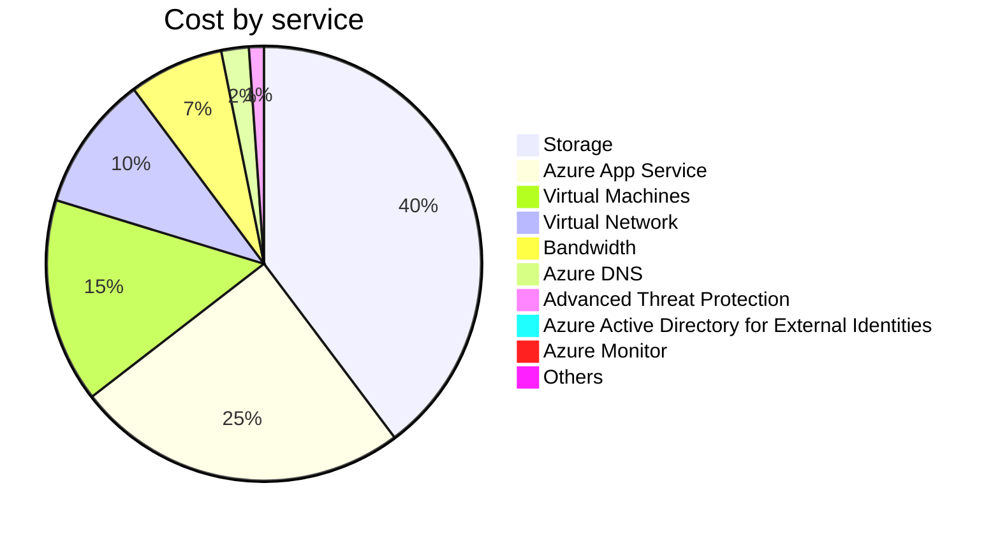
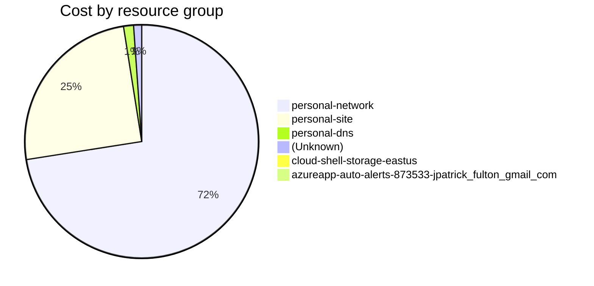

Fetching subscription details...
Fetching cost data...
Fetching forecasted cost data...
Fetching cost data by service name...
Fetching cost data by location...
Fetching cost data by resource group...
# Azure Cost Overview

> Accumulated cost for subscription id `JPF Pay-As-You-Go` from **10/01/2023** to **10/23/2023**

## Totals

|Period|Amount|
|---|---:|
|Today|0.10 USD|
|Yesterday|1.91 USD|
|Last 7 days|15.43 USD|
|Last 30 days|52.24 USD|

```mermaid
gantt
   title Accumulated cost
   dateFormat  X
   axisFormat %s
   section 01 Oct
   USD 3.83 :0, 383
   section 02 Oct
   USD 7.06 :0, 706
   section 03 Oct
   USD 9.56 :0, 956
   section 04 Oct
   USD 12.08 :0, 1208
   section 05 Oct
   USD 14.49 :0, 1449
   section 06 Oct
   USD 17.05 :0, 1705
   section 07 Oct
   USD 19.51 :0, 1951
   section 08 Oct
   USD 21.67 :0, 2167
   section 09 Oct
   USD 23.93 :0, 2393
   section 10 Oct
   USD 26.09 :0, 2609
   section 11 Oct
   USD 28.25 :0, 2825
   section 12 Oct
   USD 30.43 :0, 3043
   section 13 Oct
   USD 32.61 :0, 3261
   section 14 Oct
   USD 34.70 :0, 3470
   section 15 Oct
   USD 36.81 :0, 3681
   section 16 Oct
   USD 39.02 :0, 3902
   section 17 Oct
   USD 41.25 :0, 4125
   section 18 Oct
   USD 43.50 :0, 4350
   section 19 Oct
   USD 45.74 :0, 4574
   section 20 Oct
   USD 48.00 :0, 4800
   section 21 Oct
   USD 50.22 :0, 5022
   section 22 Oct
   USD 52.14 :0, 5214
   section 23 Oct
   USD 52.24 :0, 5224
   section 24 Oct
   USD 53.67 : done, 0, 5367
   section 25 Oct
   USD 55.05 : done, 0, 5505
   section 26 Oct
   USD 56.30 : done, 0, 5630
   section 27 Oct
   USD 57.57 : done, 0, 5757
   section 28 Oct
   USD 58.81 : done, 0, 5881
   section 29 Oct
   USD 60.46 : done, 0, 6046
   section 30 Oct
   USD 61.85 : done, 0, 6185
   section 31 Oct
   USD 62.79 : done, 0, 6279
```

## By Service Name

|Service|Amount|
|---|---:|
|Storage|20.76 USD|
|Azure App Service|12.94 USD|
|Virtual Machines|7.94 USD|
|Virtual Network|5.26 USD|
|Bandwidth|3.68 USD|
|Azure DNS|1.07 USD|
|Advanced Threat Protection|0.58 USD|
|Azure Active Directory for External Identities|0.00 USD|
|Azure Monitor|0.00 USD|
|Others|0.00 USD|

## By Location

|Location|Amount|
|---|---:|
|US North Central|37.38 USD|
|US Central|13.00 USD|
|Unknown|1.07 USD|
|Unassigned|0.58 USD|
|US East|0.21 USD|
|AP East|0.00 USD|
|EU West|0.00 USD|
|US East 2|0.00 USD|
|US West 2|0.00 USD|

## By Resource Group

|Resource Group|Amount|
|---|---:|
|personal-network|37.73 USD|
|personal-site|13.00 USD|
|personal-dns|0.72 USD|
||0.58 USD|
|cloud-shell-storage-eastus|0.21 USD|
|azureapp-auto-alerts-873533-jpatrick_fulton_gmail_com|0.00 USD|

Generated at 2023-10-23 11:36:17 for subscription with id `4913be3f-a345-4652-9bba-767418dd25e3`
