Fetching subscription details...
Fetching cost data...
Fetching forecasted cost data...
Fetching cost data by service name...
Fetching cost data by location...
Fetching cost data by resource group...
# Azure Cost Overview

> Accumulated cost for subscription id `JPF Pay-As-You-Go` from **11/01/2023** to **11/18/2023**

## Totals

|Period|Amount|
|---|---:|
|Today|0.09 USD|
|Yesterday|2.00 USD|
|Last 7 days|15.08 USD|
|Last 30 days|39.41 USD|

```mermaid
gantt
   title Accumulated cost
   dateFormat  X
   axisFormat %s
   section 01 Nov
   USD 2.50 :0, 250
   section 02 Nov
   USD 4.87 :0, 487
   section 03 Nov
   USD 7.51 :0, 751
   section 04 Nov
   USD 9.95 :0, 995
   section 05 Nov
   USD 12.34 :0, 1234
   section 06 Nov
   USD 14.80 :0, 1480
   section 07 Nov
   USD 17.20 :0, 1720
   section 08 Nov
   USD 19.70 :0, 1970
   section 09 Nov
   USD 22.15 :0, 2215
   section 10 Nov
   USD 24.33 :0, 2433
   section 11 Nov
   USD 26.50 :0, 2650
   section 12 Nov
   USD 28.68 :0, 2868
   section 13 Nov
   USD 30.85 :0, 3085
   section 14 Nov
   USD 33.00 :0, 3300
   section 15 Nov
   USD 35.16 :0, 3516
   section 16 Nov
   USD 37.32 :0, 3732
   section 17 Nov
   USD 39.32 :0, 3932
   section 18 Nov
   USD 39.41 :0, 3941
   section 19 Nov
   USD 41.41 : done, 0, 4141
   section 20 Nov
   USD 43.50 : done, 0, 4350
   section 21 Nov
   USD 45.68 : done, 0, 4568
   section 22 Nov
   USD 47.88 : done, 0, 4788
   section 23 Nov
   USD 49.99 : done, 0, 4999
   section 24 Nov
   USD 52.25 : done, 0, 5225
   section 25 Nov
   USD 54.31 : done, 0, 5431
   section 26 Nov
   USD 56.22 : done, 0, 5622
   section 27 Nov
   USD 58.23 : done, 0, 5823
   section 28 Nov
   USD 60.32 : done, 0, 6032
   section 29 Nov
   USD 62.44 : done, 0, 6244
   section 30 Nov
   USD 64.47 : done, 0, 6447
```

## By Service Name

|Service|Amount|
|---|---:|
|Storage|14.94 USD|
|Azure App Service|9.99 USD|
|Virtual Machines|6.46 USD|
|Virtual Network|4.07 USD|
|Bandwidth|2.66 USD|
|Azure DNS|0.83 USD|
|Microsoft Defender for Cloud|0.47 USD|
|Functions|0.00 USD|
|Log Analytics|0.00 USD|

## By Location

|Location|Amount|
|---|---:|
|US North Central|27.92 USD|
|US Central|10.03 USD|
|Unknown|0.83 USD|
|Unassigned|0.47 USD|
|US East|0.17 USD|
|AP East|0.00 USD|
|EU West|0.00 USD|
|US East 2|0.00 USD|
|US West 2|0.00 USD|

## By Resource Group

|Resource Group|Amount|
|---|---:|
|personal-network|28.19 USD|
|personal-site|10.03 USD|
|personal-dns|0.55 USD|
||0.47 USD|
|cloud-shell-storage-eastus|0.17 USD|

Generated at 2023-11-18 11:34:13 for subscription with id `4913be3f-a345-4652-9bba-767418dd25e3`
