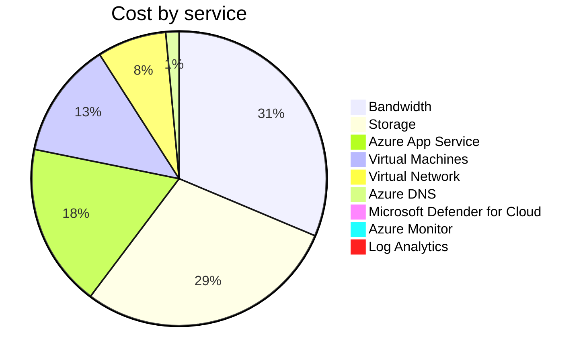
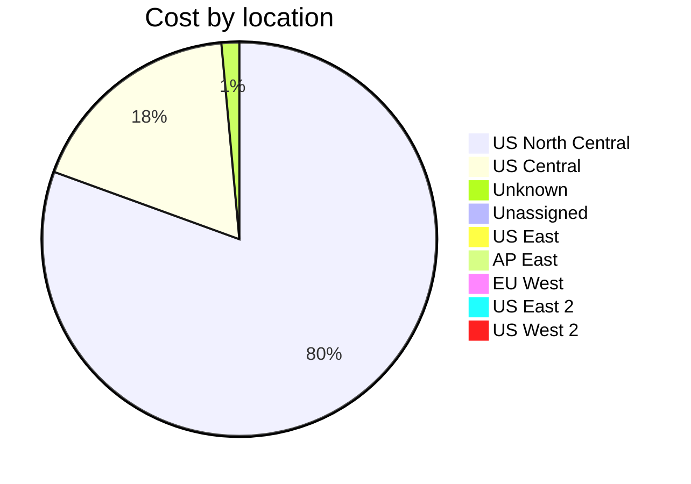
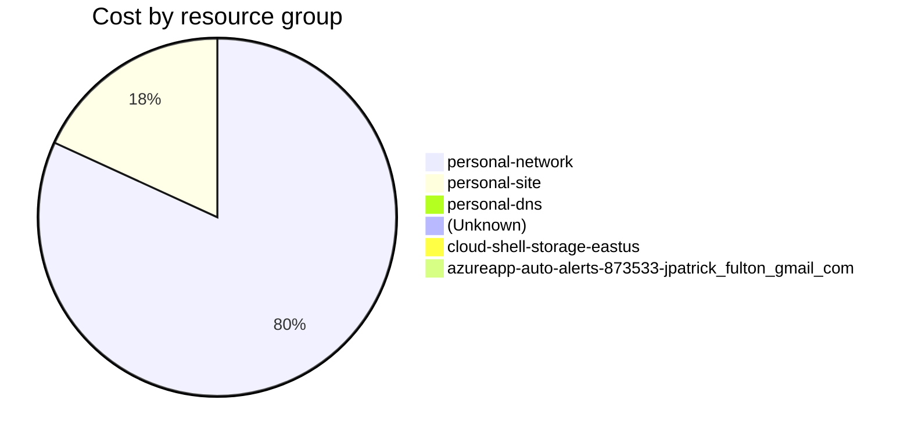

Fetching subscription details...
Fetching cost data...
Fetching forecasted cost data...
Fetching cost data by service name...
Fetching cost data by location...
Fetching cost data by resource group...
# Azure Cost Overview

> Accumulated cost for subscription id `JPF Pay-As-You-Go` from **02/01/2024** to **02/03/2024**

## Totals

|Period|Amount|
|---|---:|
|Today|0.09 USD|
|Yesterday|3.27 USD|
|Last 7 days|6.25 USD|
|Last 30 days|6.25 USD|

```mermaid
gantt
   title Accumulated cost
   dateFormat  X
   axisFormat %s
   section 01 Feb
   USD 2.89 :0, 289
   section 02 Feb
   USD 6.16 :0, 616
   section 03 Feb
   USD 6.25 :0, 625
   section 04 Feb
   USD 9.04 : done, 0, 904
   section 05 Feb
   USD 11.82 : done, 0, 1182
   section 06 Feb
   USD 14.78 : done, 0, 1478
   section 07 Feb
   USD 17.48 : done, 0, 1748
   section 08 Feb
   USD 20.39 : done, 0, 2039
   section 09 Feb
   USD 23.40 : done, 0, 2340
   section 10 Feb
   USD 26.96 : done, 0, 2696
   section 11 Feb
   USD 29.81 : done, 0, 2981
   section 12 Feb
   USD 32.66 : done, 0, 3266
   section 13 Feb
   USD 35.68 : done, 0, 3568
   section 14 Feb
   USD 38.44 : done, 0, 3844
   section 15 Feb
   USD 41.41 : done, 0, 4141
   section 16 Feb
   USD 44.47 : done, 0, 4447
   section 17 Feb
   USD 48.10 : done, 0, 4810
   section 18 Feb
   USD 51.01 : done, 0, 5101
   section 19 Feb
   USD 53.92 : done, 0, 5392
   section 20 Feb
   USD 57.00 : done, 0, 5700
   section 21 Feb
   USD 59.82 : done, 0, 5982
   section 22 Feb
   USD 62.85 : done, 0, 6285
   section 23 Feb
   USD 65.97 : done, 0, 6597
   section 24 Feb
   USD 69.66 : done, 0, 6966
   section 25 Feb
   USD 72.63 : done, 0, 7263
   section 26 Feb
   USD 75.60 : done, 0, 7560
   section 27 Feb
   USD 78.74 : done, 0, 7874
   section 28 Feb
   USD 81.62 : done, 0, 8162
   section 29 Feb
   USD 84.71 : done, 0, 8471
```

## By Service Name

|Service|Amount|
|---|---:|
|Bandwidth|1.94 USD|
|Storage|1.79 USD|
|Azure App Service|1.11 USD|
|Virtual Machines|0.79 USD|
|Virtual Network|0.47 USD|
|Azure DNS|0.09 USD|
|Microsoft Defender for Cloud|0.05 USD|
|Azure Monitor|0.00 USD|
|Log Analytics|0.00 USD|

## By Location

|Location|Amount|
|---|---:|
|US North Central|4.97 USD|
|US Central|1.11 USD|
|Unknown|0.09 USD|
|Unassigned|0.05 USD|
|US East|0.02 USD|
|AP East|0.00 USD|
|EU West|0.00 USD|
|US East 2|0.00 USD|
|US West 2|0.00 USD|

## By Resource Group

|Resource Group|Amount|
|---|---:|
|personal-network|5.00 USD|
|personal-site|1.11 USD|
|personal-dns|0.06 USD|
||0.05 USD|
|cloud-shell-storage-eastus|0.02 USD|
|azureapp-auto-alerts-873533-jpatrick_fulton_gmail_com|0.00 USD|

Generated at 2024-02-03 11:38:55 for subscription with id `4913be3f-a345-4652-9bba-767418dd25e3`
