Fetching subscription details...
Fetching cost data...
Fetching forecasted cost data...
Fetching cost data by service name...
Fetching cost data by location...
Fetching cost data by resource group...
# Azure Cost Overview

> Accumulated cost for subscription id `JPF Pay-As-You-Go` from **02/01/2024** to **02/23/2024**

## Totals

|Period|Amount|
|---|---:|
|Today|0.11 USD|
|Yesterday|2.00 USD|
|Last 7 days|15.88 USD|
|Last 30 days|57.46 USD|

```mermaid
gantt
   title Accumulated cost
   dateFormat  X
   axisFormat %s
   section 01 Feb
   USD 2.99 :0, 299
   section 02 Feb
   USD 6.68 :0, 668
   section 03 Feb
   USD 9.81 :0, 981
   section 04 Feb
   USD 12.83 :0, 1283
   section 05 Feb
   USD 15.90 :0, 1590
   section 06 Feb
   USD 18.73 :0, 1873
   section 07 Feb
   USD 21.64 :0, 2164
   section 08 Feb
   USD 25.07 :0, 2507
   section 09 Feb
   USD 27.83 :0, 2783
   section 10 Feb
   USD 30.23 :0, 3023
   section 11 Feb
   USD 32.39 :0, 3239
   section 12 Feb
   USD 34.54 :0, 3454
   section 13 Feb
   USD 36.95 :0, 3695
   section 14 Feb
   USD 39.29 :0, 3929
   section 15 Feb
   USD 41.58 :0, 4158
   section 16 Feb
   USD 43.97 :0, 4397
   section 17 Feb
   USD 46.19 :0, 4619
   section 18 Feb
   USD 48.47 :0, 4847
   section 19 Feb
   USD 50.76 :0, 5076
   section 20 Feb
   USD 53.08 :0, 5308
   section 21 Feb
   USD 55.35 :0, 5535
   section 22 Feb
   USD 57.35 :0, 5735
   section 23 Feb
   USD 57.46 :0, 5746
   section 24 Feb
   USD 59.79 : done, 0, 5979
   section 25 Feb
   USD 61.87 : done, 0, 6187
   section 26 Feb
   USD 63.62 : done, 0, 6362
   section 27 Feb
   USD 65.71 : done, 0, 6571
   section 28 Feb
   USD 67.65 : done, 0, 6765
   section 29 Feb
   USD 69.85 : done, 0, 6985
```

## By Service Name

|Service|Amount|
|---|---:|
|Storage|20.20 USD|
|Azure App Service|12.95 USD|
|Bandwidth|9.63 USD|
|Virtual Machines|7.82 USD|
|Virtual Network|5.26 USD|
|Azure DNS|1.07 USD|
|Microsoft Defender for Cloud|0.53 USD|
|Azure Monitor|0.00 USD|
|Functions|0.00 USD|
|Log Analytics|0.00 USD|

## By Location

|Location|Amount|
|---|---:|
|US North Central|42.63 USD|
|US Central|13.00 USD|
|Unknown|1.07 USD|
|Unassigned|0.53 USD|
|US East|0.23 USD|
|AP East|0.00 USD|
|EU West|0.00 USD|
|US East 2|0.00 USD|
|US West|0.00 USD|
|US West 2|0.00 USD|

## By Resource Group

|Resource Group|Amount|
|---|---:|
|personal-network|42.98 USD|
|personal-site|13.00 USD|
|personal-dns|0.72 USD|
||0.53 USD|
|cloud-shell-storage-eastus|0.23 USD|
|azureapp-auto-alerts-873533-jpatrick_fulton_gmail_com|0.00 USD|

Generated at 2024-02-23 11:35:00 for subscription with id `4913be3f-a345-4652-9bba-767418dd25e3`
