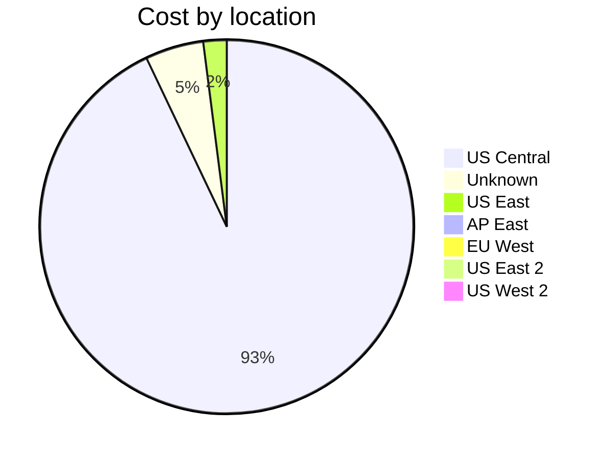

Fetching subscription details...
Fetching cost data...
Fetching forecasted cost data...
Fetching cost data by service name...
Fetching cost data by location...
Fetching cost data by resource group...
# Azure Cost Overview

> Accumulated cost for subscription id `JPF Pay-As-You-Go` from **04/01/2024** to **04/02/2024**

## Totals

|Period|Amount|
|---|---:|
|Today|0.00 USD|
|Yesterday|0.35 USD|
|Last 7 days|0.99 USD|
|Last 30 days|0.99 USD|

```mermaid
gantt
   title Accumulated cost
   dateFormat  X
   axisFormat %s
   section 01 Apr
   USD 0.64 :0, 64
   section 02 Apr
   USD 0.99 :0, 99
   section 03 Apr
   USD 1.07 : done, 0, 107
   section 04 Apr
   USD 1.10 : done, 0, 110
   section 05 Apr
   USD 1.10 : done, 0, 110
   section 06 Apr
   USD 1.10 : done, 0, 110
   section 07 Apr
   USD 1.10 : done, 0, 110
   section 08 Apr
   USD 1.10 : done, 0, 110
   section 09 Apr
   USD 1.10 : done, 0, 110
   section 10 Apr
   USD 1.10 : done, 0, 110
   section 11 Apr
   USD 1.10 : done, 0, 110
   section 12 Apr
   USD 1.10 : done, 0, 110
   section 13 Apr
   USD 1.10 : done, 0, 110
   section 14 Apr
   USD 1.10 : done, 0, 110
   section 15 Apr
   USD 1.10 : done, 0, 110
   section 16 Apr
   USD 1.10 : done, 0, 110
   section 17 Apr
   USD 1.10 : done, 0, 110
   section 18 Apr
   USD 1.10 : done, 0, 110
   section 19 Apr
   USD 1.10 : done, 0, 110
   section 20 Apr
   USD 1.10 : done, 0, 110
   section 21 Apr
   USD 1.10 : done, 0, 110
   section 22 Apr
   USD 1.10 : done, 0, 110
   section 23 Apr
   USD 1.10 : done, 0, 110
   section 24 Apr
   USD 1.10 : done, 0, 110
   section 25 Apr
   USD 1.10 : done, 0, 110
   section 26 Apr
   USD 1.10 : done, 0, 110
   section 27 Apr
   USD 1.10 : done, 0, 110
   section 28 Apr
   USD 1.10 : done, 0, 110
   section 29 Apr
   USD 1.10 : done, 0, 110
   section 30 Apr
   USD 1.10 : done, 0, 110
```

## By Service Name

|Service|Amount|
|---|---:|
|Azure App Service|0.91 USD|
|Azure DNS|0.05 USD|
|Storage|0.02 USD|
|Functions|0.00 USD|
|Log Analytics|0.00 USD|

## By Location

|Location|Amount|
|---|---:|
|US Central|0.92 USD|
|Unknown|0.05 USD|
|US East|0.02 USD|
|AP East|0.00 USD|
|EU West|0.00 USD|
|US East 2|0.00 USD|
|US West 2|0.00 USD|

## By Resource Group

|Resource Group|Amount|
|---|---:|
|personal-site|0.92 USD|
|personal-dns|0.05 USD|
|cloud-shell-storage-eastus|0.02 USD|

Generated at 2024-04-03 11:19:55 for subscription with id `4913be3f-a345-4652-9bba-767418dd25e3`
