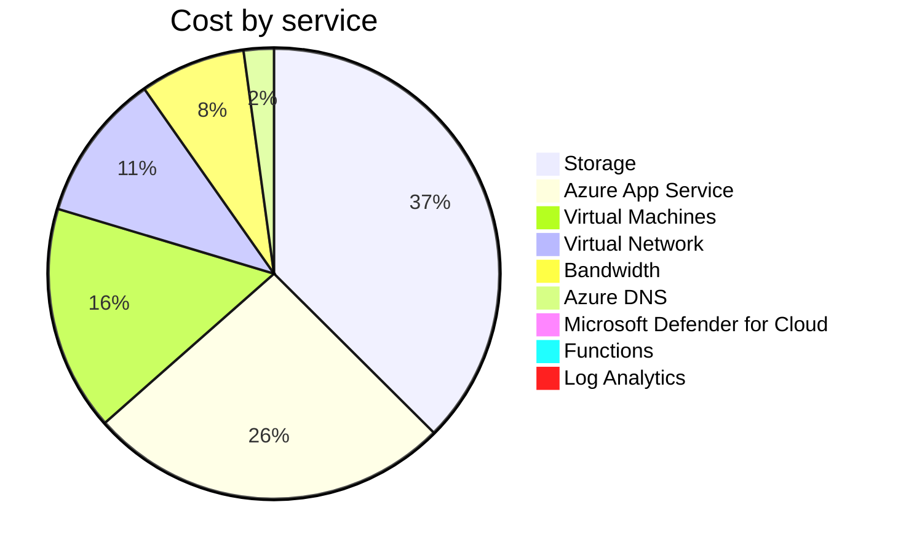

Fetching subscription details...
Fetching cost data...
Fetching forecasted cost data...
Fetching cost data by service name...
Fetching cost data by location...
Fetching cost data by resource group...
# Azure Cost Overview

> Accumulated cost for subscription id `JPF Pay-As-You-Go` from **03/01/2024** to **03/08/2024**

## Totals

|Period|Amount|
|---|---:|
|Today|0.09 USD|
|Yesterday|1.99 USD|
|Last 7 days|15.79 USD|
|Last 30 days|15.79 USD|

```mermaid
gantt
   title Accumulated cost
   dateFormat  X
   axisFormat %s
   section 01 Mar
   USD 3.32 :0, 332
   section 02 Mar
   USD 5.40 :0, 540
   section 03 Mar
   USD 7.47 :0, 747
   section 04 Mar
   USD 9.55 :0, 955
   section 05 Mar
   USD 11.63 :0, 1163
   section 06 Mar
   USD 13.71 :0, 1371
   section 07 Mar
   USD 15.70 :0, 1570
   section 08 Mar
   USD 15.79 :0, 1579
   section 09 Mar
   USD 17.85 : done, 0, 1785
   section 10 Mar
   USD 19.85 : done, 0, 1985
   section 11 Mar
   USD 21.62 : done, 0, 2162
   section 12 Mar
   USD 23.62 : done, 0, 2362
   section 13 Mar
   USD 25.67 : done, 0, 2567
   section 14 Mar
   USD 27.60 : done, 0, 2760
   section 15 Mar
   USD 29.93 : done, 0, 2993
   section 16 Mar
   USD 31.84 : done, 0, 3184
   section 17 Mar
   USD 33.68 : done, 0, 3368
   section 18 Mar
   USD 35.29 : done, 0, 3529
   section 19 Mar
   USD 37.13 : done, 0, 3713
   section 20 Mar
   USD 39.02 : done, 0, 3902
   section 21 Mar
   USD 40.79 : done, 0, 4079
   section 22 Mar
   USD 42.97 : done, 0, 4297
   section 23 Mar
   USD 44.71 : done, 0, 4471
   section 24 Mar
   USD 46.40 : done, 0, 4640
   section 25 Mar
   USD 47.85 : done, 0, 4785
   section 26 Mar
   USD 49.53 : done, 0, 4953
   section 27 Mar
   USD 51.26 : done, 0, 5126
   section 28 Mar
   USD 52.88 : done, 0, 5288
   section 29 Mar
   USD 54.89 : done, 0, 5489
   section 30 Mar
   USD 56.48 : done, 0, 5648
   section 31 Mar
   USD 58.01 : done, 0, 5801
```

## By Service Name

|Service|Amount|
|---|---:|
|Storage|5.89 USD|
|Azure App Service|4.09 USD|
|Virtual Machines|2.54 USD|
|Virtual Network|1.67 USD|
|Bandwidth|1.19 USD|
|Azure DNS|0.34 USD|
|Microsoft Defender for Cloud|0.06 USD|
|Functions|0.00 USD|
|Log Analytics|0.00 USD|

## By Location

|Location|Amount|
|---|---:|
|US North Central|11.21 USD|
|US Central|4.11 USD|
|Unknown|0.34 USD|
|US East|0.07 USD|
|Unassigned|0.06 USD|
|AP East|0.00 USD|
|EU West|0.00 USD|
|US East 2|0.00 USD|
|US West 2|0.00 USD|

## By Resource Group

|Resource Group|Amount|
|---|---:|
|personal-network|11.32 USD|
|personal-site|4.11 USD|
|personal-dns|0.23 USD|
|cloud-shell-storage-eastus|0.07 USD|
||0.06 USD|

Generated at 2024-03-08 11:35:14 for subscription with id `4913be3f-a345-4652-9bba-767418dd25e3`
