Fetching subscription details...
Fetching cost data...
Fetching forecasted cost data...
Fetching cost data by service name...
Fetching cost data by location...
Fetching cost data by resource group...
# Azure Cost Overview

> Accumulated cost for subscription id `JPF Pay-As-You-Go` from **02/01/2024** to **02/25/2024**

## Totals

|Period|Amount|
|---|---:|
|Today|0.09 USD|
|Yesterday|2.12 USD|
|Last 7 days|15.79 USD|
|Last 30 days|62.21 USD|

```mermaid
gantt
   title Accumulated cost
   dateFormat  X
   axisFormat %s
   section 01 Feb
   USD 2.99 :0, 299
   section 02 Feb
   USD 6.68 :0, 668
   section 03 Feb
   USD 9.81 :0, 981
   section 04 Feb
   USD 12.83 :0, 1283
   section 05 Feb
   USD 15.90 :0, 1590
   section 06 Feb
   USD 18.73 :0, 1873
   section 07 Feb
   USD 21.64 :0, 2164
   section 08 Feb
   USD 25.07 :0, 2507
   section 09 Feb
   USD 27.84 :0, 2784
   section 10 Feb
   USD 30.28 :0, 3028
   section 11 Feb
   USD 32.45 :0, 3245
   section 12 Feb
   USD 34.59 :0, 3459
   section 13 Feb
   USD 37.05 :0, 3705
   section 14 Feb
   USD 39.43 :0, 3943
   section 15 Feb
   USD 41.74 :0, 4174
   section 16 Feb
   USD 44.18 :0, 4418
   section 17 Feb
   USD 46.42 :0, 4642
   section 18 Feb
   USD 48.72 :0, 4872
   section 19 Feb
   USD 51.03 :0, 5103
   section 20 Feb
   USD 53.39 :0, 5339
   section 21 Feb
   USD 55.67 :0, 5567
   section 22 Feb
   USD 57.85 :0, 5785
   section 23 Feb
   USD 60.00 :0, 6000
   section 24 Feb
   USD 62.12 :0, 6212
   section 25 Feb
   USD 62.21 :0, 6221
   section 26 Feb
   USD 63.86 : done, 0, 6386
   section 27 Feb
   USD 65.86 : done, 0, 6586
   section 28 Feb
   USD 67.61 : done, 0, 6761
   section 29 Feb
   USD 69.53 : done, 0, 6953
```

## By Service Name

|Service|Amount|
|---|---:|
|Storage|22.05 USD|
|Azure App Service|14.15 USD|
|Bandwidth|10.03 USD|
|Virtual Machines|8.50 USD|
|Virtual Network|5.75 USD|
|Azure DNS|1.17 USD|
|Microsoft Defender for Cloud|0.56 USD|
|Azure Monitor|0.00 USD|
|Functions|0.00 USD|
|Log Analytics|0.00 USD|

## By Location

|Location|Amount|
|---|---:|
|US North Central|46.02 USD|
|US Central|14.21 USD|
|Unknown|1.17 USD|
|Unassigned|0.56 USD|
|US East|0.25 USD|
|AP East|0.00 USD|
|EU West|0.00 USD|
|US East 2|0.00 USD|
|US West|0.00 USD|
|US West 2|0.00 USD|

## By Resource Group

|Resource Group|Amount|
|---|---:|
|personal-network|46.40 USD|
|personal-site|14.21 USD|
|personal-dns|0.79 USD|
||0.56 USD|
|cloud-shell-storage-eastus|0.25 USD|
|azureapp-auto-alerts-873533-jpatrick_fulton_gmail_com|0.00 USD|

Generated at 2024-02-25 11:34:54 for subscription with id `4913be3f-a345-4652-9bba-767418dd25e3`
