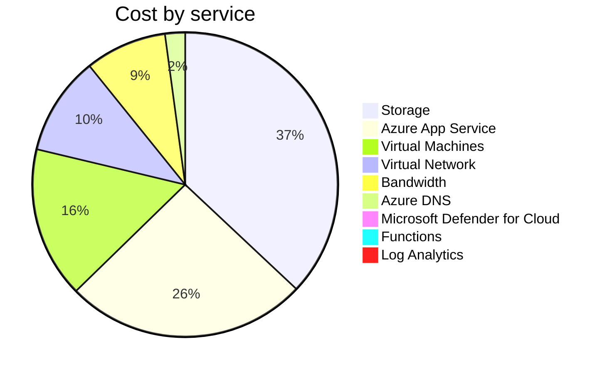
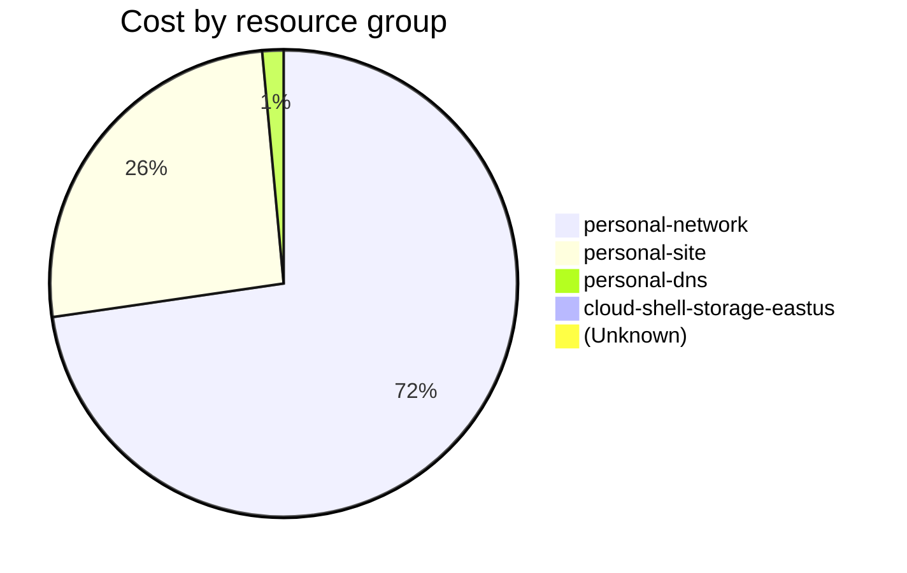

Fetching subscription details...
Fetching cost data...
Fetching forecasted cost data...
Fetching cost data by service name...
Fetching cost data by location...
Fetching cost data by resource group...
# Azure Cost Overview

> Accumulated cost for subscription id `JPF Pay-As-You-Go` from **03/01/2024** to **03/07/2024**

## Totals

|Period|Amount|
|---|---:|
|Today|0.09 USD|
|Yesterday|1.98 USD|
|Last 7 days|13.70 USD|
|Last 30 days|13.70 USD|

```mermaid
gantt
   title Accumulated cost
   dateFormat  X
   axisFormat %s
   section 01 Mar
   USD 3.32 :0, 332
   section 02 Mar
   USD 5.40 :0, 540
   section 03 Mar
   USD 7.47 :0, 747
   section 04 Mar
   USD 9.55 :0, 955
   section 05 Mar
   USD 11.63 :0, 1163
   section 06 Mar
   USD 13.61 :0, 1361
   section 07 Mar
   USD 13.70 :0, 1370
   section 08 Mar
   USD 16.16 : done, 0, 1616
   section 09 Mar
   USD 18.19 : done, 0, 1819
   section 10 Mar
   USD 20.16 : done, 0, 2016
   section 11 Mar
   USD 21.90 : done, 0, 2190
   section 12 Mar
   USD 24.12 : done, 0, 2412
   section 13 Mar
   USD 26.26 : done, 0, 2626
   section 14 Mar
   USD 28.16 : done, 0, 2816
   section 15 Mar
   USD 30.47 : done, 0, 3047
   section 16 Mar
   USD 32.35 : done, 0, 3235
   section 17 Mar
   USD 34.17 : done, 0, 3417
   section 18 Mar
   USD 35.77 : done, 0, 3577
   section 19 Mar
   USD 37.84 : done, 0, 3784
   section 20 Mar
   USD 39.82 : done, 0, 3982
   section 21 Mar
   USD 41.58 : done, 0, 4158
   section 22 Mar
   USD 43.73 : done, 0, 4373
   section 23 Mar
   USD 45.47 : done, 0, 4547
   section 24 Mar
   USD 47.14 : done, 0, 4714
   section 25 Mar
   USD 48.58 : done, 0, 4858
   section 26 Mar
   USD 50.50 : done, 0, 5050
   section 27 Mar
   USD 52.33 : done, 0, 5233
   section 28 Mar
   USD 53.94 : done, 0, 5394
   section 29 Mar
   USD 55.94 : done, 0, 5594
   section 30 Mar
   USD 57.53 : done, 0, 5753
   section 31 Mar
   USD 59.05 : done, 0, 5905
```

## By Service Name

|Service|Amount|
|---|---:|
|Storage|5.05 USD|
|Azure App Service|3.50 USD|
|Virtual Machines|2.19 USD|
|Virtual Network|1.43 USD|
|Bandwidth|1.18 USD|
|Azure DNS|0.29 USD|
|Microsoft Defender for Cloud|0.05 USD|
|Functions|0.00 USD|
|Log Analytics|0.00 USD|

## By Location

|Location|Amount|
|---|---:|
|US North Central|9.79 USD|
|US Central|3.51 USD|
|Unknown|0.29 USD|
|US East|0.06 USD|
|Unassigned|0.05 USD|
|AP East|0.00 USD|
|EU West|0.00 USD|
|US East 2|0.00 USD|
|US West 2|0.00 USD|

## By Resource Group

|Resource Group|Amount|
|---|---:|
|personal-network|9.88 USD|
|personal-site|3.51 USD|
|personal-dns|0.20 USD|
|cloud-shell-storage-eastus|0.06 USD|
||0.05 USD|

Generated at 2024-03-07 11:30:12 for subscription with id `4913be3f-a345-4652-9bba-767418dd25e3`
