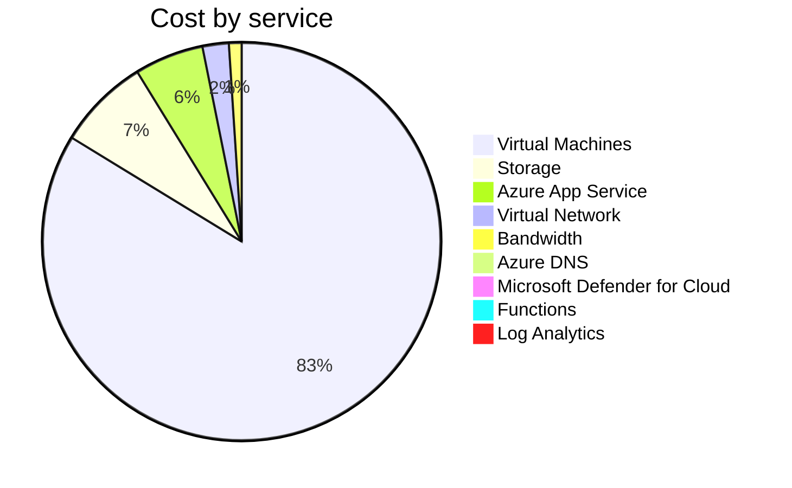
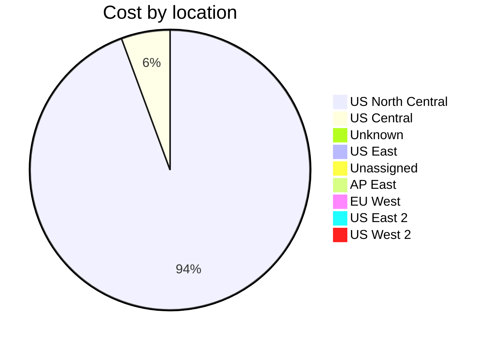
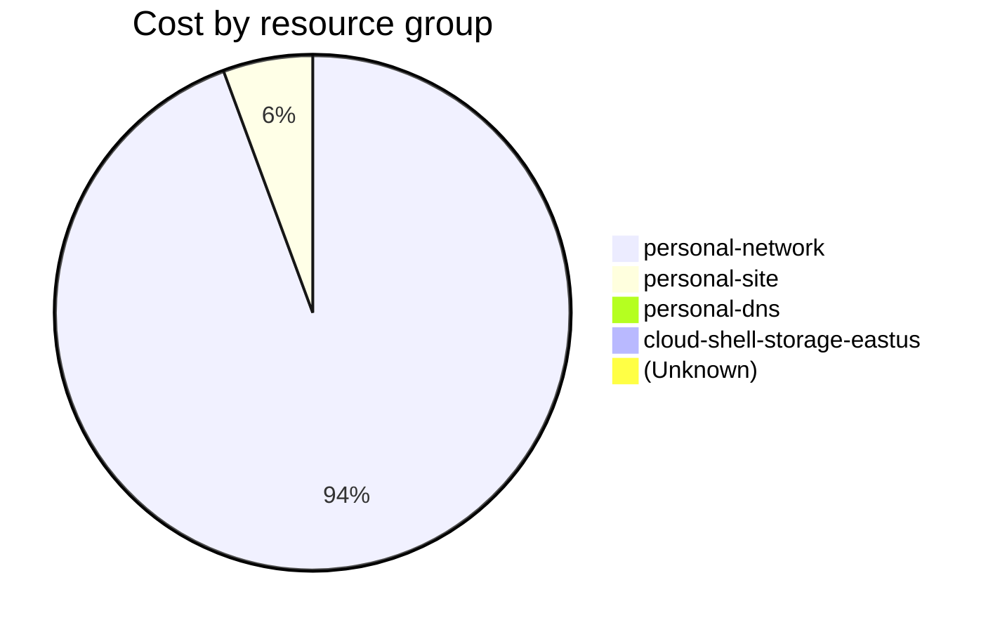

Fetching subscription details...
Fetching cost data...
Fetching forecasted cost data...
Fetching cost data by service name...
Fetching cost data by location...
Fetching cost data by resource group...
# Azure Cost Overview

> Accumulated cost for subscription id `JPF Pay-As-You-Go` from **03/01/2024** to **03/12/2024**

## Totals

|Period|Amount|
|---|---:|
|Today|0.00 USD|
|Yesterday|0.16 USD|
|Last 7 days|59.10 USD|
|Last 30 days|116.27 USD|

```mermaid
gantt
   title Accumulated cost
   dateFormat  X
   axisFormat %s
   section 01 Mar
   USD 12.43 :0, 1243
   section 02 Mar
   USD 23.62 :0, 2362
   section 03 Mar
   USD 34.80 :0, 3480
   section 04 Mar
   USD 45.98 :0, 4598
   section 05 Mar
   USD 57.17 :0, 5717
   section 06 Mar
   USD 68.36 :0, 6836
   section 07 Mar
   USD 79.56 :0, 7956
   section 08 Mar
   USD 90.75 :0, 9075
   section 09 Mar
   USD 101.94 :0, 10194
   section 10 Mar
   USD 113.13 :0, 11313
   section 11 Mar
   USD 116.11 :0, 11611
   section 12 Mar
   USD 116.27 :0, 11627
   section 13 Mar
   USD 126.24 : done, 0, 12624
   section 14 Mar
   USD 136.03 : done, 0, 13603
   section 15 Mar
   USD 146.02 : done, 0, 14602
   section 16 Mar
   USD 155.68 : done, 0, 15568
   section 17 Mar
   USD 165.33 : done, 0, 16533
   section 18 Mar
   USD 174.74 : done, 0, 17474
   section 19 Mar
   USD 184.33 : done, 0, 18433
   section 20 Mar
   USD 193.76 : done, 0, 19376
   section 21 Mar
   USD 203.02 : done, 0, 20302
   section 22 Mar
   USD 212.47 : done, 0, 21247
   section 23 Mar
   USD 221.59 : done, 0, 22159
   section 24 Mar
   USD 230.70 : done, 0, 23070
   section 25 Mar
   USD 239.58 : done, 0, 23958
   section 26 Mar
   USD 248.63 : done, 0, 24863
   section 27 Mar
   USD 257.53 : done, 0, 25753
   section 28 Mar
   USD 266.25 : done, 0, 26625
   section 29 Mar
   USD 275.16 : done, 0, 27516
   section 30 Mar
   USD 283.75 : done, 0, 28375
   section 31 Mar
   USD 292.33 : done, 0, 29233
```

## By Service Name

|Service|Amount|
|---|---:|
|Virtual Machines|96.84 USD|
|Storage|8.66 USD|
|Azure App Service|6.49 USD|
|Virtual Network|2.47 USD|
|Bandwidth|1.19 USD|
|Azure DNS|0.53 USD|
|Microsoft Defender for Cloud|0.10 USD|
|Functions|0.00 USD|
|Log Analytics|0.00 USD|

## By Location

|Location|Amount|
|---|---:|
|US North Central|109.02 USD|
|US Central|6.51 USD|
|Unknown|0.53 USD|
|US East|0.11 USD|
|Unassigned|0.10 USD|
|AP East|0.00 USD|
|EU West|0.00 USD|
|US East 2|0.00 USD|
|US West 2|0.00 USD|

## By Resource Group

|Resource Group|Amount|
|---|---:|
|personal-network|109.19 USD|
|personal-site|6.51 USD|
|personal-dns|0.36 USD|
|cloud-shell-storage-eastus|0.11 USD|
||0.10 USD|

Generated at 2024-03-13 11:23:03 for subscription with id `4913be3f-a345-4652-9bba-767418dd25e3`
