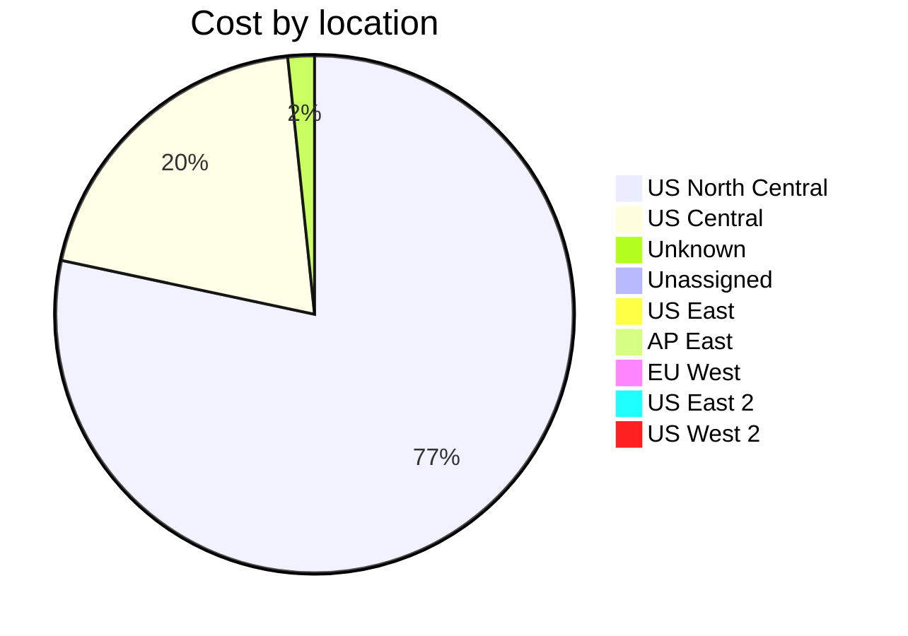

Fetching subscription details...
Fetching cost data...
Fetching forecasted cost data...
Fetching cost data by service name...
Fetching cost data by location...
Fetching cost data by resource group...
# Azure Cost Overview

> Accumulated cost for subscription id `JPF Pay-As-You-Go` from **02/01/2024** to **02/12/2024**

## Totals

|Period|Amount|
|---|---:|
|Today|0.09 USD|
|Yesterday|1.08 USD|
|Last 7 days|18.35 USD|
|Last 30 days|31.17 USD|

```mermaid
gantt
   title Accumulated cost
   dateFormat  X
   axisFormat %s
   section 01 Feb
   USD 2.99 :0, 299
   section 02 Feb
   USD 6.68 :0, 668
   section 03 Feb
   USD 9.81 :0, 981
   section 04 Feb
   USD 12.82 :0, 1282
   section 05 Feb
   USD 15.89 :0, 1589
   section 06 Feb
   USD 18.72 :0, 1872
   section 07 Feb
   USD 21.64 :0, 2164
   section 08 Feb
   USD 25.06 :0, 2506
   section 09 Feb
   USD 27.82 :0, 2782
   section 10 Feb
   USD 30.01 :0, 3001
   section 11 Feb
   USD 31.08 :0, 3108
   section 12 Feb
   USD 31.17 :0, 3117
   section 13 Feb
   USD 33.95 : done, 0, 3395
   section 14 Feb
   USD 36.61 : done, 0, 3661
   section 15 Feb
   USD 39.47 : done, 0, 3947
   section 16 Feb
   USD 42.45 : done, 0, 4245
   section 17 Feb
   USD 45.81 : done, 0, 4581
   section 18 Feb
   USD 48.59 : done, 0, 4859
   section 19 Feb
   USD 51.15 : done, 0, 5115
   section 20 Feb
   USD 53.90 : done, 0, 5390
   section 21 Feb
   USD 56.54 : done, 0, 5654
   section 22 Feb
   USD 59.37 : done, 0, 5937
   section 23 Feb
   USD 62.31 : done, 0, 6231
   section 24 Feb
   USD 65.65 : done, 0, 6565
   section 25 Feb
   USD 68.41 : done, 0, 6841
   section 26 Feb
   USD 70.94 : done, 0, 7094
   section 27 Feb
   USD 73.66 : done, 0, 7366
   section 28 Feb
   USD 76.27 : done, 0, 7627
   section 29 Feb
   USD 79.07 : done, 0, 7907
```

## By Service Name

|Service|Amount|
|---|---:|
|Storage|9.67 USD|
|Bandwidth|8.16 USD|
|Azure App Service|6.14 USD|
|Virtual Machines|3.94 USD|
|Virtual Network|2.50 USD|
|Azure DNS|0.51 USD|
|Microsoft Defender for Cloud|0.26 USD|
|Azure Monitor|0.00 USD|
|Functions|0.00 USD|
|Log Analytics|0.00 USD|

## By Location

|Location|Amount|
|---|---:|
|US North Central|24.13 USD|
|US Central|6.16 USD|
|Unknown|0.51 USD|
|Unassigned|0.26 USD|
|US East|0.11 USD|
|AP East|0.00 USD|
|EU West|0.00 USD|
|US East 2|0.00 USD|
|US West 2|0.00 USD|

## By Resource Group

|Resource Group|Amount|
|---|---:|
|personal-network|24.30 USD|
|personal-site|6.16 USD|
|personal-dns|0.34 USD|
||0.26 USD|
|cloud-shell-storage-eastus|0.11 USD|
|azureapp-auto-alerts-873533-jpatrick_fulton_gmail_com|0.00 USD|

Generated at 2024-02-12 11:34:57 for subscription with id `4913be3f-a345-4652-9bba-767418dd25e3`
