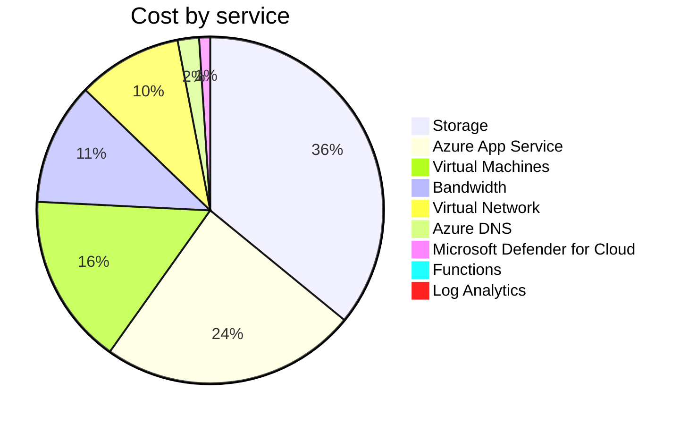

Fetching subscription details...
Fetching cost data...
Fetching forecasted cost data...
Fetching cost data by service name...
Fetching cost data by location...
Fetching cost data by resource group...
# Azure Cost Overview

> Accumulated cost for subscription id `JPF Pay-As-You-Go` from **11/01/2023** to **11/07/2023**

## Totals

|Period|Amount|
|---|---:|
|Today|0.08 USD|
|Yesterday|2.26 USD|
|Last 7 days|14.54 USD|
|Last 30 days|14.54 USD|

```mermaid
gantt
   title Accumulated cost
   dateFormat  X
   axisFormat %s
   section 01 Nov
   USD 2.47 :0, 247
   section 02 Nov
   USD 4.82 :0, 482
   section 03 Nov
   USD 7.42 :0, 742
   section 04 Nov
   USD 9.84 :0, 984
   section 05 Nov
   USD 12.20 :0, 1220
   section 06 Nov
   USD 14.47 :0, 1447
   section 07 Nov
   USD 14.54 :0, 1454
   section 08 Nov
   USD 17.01 : done, 0, 1701
   section 09 Nov
   USD 19.47 : done, 0, 1947
   section 10 Nov
   USD 22.02 : done, 0, 2202
   section 11 Nov
   USD 24.40 : done, 0, 2440
   section 12 Nov
   USD 26.61 : done, 0, 2661
   section 13 Nov
   USD 28.97 : done, 0, 2897
   section 14 Nov
   USD 31.43 : done, 0, 3143
   section 15 Nov
   USD 33.90 : done, 0, 3390
   section 16 Nov
   USD 36.37 : done, 0, 3637
   section 17 Nov
   USD 38.92 : done, 0, 3892
   section 18 Nov
   USD 41.30 : done, 0, 4130
   section 19 Nov
   USD 43.51 : done, 0, 4351
   section 20 Nov
   USD 45.87 : done, 0, 4587
   section 21 Nov
   USD 48.34 : done, 0, 4834
   section 22 Nov
   USD 50.81 : done, 0, 5081
   section 23 Nov
   USD 53.28 : done, 0, 5328
   section 24 Nov
   USD 55.83 : done, 0, 5583
   section 25 Nov
   USD 58.21 : done, 0, 5821
   section 26 Nov
   USD 60.43 : done, 0, 6043
   section 27 Nov
   USD 62.79 : done, 0, 6279
   section 28 Nov
   USD 65.26 : done, 0, 6526
   section 29 Nov
   USD 67.74 : done, 0, 6774
   section 30 Nov
   USD 70.21 : done, 0, 7021
```

## By Service Name

|Service|Amount|
|---|---:|
|Storage|5.22 USD|
|Azure App Service|3.48 USD|
|Virtual Machines|2.32 USD|
|Bandwidth|1.66 USD|
|Virtual Network|1.42 USD|
|Azure DNS|0.29 USD|
|Microsoft Defender for Cloud|0.15 USD|
|Functions|0.00 USD|
|Log Analytics|0.00 USD|

## By Location

|Location|Amount|
|---|---:|
|US North Central|10.55 USD|
|US Central|3.49 USD|
|Unknown|0.29 USD|
|Unassigned|0.15 USD|
|US East|0.06 USD|
|AP East|0.00 USD|
|EU West|0.00 USD|
|US East 2|0.00 USD|
|US West 2|0.00 USD|

## By Resource Group

|Resource Group|Amount|
|---|---:|
|personal-network|10.65 USD|
|personal-site|3.49 USD|
|personal-dns|0.19 USD|
||0.15 USD|
|cloud-shell-storage-eastus|0.06 USD|

Generated at 2023-11-07 11:35:39 for subscription with id `4913be3f-a345-4652-9bba-767418dd25e3`
