Fetching subscription details...
Fetching cost data...
Fetching forecasted cost data...
Fetching cost data by service name...
Fetching cost data by location...
Fetching cost data by resource group...
# Azure Cost Overview

> Accumulated cost for subscription id `JPF Pay-As-You-Go` from **01/01/2024** to **01/04/2024**

## Totals

|Period|Amount|
|---|---:|
|Today|0.10 USD|
|Yesterday|2.12 USD|
|Last 7 days|7.69 USD|
|Last 30 days|7.69 USD|

```mermaid
gantt
   title Accumulated cost
   dateFormat  X
   axisFormat %s
   section 01 Jan
   USD 2.56 :0, 256
   section 02 Jan
   USD 5.46 :0, 546
   section 03 Jan
   USD 7.59 :0, 759
   section 04 Jan
   USD 7.69 :0, 769
   section 05 Jan
   USD 9.89 : done, 0, 989
   section 06 Jan
   USD 12.27 : done, 0, 1227
   section 07 Jan
   USD 14.70 : done, 0, 1470
   section 08 Jan
   USD 17.25 : done, 0, 1725
   section 09 Jan
   USD 19.68 : done, 0, 1968
   section 10 Jan
   USD 22.00 : done, 0, 2200
   section 11 Jan
   USD 24.31 : done, 0, 2431
   section 12 Jan
   USD 26.50 : done, 0, 2650
   section 13 Jan
   USD 28.86 : done, 0, 2886
   section 14 Jan
   USD 31.27 : done, 0, 3127
   section 15 Jan
   USD 33.80 : done, 0, 3380
   section 16 Jan
   USD 36.22 : done, 0, 3622
   section 17 Jan
   USD 38.52 : done, 0, 3852
   section 18 Jan
   USD 40.82 : done, 0, 4082
   section 19 Jan
   USD 42.99 : done, 0, 4299
   section 20 Jan
   USD 45.33 : done, 0, 4533
   section 21 Jan
   USD 47.73 : done, 0, 4773
   section 22 Jan
   USD 50.24 : done, 0, 5024
   section 23 Jan
   USD 52.65 : done, 0, 5265
   section 24 Jan
   USD 54.93 : done, 0, 5493
   section 25 Jan
   USD 57.21 : done, 0, 5721
   section 26 Jan
   USD 59.36 : done, 0, 5936
   section 27 Jan
   USD 61.69 : done, 0, 6169
   section 28 Jan
   USD 64.06 : done, 0, 6406
   section 29 Jan
   USD 66.56 : done, 0, 6656
   section 30 Jan
   USD 68.95 : done, 0, 6895
   section 31 Jan
   USD 71.22 : done, 0, 7122
```

## By Service Name

|Service|Amount|
|---|---:|
|Storage|2.51 USD|
|Azure App Service|1.68 USD|
|Virtual Machines|1.34 USD|
|Bandwidth|1.24 USD|
|Virtual Network|0.69 USD|
|Azure DNS|0.14 USD|
|Microsoft Defender for Cloud|0.09 USD|
|Functions|0.00 USD|
|Log Analytics|0.00 USD|

## By Location

|Location|Amount|
|---|---:|
|US North Central|5.75 USD|
|US Central|1.68 USD|
|Unknown|0.14 USD|
|Unassigned|0.09 USD|
|US East|0.03 USD|
|AP East|0.00 USD|
|EU West|0.00 USD|
|US East 2|0.00 USD|
|US West 2|0.00 USD|

## By Resource Group

|Resource Group|Amount|
|---|---:|
|personal-network|5.79 USD|
|personal-site|1.68 USD|
|personal-dns|0.09 USD|
||0.09 USD|
|cloud-shell-storage-eastus|0.03 USD|

Generated at 2024-01-04 11:34:15 for subscription with id `4913be3f-a345-4652-9bba-767418dd25e3`
