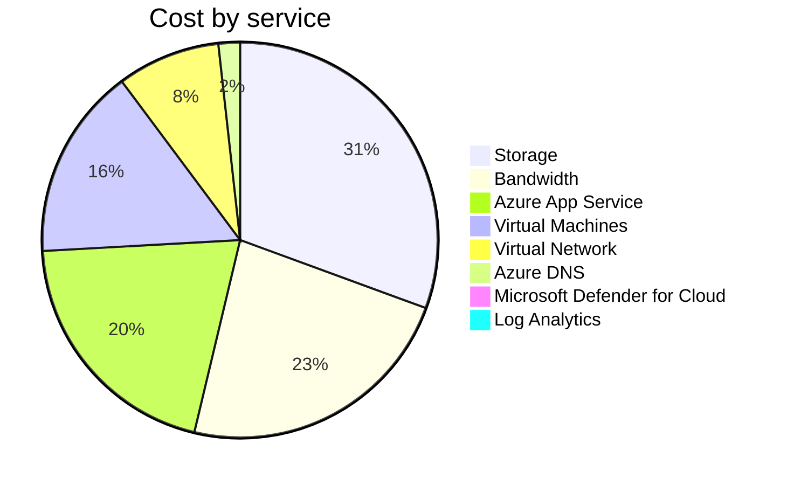
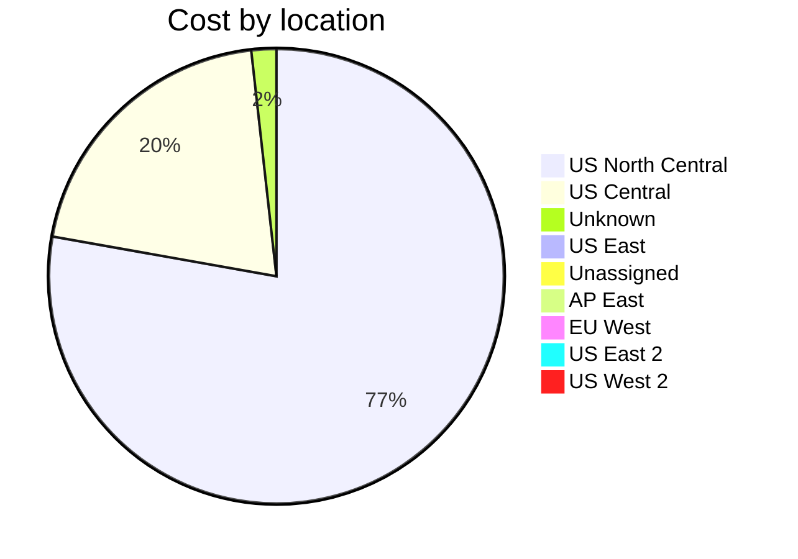
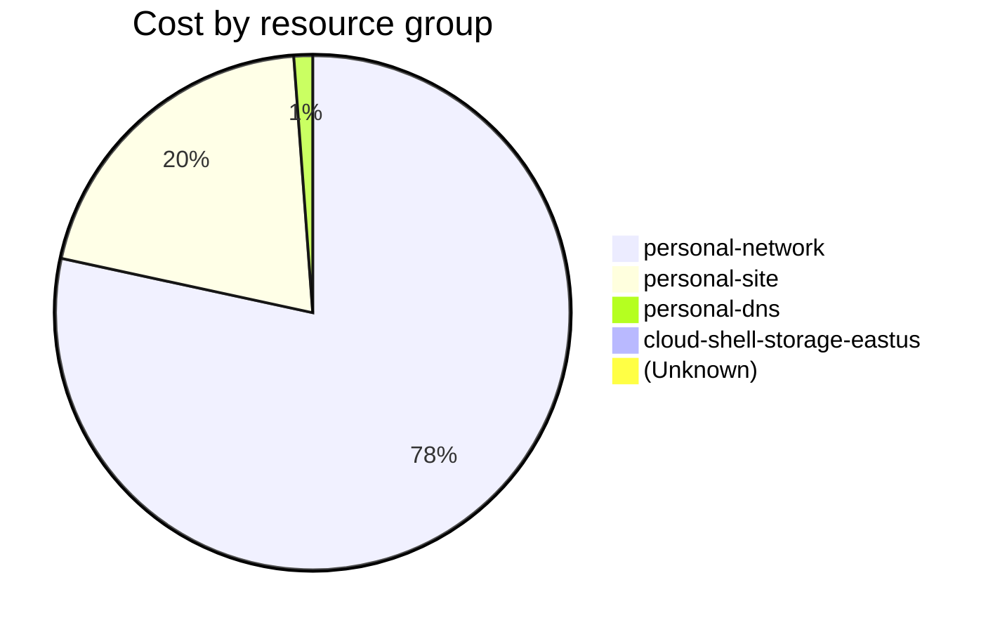

Fetching subscription details...
Fetching cost data...
Fetching forecasted cost data...
Fetching cost data by service name...
Fetching cost data by location...
Fetching cost data by resource group...
# Azure Cost Overview

> Accumulated cost for subscription id `JPF Pay-As-You-Go` from **03/01/2024** to **03/03/2024**

## Totals

|Period|Amount|
|---|---:|
|Today|0.10 USD|
|Yesterday|1.26 USD|
|Last 7 days|4.69 USD|
|Last 30 days|4.69 USD|

```mermaid
gantt
   title Accumulated cost
   dateFormat  X
   axisFormat %s
   section 01 Mar
   USD 3.32 :0, 332
   section 02 Mar
   USD 4.58 :0, 458
   section 03 Mar
   USD 4.69 :0, 469
   section 04 Mar
   USD 6.63 : done, 0, 663
   section 05 Mar
   USD 8.95 : done, 0, 895
   section 06 Mar
   USD 11.00 : done, 0, 1100
   section 07 Mar
   USD 13.06 : done, 0, 1306
   section 08 Mar
   USD 15.36 : done, 0, 1536
   section 09 Mar
   USD 17.48 : done, 0, 1748
   section 10 Mar
   USD 19.70 : done, 0, 1970
   section 11 Mar
   USD 21.47 : done, 0, 2147
   section 12 Mar
   USD 23.61 : done, 0, 2361
   section 13 Mar
   USD 25.50 : done, 0, 2550
   section 14 Mar
   USD 27.38 : done, 0, 2738
   section 15 Mar
   USD 29.51 : done, 0, 2951
   section 16 Mar
   USD 31.45 : done, 0, 3145
   section 17 Mar
   USD 33.50 : done, 0, 3350
   section 18 Mar
   USD 35.09 : done, 0, 3509
   section 19 Mar
   USD 37.07 : done, 0, 3707
   section 20 Mar
   USD 38.78 : done, 0, 3878
   section 21 Mar
   USD 40.48 : done, 0, 4048
   section 22 Mar
   USD 42.44 : done, 0, 4244
   section 23 Mar
   USD 44.21 : done, 0, 4421
   section 24 Mar
   USD 46.08 : done, 0, 4608
   section 25 Mar
   USD 47.51 : done, 0, 4751
   section 26 Mar
   USD 49.30 : done, 0, 4930
   section 27 Mar
   USD 50.84 : done, 0, 5084
   section 28 Mar
   USD 52.37 : done, 0, 5237
   section 29 Mar
   USD 54.16 : done, 0, 5416
   section 30 Mar
   USD 55.75 : done, 0, 5575
   section 31 Mar
   USD 57.46 : done, 0, 5746
```

## By Service Name

|Service|Amount|
|---|---:|
|Storage|1.56 USD|
|Bandwidth|1.18 USD|
|Azure App Service|1.04 USD|
|Virtual Machines|0.80 USD|
|Virtual Network|0.43 USD|
|Azure DNS|0.09 USD|
|Microsoft Defender for Cloud|0.01 USD|
|Log Analytics|0.00 USD|

## By Location

|Location|Amount|
|---|---:|
|US North Central|3.96 USD|
|US Central|1.04 USD|
|Unknown|0.09 USD|
|US East|0.02 USD|
|Unassigned|0.01 USD|
|AP East|0.00 USD|
|EU West|0.00 USD|
|US East 2|0.00 USD|
|US West 2|0.00 USD|

## By Resource Group

|Resource Group|Amount|
|---|---:|
|personal-network|3.99 USD|
|personal-site|1.04 USD|
|personal-dns|0.06 USD|
|cloud-shell-storage-eastus|0.02 USD|
||0.01 USD|

Generated at 2024-03-03 11:35:13 for subscription with id `4913be3f-a345-4652-9bba-767418dd25e3`
