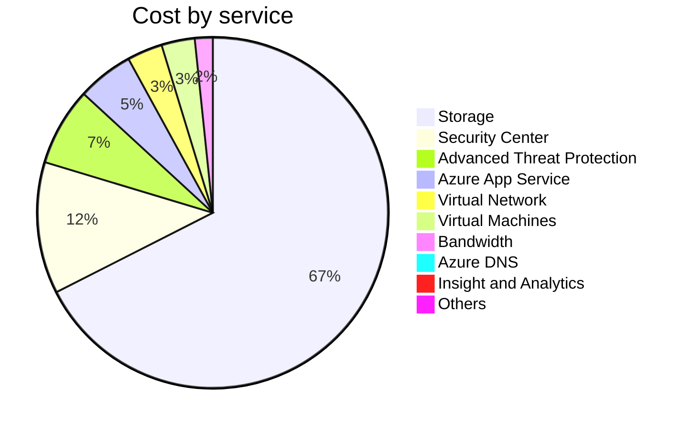
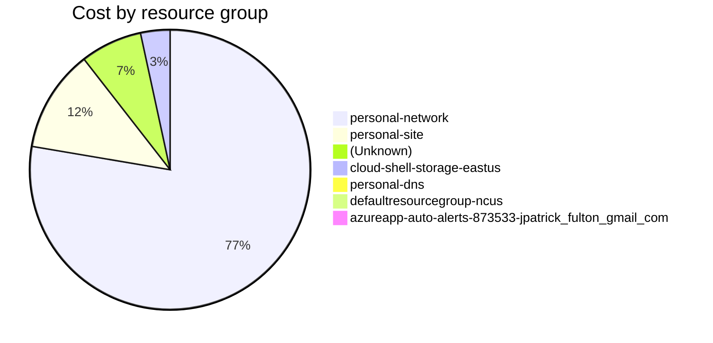

Fetching subscription details...
Fetching cost data...
Fetching forecasted cost data...
Fetching cost data by service name...
Fetching cost data by location...
Fetching cost data by resource group...
# Azure Cost Overview

> Accumulated cost for subscription id `JPF Pay-As-You-Go` from **09/01/2023** to **09/15/2023**

## Totals

|Period|Amount|
|---|---:|
|Today|0.79 USD|
|Yesterday|34.98 USD|
|Last 7 days|120.08 USD|
|Last 30 days|163.69 USD|

```mermaid
gantt
   title Accumulated cost
   dateFormat  X
   axisFormat %s
   section 01 Sep
   USD 6.35 :0, 635
   section 02 Sep
   USD 12.48 :0, 1248
   section 03 Sep
   USD 18.76 :0, 1876
   section 04 Sep
   USD 24.93 :0, 2493
   section 05 Sep
   USD 31.24 :0, 3124
   section 06 Sep
   USD 37.37 :0, 3737
   section 07 Sep
   USD 43.61 :0, 4361
   section 08 Sep
   USD 49.87 :0, 4987
   section 09 Sep
   USD 56.00 :0, 5600
   section 10 Sep
   USD 61.91 :0, 6191
   section 11 Sep
   USD 67.84 :0, 6784
   section 12 Sep
   USD 81.11 :0, 8111
   section 13 Sep
   USD 127.92 :0, 12792
   section 14 Sep
   USD 162.90 :0, 16290
   section 15 Sep
   USD 163.69 :0, 16369
   section 16 Sep
   USD 177.42 : done, 0, 17742
   section 17 Sep
   USD 191.43 : done, 0, 19143
   section 18 Sep
   USD 205.70 : done, 0, 20570
   section 19 Sep
   USD 220.39 : done, 0, 22039
   section 20 Sep
   USD 235.33 : done, 0, 23533
   section 21 Sep
   USD 250.66 : done, 0, 25066
   section 22 Sep
   USD 266.60 : done, 0, 26660
   section 23 Sep
   USD 282.77 : done, 0, 28277
   section 24 Sep
   USD 299.22 : done, 0, 29922
   section 25 Sep
   USD 315.94 : done, 0, 31594
   section 26 Sep
   USD 333.07 : done, 0, 33307
   section 27 Sep
   USD 350.46 : done, 0, 35046
   section 28 Sep
   USD 368.23 : done, 0, 36823
   section 29 Sep
   USD 386.61 : done, 0, 38661
   section 30 Sep
   USD 405.23 : done, 0, 40523
```

## By Service Name

|Service|Amount|
|---|---:|
|Storage|110.05 USD|
|Security Center|19.78 USD|
|Advanced Threat Protection|11.71 USD|
|Azure App Service|8.43 USD|
|Virtual Network|5.32 USD|
|Virtual Machines|5.00 USD|
|Bandwidth|2.69 USD|
|Azure DNS|0.70 USD|
|Insight and Analytics|0.00 USD|
|Others|0.00 USD|

## By Location

|Location|Amount|
|---|---:|
|US North Central|126.56 USD|
|US Central|19.28 USD|
|Unassigned|11.62 USD|
|US East|5.54 USD|
|Unknown|0.70 USD|
|AP East|0.00 USD|
|EU West|0.00 USD|
|Intercontinental|0.00 USD|
|US East 2|0.00 USD|
|US West 2|0.00 USD|

## By Resource Group

|Resource Group|Amount|
|---|---:|
|personal-network|126.79 USD|
|personal-site|19.28 USD|
||11.62 USD|
|cloud-shell-storage-eastus|5.54 USD|
|personal-dns|0.47 USD|
|defaultresourcegroup-ncus|0.00 USD|
|azureapp-auto-alerts-873533-jpatrick_fulton_gmail_com|0.00 USD|

Generated at 2023-09-15 19:00:38 for subscription with id `4913be3f-a345-4652-9bba-767418dd25e3`
