Fetching subscription details...
Fetching cost data...
Fetching forecasted cost data...
Fetching cost data by service name...
Fetching cost data by location...
Fetching cost data by resource group...
# Azure Cost Overview

> Accumulated cost for subscription id `JPF Pay-As-You-Go` from **09/01/2023** to **09/21/2023**

## Totals

|Period|Amount|
|---|---:|
|Today|0.12 USD|
|Yesterday|3.37 USD|
|Last 7 days|117.44 USD|
|Last 30 days|245.36 USD|

```mermaid
gantt
   title Accumulated cost
   dateFormat  X
   axisFormat %s
   section 01 Sep
   USD 6.35 :0, 635
   section 02 Sep
   USD 12.48 :0, 1248
   section 03 Sep
   USD 18.76 :0, 1876
   section 04 Sep
   USD 24.93 :0, 2493
   section 05 Sep
   USD 31.24 :0, 3124
   section 06 Sep
   USD 37.37 :0, 3737
   section 07 Sep
   USD 43.61 :0, 4361
   section 08 Sep
   USD 49.87 :0, 4987
   section 09 Sep
   USD 56.00 :0, 5600
   section 10 Sep
   USD 61.91 :0, 6191
   section 11 Sep
   USD 67.84 :0, 6784
   section 12 Sep
   USD 81.11 :0, 8111
   section 13 Sep
   USD 127.92 :0, 12792
   section 14 Sep
   USD 163.01 :0, 16301
   section 15 Sep
   USD 169.25 :0, 16925
   section 16 Sep
   USD 182.94 :0, 18294
   section 17 Sep
   USD 211.06 :0, 21106
   section 18 Sep
   USD 226.22 :0, 22622
   section 19 Sep
   USD 241.88 :0, 24188
   section 20 Sep
   USD 245.25 :0, 24525
   section 21 Sep
   USD 245.36 :0, 24536
   section 22 Sep
   USD 266.08 : done, 0, 26608
   section 23 Sep
   USD 287.52 : done, 0, 28752
   section 24 Sep
   USD 309.37 : done, 0, 30937
   section 25 Sep
   USD 331.75 : done, 0, 33175
   section 26 Sep
   USD 354.89 : done, 0, 35489
   section 27 Sep
   USD 378.58 : done, 0, 37858
   section 28 Sep
   USD 402.88 : done, 0, 40288
   section 29 Sep
   USD 427.80 : done, 0, 42780
   section 30 Sep
   USD 453.43 : done, 0, 45343
```

## By Service Name

|Service|Amount|
|---|---:|
|Storage|183.34 USD|
|Security Center|19.78 USD|
|Advanced Threat Protection|11.90 USD|
|Azure App Service|11.79 USD|
|Virtual Machines|7.54 USD|
|Virtual Network|7.34 USD|
|Bandwidth|2.69 USD|
|Azure DNS|0.97 USD|
|Insight and Analytics|0.00 USD|
|Others|0.00 USD|

## By Location

|Location|Amount|
|---|---:|
|US North Central|204.34 USD|
|US Central|22.64 USD|
|Unassigned|11.81 USD|
|US East|5.59 USD|
|Unknown|0.97 USD|
|AP East|0.00 USD|
|EU West|0.00 USD|
|Intercontinental|0.00 USD|
|US East 2|0.00 USD|
|Others|0.00 USD|

## By Resource Group

|Resource Group|Amount|
|---|---:|
|personal-network|204.67 USD|
|personal-site|22.64 USD|
||11.81 USD|
|cloud-shell-storage-eastus|5.59 USD|
|personal-dns|0.65 USD|
|defaultresourcegroup-ncus|0.00 USD|
|azureapp-auto-alerts-873533-jpatrick_fulton_gmail_com|0.00 USD|

Generated at 2023-09-21 11:32:36 for subscription with id `4913be3f-a345-4652-9bba-767418dd25e3`
