Fetching subscription details...
Fetching cost data...
Fetching forecasted cost data...
Fetching cost data by service name...
Fetching cost data by location...
Fetching cost data by resource group...
# Azure Cost Overview

> Accumulated cost for subscription id `JPF Pay-As-You-Go` from **01/01/2024** to **01/06/2024**

## Totals

|Period|Amount|
|---|---:|
|Today|0.12 USD|
|Yesterday|2.33 USD|
|Last 7 days|12.99 USD|
|Last 30 days|12.99 USD|

```mermaid
gantt
   title Accumulated cost
   dateFormat  X
   axisFormat %s
   section 01 Jan
   USD 2.59 :0, 259
   section 02 Jan
   USD 5.57 :0, 557
   section 03 Jan
   USD 8.00 :0, 800
   section 04 Jan
   USD 10.53 :0, 1053
   section 05 Jan
   USD 12.87 :0, 1287
   section 06 Jan
   USD 12.99 :0, 1299
   section 07 Jan
   USD 15.41 : done, 0, 1541
   section 08 Jan
   USD 18.00 : done, 0, 1800
   section 09 Jan
   USD 20.57 : done, 0, 2057
   section 10 Jan
   USD 22.86 : done, 0, 2286
   section 11 Jan
   USD 25.24 : done, 0, 2524
   section 12 Jan
   USD 27.40 : done, 0, 2740
   section 13 Jan
   USD 29.74 : done, 0, 2974
   section 14 Jan
   USD 32.14 : done, 0, 3214
   section 15 Jan
   USD 34.70 : done, 0, 3470
   section 16 Jan
   USD 37.25 : done, 0, 3725
   section 17 Jan
   USD 39.52 : done, 0, 3952
   section 18 Jan
   USD 41.87 : done, 0, 4187
   section 19 Jan
   USD 44.01 : done, 0, 4401
   section 20 Jan
   USD 46.32 : done, 0, 4632
   section 21 Jan
   USD 48.71 : done, 0, 4871
   section 22 Jan
   USD 51.24 : done, 0, 5124
   section 23 Jan
   USD 53.77 : done, 0, 5377
   section 24 Jan
   USD 56.01 : done, 0, 5601
   section 25 Jan
   USD 58.34 : done, 0, 5834
   section 26 Jan
   USD 60.46 : done, 0, 6046
   section 27 Jan
   USD 62.75 : done, 0, 6275
   section 28 Jan
   USD 65.11 : done, 0, 6511
   section 29 Jan
   USD 67.62 : done, 0, 6762
   section 30 Jan
   USD 70.13 : done, 0, 7013
   section 31 Jan
   USD 72.35 : done, 0, 7235
```

## By Service Name

|Service|Amount|
|---|---:|
|Storage|4.30 USD|
|Azure App Service|2.88 USD|
|Virtual Machines|2.18 USD|
|Bandwidth|2.04 USD|
|Virtual Network|1.18 USD|
|Azure DNS|0.24 USD|
|Microsoft Defender for Cloud|0.16 USD|
|Functions|0.00 USD|
|Log Analytics|0.00 USD|

## By Location

|Location|Amount|
|---|---:|
|US North Central|9.64 USD|
|US Central|2.90 USD|
|Unknown|0.24 USD|
|Unassigned|0.16 USD|
|US East|0.05 USD|
|AP East|0.00 USD|
|EU West|0.00 USD|
|US East 2|0.00 USD|
|US West 2|0.00 USD|

## By Resource Group

|Resource Group|Amount|
|---|---:|
|personal-network|9.72 USD|
|personal-site|2.90 USD|
|personal-dns|0.16 USD|
||0.16 USD|
|cloud-shell-storage-eastus|0.05 USD|

Generated at 2024-01-06 11:35:12 for subscription with id `4913be3f-a345-4652-9bba-767418dd25e3`
