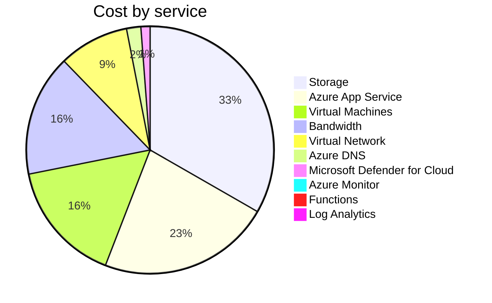
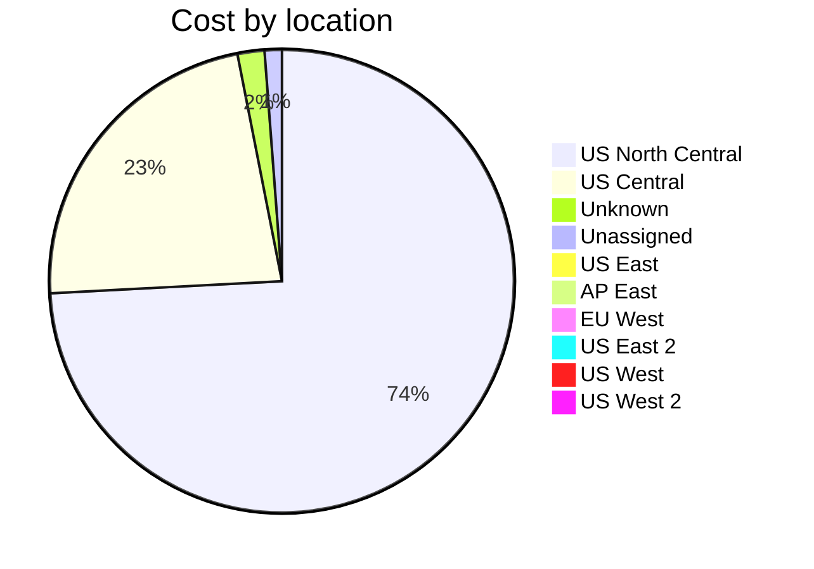

Fetching subscription details...
Fetching cost data...
Fetching forecasted cost data...
Fetching cost data by service name...
Fetching cost data by location...
Fetching cost data by resource group...
# Azure Cost Overview

> Accumulated cost for subscription id `JPF Pay-As-You-Go` from **01/01/2024** to **01/25/2024**

## Totals

|Period|Amount|
|---|---:|
|Today|0.12 USD|
|Yesterday|2.26 USD|
|Last 7 days|17.95 USD|
|Last 30 days|62.67 USD|

```mermaid
gantt
   title Accumulated cost
   dateFormat  X
   axisFormat %s
   section 01 Jan
   USD 2.68 :0, 268
   section 02 Jan
   USD 5.81 :0, 581
   section 03 Jan
   USD 8.29 :0, 829
   section 04 Jan
   USD 10.88 :0, 1088
   section 05 Jan
   USD 13.49 :0, 1349
   section 06 Jan
   USD 16.41 :0, 1641
   section 07 Jan
   USD 18.82 :0, 1882
   section 08 Jan
   USD 21.90 :0, 2190
   section 09 Jan
   USD 24.52 :0, 2452
   section 10 Jan
   USD 26.80 :0, 2680
   section 11 Jan
   USD 29.28 :0, 2928
   section 12 Jan
   USD 31.75 :0, 3175
   section 13 Jan
   USD 34.59 :0, 3459
   section 14 Jan
   USD 36.78 :0, 3678
   section 15 Jan
   USD 39.04 :0, 3904
   section 16 Jan
   USD 42.12 :0, 4212
   section 17 Jan
   USD 44.72 :0, 4472
   section 18 Jan
   USD 47.24 :0, 4724
   section 19 Jan
   USD 49.80 :0, 4980
   section 20 Jan
   USD 52.68 :0, 5268
   section 21 Jan
   USD 55.22 :0, 5522
   section 22 Jan
   USD 57.77 :0, 5777
   section 23 Jan
   USD 60.29 :0, 6029
   section 24 Jan
   USD 62.55 :0, 6255
   section 25 Jan
   USD 62.67 :0, 6267
   section 26 Jan
   USD 65.26 : done, 0, 6526
   section 27 Jan
   USD 68.19 : done, 0, 6819
   section 28 Jan
   USD 70.70 : done, 0, 7070
   section 29 Jan
   USD 73.34 : done, 0, 7334
   section 30 Jan
   USD 75.99 : done, 0, 7599
   section 31 Jan
   USD 78.40 : done, 0, 7840
```

## By Service Name

|Service|Amount|
|---|---:|
|Storage|20.87 USD|
|Azure App Service|14.15 USD|
|Virtual Machines|10.02 USD|
|Bandwidth|9.96 USD|
|Virtual Network|5.75 USD|
|Azure DNS|1.17 USD|
|Microsoft Defender for Cloud|0.75 USD|
|Azure Monitor|0.00 USD|
|Functions|0.00 USD|
|Log Analytics|0.00 USD|

## By Location

|Location|Amount|
|---|---:|
|US North Central|46.31 USD|
|US Central|14.21 USD|
|Unknown|1.17 USD|
|Unassigned|0.75 USD|
|US East|0.23 USD|
|AP East|0.00 USD|
|EU West|0.00 USD|
|US East 2|0.00 USD|
|US West|0.00 USD|
|US West 2|0.00 USD|

## By Resource Group

|Resource Group|Amount|
|---|---:|
|personal-network|46.70 USD|
|personal-site|14.21 USD|
|personal-dns|0.79 USD|
||0.75 USD|
|cloud-shell-storage-eastus|0.23 USD|
|azureapp-auto-alerts-873533-jpatrick_fulton_gmail_com|0.00 USD|

Generated at 2024-01-25 11:39:00 for subscription with id `4913be3f-a345-4652-9bba-767418dd25e3`
