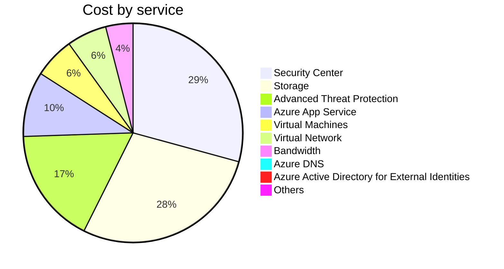
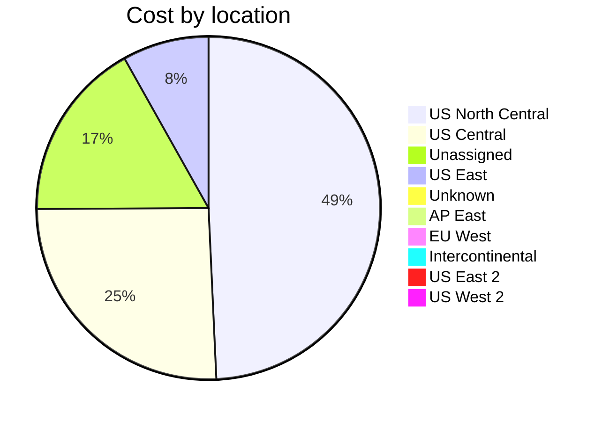
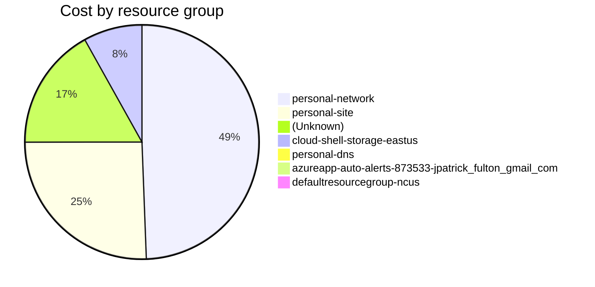

Fetching subscription details...
Fetching cost data...
Fetching forecasted cost data...
Fetching cost data by service name...
Fetching cost data by location...
Fetching cost data by resource group...
# Azure Cost Overview

> Accumulated cost for subscription id `JPF Pay-As-You-Go` from **09/01/2023** to **09/12/2023**

## Totals

|Period|Amount|
|---|---:|
|Today|0.12 USD|
|Yesterday|5.40 USD|
|Last 7 days|42.49 USD|
|Last 30 days|67.42 USD|

```mermaid
gantt
   title Accumulated cost
   dateFormat  X
   axisFormat %s
   section 01 Sep
   USD 6.35 :0, 635
   section 02 Sep
   USD 12.48 :0, 1248
   section 03 Sep
   USD 18.76 :0, 1876
   section 04 Sep
   USD 24.93 :0, 2493
   section 05 Sep
   USD 31.24 :0, 3124
   section 06 Sep
   USD 37.37 :0, 3737
   section 07 Sep
   USD 43.61 :0, 4361
   section 08 Sep
   USD 49.87 :0, 4987
   section 09 Sep
   USD 56.00 :0, 5600
   section 10 Sep
   USD 61.91 :0, 6191
   section 11 Sep
   USD 67.30 :0, 6730
   section 12 Sep
   USD 67.42 :0, 6742
   section 13 Sep
   USD 74.28 : done, 0, 7428
   section 14 Sep
   USD 81.25 : done, 0, 8125
   section 15 Sep
   USD 88.55 : done, 0, 8855
   section 16 Sep
   USD 95.79 : done, 0, 9579
   section 17 Sep
   USD 102.98 : done, 0, 10298
   section 18 Sep
   USD 110.21 : done, 0, 11021
   section 19 Sep
   USD 117.43 : done, 0, 11743
   section 20 Sep
   USD 124.76 : done, 0, 12476
   section 21 Sep
   USD 132.18 : done, 0, 13218
   section 22 Sep
   USD 139.94 : done, 0, 13994
   section 23 Sep
   USD 147.65 : done, 0, 14765
   section 24 Sep
   USD 155.30 : done, 0, 15530
   section 25 Sep
   USD 162.99 : done, 0, 16299
   section 26 Sep
   USD 170.68 : done, 0, 17068
   section 27 Sep
   USD 178.46 : done, 0, 17846
   section 28 Sep
   USD 186.35 : done, 0, 18635
   section 29 Sep
   USD 194.57 : done, 0, 19457
   section 30 Sep
   USD 202.74 : done, 0, 20274
```

## By Service Name

|Service|Amount|
|---|---:|
|Security Center|19.56 USD|
|Storage|18.81 USD|
|Advanced Threat Protection|11.43 USD|
|Azure App Service|6.43 USD|
|Virtual Machines|4.01 USD|
|Virtual Network|3.94 USD|
|Bandwidth|2.69 USD|
|Azure DNS|0.53 USD|
|Azure Active Directory for External Identities|0.00 USD|
|Others|0.00 USD|

## By Location

|Location|Amount|
|---|---:|
|US North Central|32.96 USD|
|US Central|17.15 USD|
|Unassigned|11.34 USD|
|US East|5.44 USD|
|Unknown|0.53 USD|
|AP East|0.00 USD|
|EU West|0.00 USD|
|Intercontinental|0.00 USD|
|US East 2|0.00 USD|
|US West 2|0.00 USD|

## By Resource Group

|Resource Group|Amount|
|---|---:|
|personal-network|33.13 USD|
|personal-site|17.15 USD|
||11.34 USD|
|cloud-shell-storage-eastus|5.44 USD|
|personal-dns|0.36 USD|
|azureapp-auto-alerts-873533-jpatrick_fulton_gmail_com|0.00 USD|
|defaultresourcegroup-ncus|0.00 USD|

Generated at 2023-09-12 11:03:12 for subscription with id `4913be3f-a345-4652-9bba-767418dd25e3`
