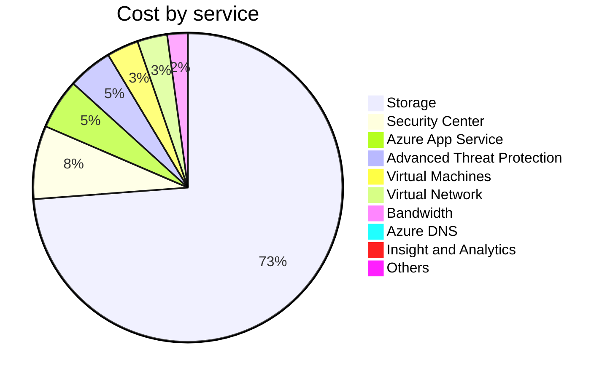
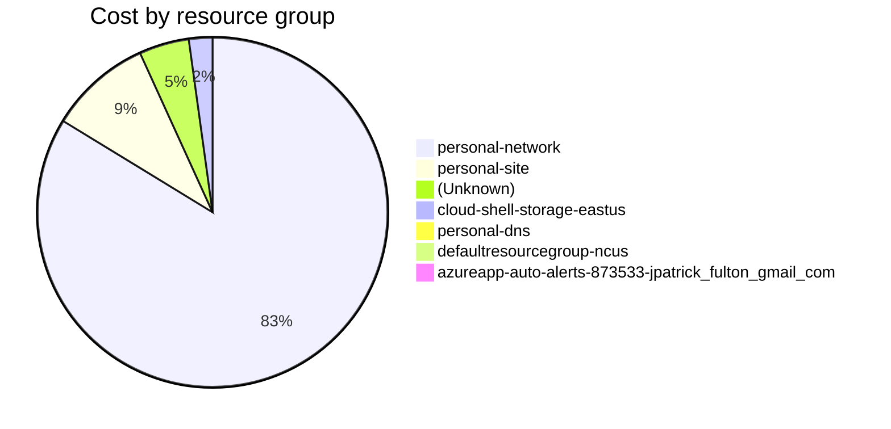

Fetching subscription details...
Fetching cost data...
Fetching forecasted cost data...
Fetching cost data by service name...
Fetching cost data by location...
Fetching cost data by resource group...
# Azure Cost Overview

> Accumulated cost for subscription id `JPF Pay-As-You-Go` from **09/01/2023** to **09/24/2023**

## Totals

|Period|Amount|
|---|---:|
|Today|0.09 USD|
|Yesterday|3.42 USD|
|Last 7 days|74.83 USD|
|Last 30 days|258.72 USD|

```mermaid
gantt
   title Accumulated cost
   dateFormat  X
   axisFormat %s
   section 01 Sep
   USD 6.35 :0, 635
   section 02 Sep
   USD 12.48 :0, 1248
   section 03 Sep
   USD 18.76 :0, 1876
   section 04 Sep
   USD 24.93 :0, 2493
   section 05 Sep
   USD 31.24 :0, 3124
   section 06 Sep
   USD 37.37 :0, 3737
   section 07 Sep
   USD 43.61 :0, 4361
   section 08 Sep
   USD 49.87 :0, 4987
   section 09 Sep
   USD 56.01 :0, 5601
   section 10 Sep
   USD 62.02 :0, 6202
   section 11 Sep
   USD 68.11 :0, 6811
   section 12 Sep
   USD 81.45 :0, 8145
   section 13 Sep
   USD 128.40 :0, 12840
   section 14 Sep
   USD 163.64 :0, 16364
   section 15 Sep
   USD 170.00 :0, 17000
   section 16 Sep
   USD 183.89 :0, 18389
   section 17 Sep
   USD 212.19 :0, 21219
   section 18 Sep
   USD 227.72 :0, 22772
   section 19 Sep
   USD 243.54 :0, 24354
   section 20 Sep
   USD 247.26 :0, 24726
   section 21 Sep
   USD 251.09 :0, 25109
   section 22 Sep
   USD 255.21 :0, 25521
   section 23 Sep
   USD 258.63 :0, 25863
   section 24 Sep
   USD 258.72 :0, 25872
   section 25 Sep
   USD 274.85 : done, 0, 27485
   section 26 Sep
   USD 295.03 : done, 0, 29503
   section 27 Sep
   USD 311.87 : done, 0, 31187
   section 28 Sep
   USD 329.14 : done, 0, 32914
   section 29 Sep
   USD 346.96 : done, 0, 34696
   section 30 Sep
   USD 365.23 : done, 0, 36523
```

## By Service Name

|Service|Amount|
|---|---:|
|Storage|190.10 USD|
|Security Center|19.78 USD|
|Azure App Service|13.56 USD|
|Advanced Threat Protection|12.00 USD|
|Virtual Machines|8.57 USD|
|Virtual Network|8.06 USD|
|Bandwidth|5.53 USD|
|Azure DNS|1.12 USD|
|Insight and Analytics|0.00 USD|
|Others|0.00 USD|

## By Location

|Location|Amount|
|---|---:|
|US North Central|215.64 USD|
|US Central|24.42 USD|
|Unassigned|11.91 USD|
|US East|5.62 USD|
|Unknown|1.12 USD|
|AP East|0.00 USD|
|EU West|0.00 USD|
|Intercontinental|0.00 USD|
|US East 2|0.00 USD|
|Others|0.00 USD|

## By Resource Group

|Resource Group|Amount|
|---|---:|
|personal-network|216.01 USD|
|personal-site|24.42 USD|
||11.91 USD|
|cloud-shell-storage-eastus|5.62 USD|
|personal-dns|0.75 USD|
|defaultresourcegroup-ncus|0.00 USD|
|azureapp-auto-alerts-873533-jpatrick_fulton_gmail_com|0.00 USD|

Generated at 2023-09-24 11:34:07 for subscription with id `4913be3f-a345-4652-9bba-767418dd25e3`
