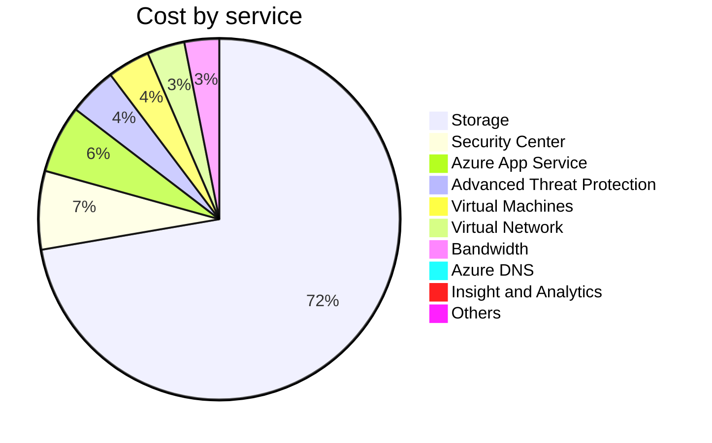

Fetching subscription details...
Fetching cost data...
Fetching forecasted cost data...
Fetching cost data by service name...
Fetching cost data by location...
Fetching cost data by resource group...
# Azure Cost Overview

> Accumulated cost for subscription id `JPF Pay-As-You-Go` from **09/01/2023** to **09/30/2023**

## Totals

|Period|Amount|
|---|---:|
|Today|0.10 USD|
|Yesterday|3.52 USD|
|Last 7 days|25.93 USD|
|Last 30 days|282.99 USD|

```mermaid
gantt
   title Accumulated cost
   dateFormat  X
   axisFormat %s
   section 01 Sep
   USD 6.35 :0, 635
   section 02 Sep
   USD 12.48 :0, 1248
   section 03 Sep
   USD 18.76 :0, 1876
   section 04 Sep
   USD 24.93 :0, 2493
   section 05 Sep
   USD 31.24 :0, 3124
   section 06 Sep
   USD 37.37 :0, 3737
   section 07 Sep
   USD 43.61 :0, 4361
   section 08 Sep
   USD 49.87 :0, 4987
   section 09 Sep
   USD 56.02 :0, 5602
   section 10 Sep
   USD 62.10 :0, 6210
   section 11 Sep
   USD 68.28 :0, 6828
   section 12 Sep
   USD 81.67 :0, 8167
   section 13 Sep
   USD 128.72 :0, 12872
   section 14 Sep
   USD 164.06 :0, 16406
   section 15 Sep
   USD 170.50 :0, 17050
   section 16 Sep
   USD 184.53 :0, 18453
   section 17 Sep
   USD 212.95 :0, 21295
   section 18 Sep
   USD 228.72 :0, 22872
   section 19 Sep
   USD 244.66 :0, 24466
   section 20 Sep
   USD 248.50 :0, 24850
   section 21 Sep
   USD 252.55 :0, 25255
   section 22 Sep
   USD 257.06 :0, 25706
   section 23 Sep
   USD 260.69 :0, 26069
   section 24 Sep
   USD 264.35 :0, 26435
   section 25 Sep
   USD 268.09 :0, 26809
   section 26 Sep
   USD 271.81 :0, 27181
   section 27 Sep
   USD 275.52 :0, 27552
   section 28 Sep
   USD 279.37 :0, 27937
   section 29 Sep
   USD 282.88 :0, 28288
   section 30 Sep
   USD 282.99 :0, 28299
```

## By Service Name

|Service|Amount|
|---|---:|
|Storage|203.55 USD|
|Security Center|19.78 USD|
|Azure App Service|17.11 USD|
|Advanced Threat Protection|12.19 USD|
|Virtual Machines|10.68 USD|
|Virtual Network|9.50 USD|
|Bandwidth|8.76 USD|
|Azure DNS|1.41 USD|
|Insight and Analytics|0.00 USD|
|Others|0.00 USD|

## By Location

|Location|Amount|
|---|---:|
|US North Central|235.80 USD|
|US Central|27.99 USD|
|Unassigned|12.10 USD|
|US East|5.68 USD|
|Unknown|1.41 USD|
|AP East|0.00 USD|
|EU West|0.00 USD|
|Intercontinental|0.00 USD|
|US East 2|0.00 USD|
|Others|0.00 USD|

## By Resource Group

|Resource Group|Amount|
|---|---:|
|personal-network|236.27 USD|
|personal-site|27.99 USD|
||12.10 USD|
|cloud-shell-storage-eastus|5.68 USD|
|personal-dns|0.95 USD|
|defaultresourcegroup-ncus|0.00 USD|
|azureapp-auto-alerts-873533-jpatrick_fulton_gmail_com|0.00 USD|

Generated at 2023-09-30 11:32:27 for subscription with id `4913be3f-a345-4652-9bba-767418dd25e3`
