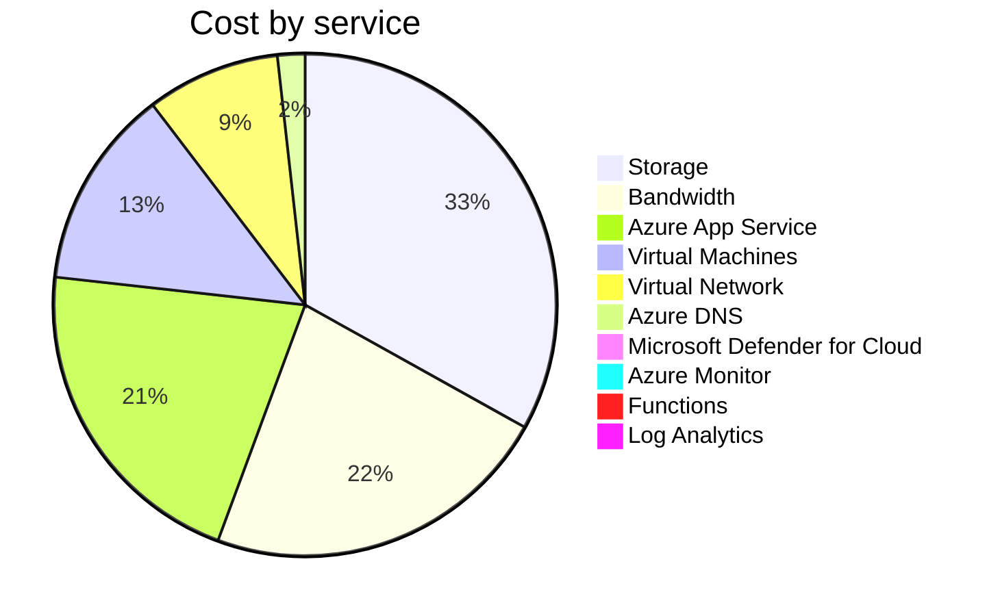

Fetching subscription details...
Fetching cost data...
Fetching forecasted cost data...
Fetching cost data by service name...
Fetching cost data by location...
Fetching cost data by resource group...
# Azure Cost Overview

> Accumulated cost for subscription id `JPF Pay-As-You-Go` from **02/01/2024** to **02/14/2024**

## Totals

|Period|Amount|
|---|---:|
|Today|0.10 USD|
|Yesterday|2.09 USD|
|Last 7 days|17.77 USD|
|Last 30 days|36.50 USD|

```mermaid
gantt
   title Accumulated cost
   dateFormat  X
   axisFormat %s
   section 01 Feb
   USD 2.99 :0, 299
   section 02 Feb
   USD 6.68 :0, 668
   section 03 Feb
   USD 9.81 :0, 981
   section 04 Feb
   USD 12.83 :0, 1283
   section 05 Feb
   USD 15.90 :0, 1590
   section 06 Feb
   USD 18.73 :0, 1873
   section 07 Feb
   USD 21.64 :0, 2164
   section 08 Feb
   USD 25.07 :0, 2507
   section 09 Feb
   USD 27.83 :0, 2783
   section 10 Feb
   USD 30.01 :0, 3001
   section 11 Feb
   USD 32.16 :0, 3216
   section 12 Feb
   USD 34.31 :0, 3431
   section 13 Feb
   USD 36.40 :0, 3640
   section 14 Feb
   USD 36.50 :0, 3650
   section 15 Feb
   USD 39.19 : done, 0, 3919
   section 16 Feb
   USD 41.99 : done, 0, 4199
   section 17 Feb
   USD 45.05 : done, 0, 4505
   section 18 Feb
   USD 47.63 : done, 0, 4763
   section 19 Feb
   USD 49.69 : done, 0, 4969
   section 20 Feb
   USD 52.21 : done, 0, 5221
   section 21 Feb
   USD 54.61 : done, 0, 5461
   section 22 Feb
   USD 57.18 : done, 0, 5718
   section 23 Feb
   USD 59.86 : done, 0, 5986
   section 24 Feb
   USD 62.80 : done, 0, 6280
   section 25 Feb
   USD 65.26 : done, 0, 6526
   section 26 Feb
   USD 67.21 : done, 0, 6721
   section 27 Feb
   USD 69.61 : done, 0, 6961
   section 28 Feb
   USD 71.89 : done, 0, 7189
   section 29 Feb
   USD 74.34 : done, 0, 7434
```

## By Service Name

|Service|Amount|
|---|---:|
|Storage|11.98 USD|
|Bandwidth|8.16 USD|
|Azure App Service|7.65 USD|
|Virtual Machines|4.66 USD|
|Virtual Network|3.11 USD|
|Azure DNS|0.64 USD|
|Microsoft Defender for Cloud|0.31 USD|
|Azure Monitor|0.00 USD|
|Functions|0.00 USD|
|Log Analytics|0.00 USD|

## By Location

|Location|Amount|
|---|---:|
|US North Central|27.74 USD|
|US Central|7.68 USD|
|Unknown|0.64 USD|
|Unassigned|0.31 USD|
|US East|0.13 USD|
|AP East|0.00 USD|
|EU West|0.00 USD|
|US East 2|0.00 USD|
|US West 2|0.00 USD|

## By Resource Group

|Resource Group|Amount|
|---|---:|
|personal-network|27.95 USD|
|personal-site|7.68 USD|
|personal-dns|0.43 USD|
||0.31 USD|
|cloud-shell-storage-eastus|0.13 USD|
|azureapp-auto-alerts-873533-jpatrick_fulton_gmail_com|0.00 USD|

Generated at 2024-02-14 11:35:17 for subscription with id `4913be3f-a345-4652-9bba-767418dd25e3`
