Fetching subscription details...
Fetching cost data...
Fetching forecasted cost data...
Fetching cost data by service name...
Fetching cost data by location...
Fetching cost data by resource group...
# Azure Cost Overview

> Accumulated cost for subscription id `JPF Pay-As-You-Go` from **01/01/2024** to **01/30/2024**

## Totals

|Period|Amount|
|---|---:|
|Today|0.11 USD|
|Yesterday|2.10 USD|
|Last 7 days|19.32 USD|
|Last 30 days|79.42 USD|

```mermaid
gantt
   title Accumulated cost
   dateFormat  X
   axisFormat %s
   section 01 Jan
   USD 2.68 :0, 268
   section 02 Jan
   USD 5.81 :0, 581
   section 03 Jan
   USD 8.29 :0, 829
   section 04 Jan
   USD 10.88 :0, 1088
   section 05 Jan
   USD 13.49 :0, 1349
   section 06 Jan
   USD 16.41 :0, 1641
   section 07 Jan
   USD 18.82 :0, 1882
   section 08 Jan
   USD 21.90 :0, 2190
   section 09 Jan
   USD 24.54 :0, 2454
   section 10 Jan
   USD 26.87 :0, 2687
   section 11 Jan
   USD 29.48 :0, 2948
   section 12 Jan
   USD 32.11 :0, 3211
   section 13 Jan
   USD 35.25 :0, 3525
   section 14 Jan
   USD 37.45 :0, 3745
   section 15 Jan
   USD 39.76 :0, 3976
   section 16 Jan
   USD 43.25 :0, 4325
   section 17 Jan
   USD 46.04 :0, 4604
   section 18 Jan
   USD 48.73 :0, 4873
   section 19 Jan
   USD 51.45 :0, 5145
   section 20 Jan
   USD 54.66 :0, 5466
   section 21 Jan
   USD 57.36 :0, 5736
   section 22 Jan
   USD 60.10 :0, 6010
   section 23 Jan
   USD 62.76 :0, 6276
   section 24 Jan
   USD 65.21 :0, 6521
   section 25 Jan
   USD 67.70 :0, 6770
   section 26 Jan
   USD 70.64 :0, 7064
   section 27 Jan
   USD 74.53 :0, 7453
   section 28 Jan
   USD 77.21 :0, 7721
   section 29 Jan
   USD 79.31 :0, 7931
   section 30 Jan
   USD 79.42 :0, 7942
   section 31 Jan
   USD 82.04 : done, 0, 8204
```

## By Service Name

|Service|Amount|
|---|---:|
|Storage|25.21 USD|
|Azure App Service|17.11 USD|
|Bandwidth|15.78 USD|
|Virtual Machines|12.07 USD|
|Virtual Network|6.95 USD|
|Azure DNS|1.42 USD|
|Microsoft Defender for Cloud|0.87 USD|
|Azure Monitor|0.00 USD|
|Functions|0.00 USD|
|Log Analytics|0.00 USD|

## By Location

|Location|Amount|
|---|---:|
|US North Central|59.67 USD|
|US Central|17.18 USD|
|Unknown|1.42 USD|
|Unassigned|0.87 USD|
|US East|0.28 USD|
|AP East|0.00 USD|
|EU West|0.00 USD|
|US East 2|0.00 USD|
|US West|0.00 USD|
|US West 2|0.00 USD|

## By Resource Group

|Resource Group|Amount|
|---|---:|
|personal-network|60.14 USD|
|personal-site|17.18 USD|
|personal-dns|0.95 USD|
||0.87 USD|
|cloud-shell-storage-eastus|0.28 USD|
|azureapp-auto-alerts-873533-jpatrick_fulton_gmail_com|0.00 USD|

Generated at 2024-01-30 11:47:43 for subscription with id `4913be3f-a345-4652-9bba-767418dd25e3`
