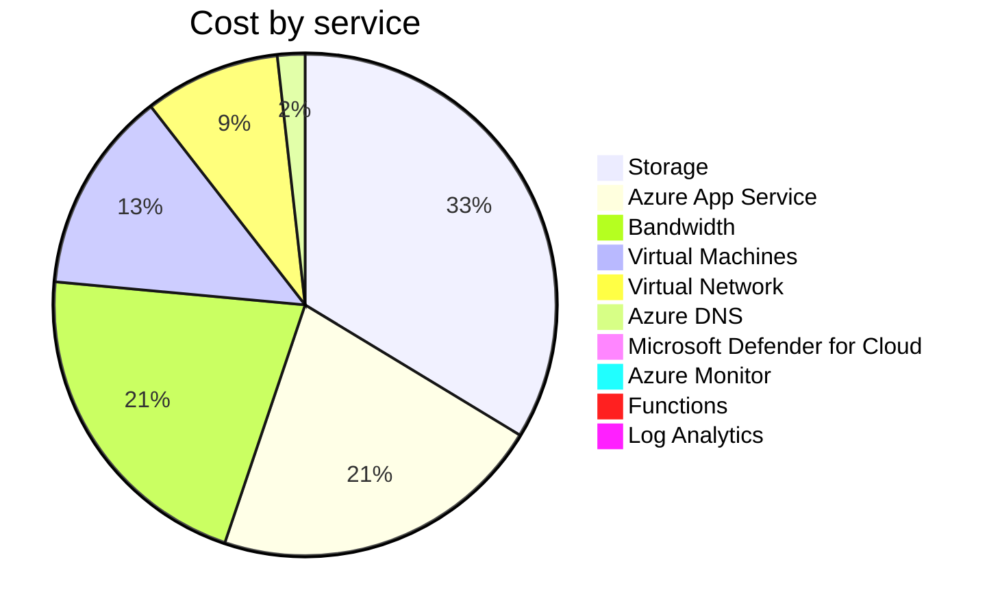
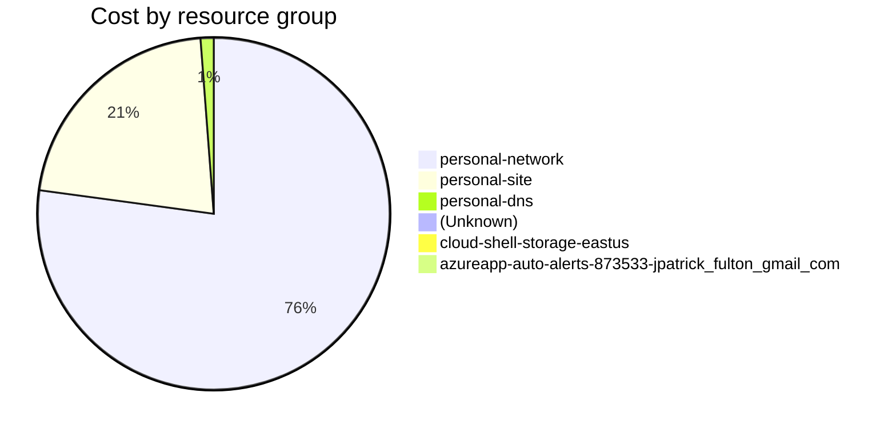

Fetching subscription details...
Fetching cost data...
Fetching forecasted cost data...
Fetching cost data by service name...
Fetching cost data by location...
Fetching cost data by resource group...
# Azure Cost Overview

> Accumulated cost for subscription id `JPF Pay-As-You-Go` from **02/01/2024** to **02/15/2024**

## Totals

|Period|Amount|
|---|---:|
|Today|0.09 USD|
|Yesterday|2.08 USD|
|Last 7 days|17.02 USD|
|Last 30 days|38.67 USD|

## By Service Name

|Service|Amount|
|---|---:|
|Storage|12.91 USD|
|Azure App Service|8.24 USD|
|Bandwidth|8.16 USD|
|Virtual Machines|4.99 USD|
|Virtual Network|3.35 USD|
|Azure DNS|0.68 USD|
|Microsoft Defender for Cloud|0.33 USD|
|Azure Monitor|0.00 USD|
|Functions|0.00 USD|
|Log Analytics|0.00 USD|

## By Location

|Location|Amount|
|---|---:|
|US North Central|29.23 USD|
|US Central|8.27 USD|
|Unknown|0.68 USD|
|Unassigned|0.33 USD|
|US East|0.15 USD|
|AP East|0.00 USD|
|EU West|0.00 USD|
|US East 2|0.00 USD|
|US West 2|0.00 USD|

## By Resource Group

|Resource Group|Amount|
|---|---:|
|personal-network|29.46 USD|
|personal-site|8.27 USD|
|personal-dns|0.46 USD|
||0.33 USD|
|cloud-shell-storage-eastus|0.15 USD|
|azureapp-auto-alerts-873533-jpatrick_fulton_gmail_com|0.00 USD|

Generated at 2024-02-15 11:33:27 for subscription with id `4913be3f-a345-4652-9bba-767418dd25e3`
