Fetching subscription details...
Fetching cost data...
Fetching forecasted cost data...
Fetching cost data by service name...
Fetching cost data by location...
Fetching cost data by resource group...
# Azure Cost Overview

> Accumulated cost for subscription id `JPF Pay-As-You-Go` from **09/01/2024** to **09/03/2024**

## Totals

|Period|Amount|
|---|---:|
|Today|0.00 USD|
|Yesterday|0.08 USD|
|Last 7 days|1.35 USD|
|Last 30 days|1.35 USD|

```mermaid
gantt
   title Accumulated cost
   dateFormat  X
   axisFormat %s
   section 01 Sep
   USD 0.64 :0, 64
   section 02 Sep
   USD 1.27 :0, 127
   section 03 Sep
   USD 1.35 :0, 135
   section 04 Sep
   USD 1.99 : done, 0, 199
   section 05 Sep
   USD 2.63 : done, 0, 263
   section 06 Sep
   USD 3.26 : done, 0, 326
   section 07 Sep
   USD 3.90 : done, 0, 390
   section 08 Sep
   USD 4.54 : done, 0, 454
   section 09 Sep
   USD 5.17 : done, 0, 517
   section 10 Sep
   USD 5.81 : done, 0, 581
   section 11 Sep
   USD 6.44 : done, 0, 644
   section 12 Sep
   USD 7.08 : done, 0, 708
   section 13 Sep
   USD 7.72 : done, 0, 772
   section 14 Sep
   USD 8.35 : done, 0, 835
   section 15 Sep
   USD 8.99 : done, 0, 899
   section 16 Sep
   USD 9.63 : done, 0, 963
   section 17 Sep
   USD 10.26 : done, 0, 1026
   section 18 Sep
   USD 10.90 : done, 0, 1090
   section 19 Sep
   USD 11.54 : done, 0, 1154
   section 20 Sep
   USD 12.17 : done, 0, 1217
   section 21 Sep
   USD 12.81 : done, 0, 1281
   section 22 Sep
   USD 13.45 : done, 0, 1345
   section 23 Sep
   USD 14.08 : done, 0, 1408
   section 24 Sep
   USD 14.72 : done, 0, 1472
   section 25 Sep
   USD 15.36 : done, 0, 1536
   section 26 Sep
   USD 15.99 : done, 0, 1599
   section 27 Sep
   USD 16.63 : done, 0, 1663
   section 28 Sep
   USD 17.26 : done, 0, 1726
   section 29 Sep
   USD 17.90 : done, 0, 1790
   section 30 Sep
   USD 18.54 : done, 0, 1854
```

## By Service Name

|Service|Amount|
|---|---:|
|Azure App Service|1.26 USD|
|Azure DNS|0.07 USD|
|Storage|0.03 USD|
|Bandwidth|0.00 USD|
|Log Analytics|0.00 USD|

## By Location

|Location|Amount|
|---|---:|
|US Central|1.26 USD|
|Unknown|0.07 USD|
|US East|0.02 USD|
|AP East|0.00 USD|
|EU West|0.00 USD|
|US East 2|0.00 USD|
|US West 2|0.00 USD|

## By Resource Group

|Resource Group|Amount|
|---|---:|
|personal-site|1.26 USD|
|personal-dns|0.07 USD|
|cloud-shell-storage-eastus|0.02 USD|

Generated at 2024-09-04 11:22:02 for subscription with id `4913be3f-a345-4652-9bba-767418dd25e3`
