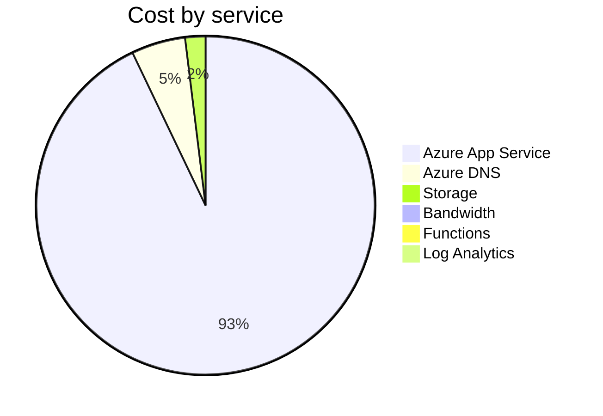

Fetching subscription details...
Fetching cost data...
Fetching forecasted cost data...
Fetching cost data by service name...
Fetching cost data by location...
Fetching cost data by resource group...
# Azure Cost Overview

> Accumulated cost for subscription id `JPF Pay-As-You-Go` from **04/01/2024** to **04/26/2024**

## Totals

|Period|Amount|
|---|---:|
|Today|0.00 USD|
|Yesterday|0.56 USD|
|Last 7 days|4.38 USD|
|Last 30 days|16.49 USD|

```mermaid
gantt
   title Accumulated cost
   dateFormat  X
   axisFormat %s
   section 01 Apr
   USD 0.64 :0, 64
   section 02 Apr
   USD 1.27 :0, 127
   section 03 Apr
   USD 1.91 :0, 191
   section 04 Apr
   USD 2.55 :0, 255
   section 05 Apr
   USD 3.19 :0, 319
   section 06 Apr
   USD 3.83 :0, 383
   section 07 Apr
   USD 4.46 :0, 446
   section 08 Apr
   USD 5.10 :0, 510
   section 09 Apr
   USD 5.74 :0, 574
   section 10 Apr
   USD 6.38 :0, 638
   section 11 Apr
   USD 7.01 :0, 701
   section 12 Apr
   USD 7.65 :0, 765
   section 13 Apr
   USD 8.29 :0, 829
   section 14 Apr
   USD 8.92 :0, 892
   section 15 Apr
   USD 9.56 :0, 956
   section 16 Apr
   USD 10.20 :0, 1020
   section 17 Apr
   USD 10.83 :0, 1083
   section 18 Apr
   USD 11.47 :0, 1147
   section 19 Apr
   USD 12.11 :0, 1211
   section 20 Apr
   USD 12.74 :0, 1274
   section 21 Apr
   USD 13.38 :0, 1338
   section 22 Apr
   USD 14.02 :0, 1402
   section 23 Apr
   USD 14.66 :0, 1466
   section 24 Apr
   USD 15.29 :0, 1529
   section 25 Apr
   USD 15.93 :0, 1593
   section 26 Apr
   USD 16.49 :0, 1649
   section 27 Apr
   USD 17.13 : done, 0, 1713
   section 28 Apr
   USD 17.76 : done, 0, 1776
   section 29 Apr
   USD 18.40 : done, 0, 1840
   section 30 Apr
   USD 19.04 : done, 0, 1904
```

## By Service Name

|Service|Amount|
|---|---:|
|Azure App Service|15.31 USD|
|Azure DNS|0.85 USD|
|Storage|0.32 USD|
|Bandwidth|0.00 USD|
|Functions|0.00 USD|
|Log Analytics|0.00 USD|

## By Location

|Location|Amount|
|---|---:|
|US Central|15.38 USD|
|Unknown|0.85 USD|
|US East|0.26 USD|
|AP East|0.00 USD|
|EU West|0.00 USD|
|US East 2|0.00 USD|
|US West 2|0.00 USD|

## By Resource Group

|Resource Group|Amount|
|---|---:|
|personal-site|15.38 USD|
|personal-dns|0.85 USD|
|cloud-shell-storage-eastus|0.26 USD|

Generated at 2024-04-27 11:23:12 for subscription with id `4913be3f-a345-4652-9bba-767418dd25e3`
