Fetching subscription details...
Fetching cost data...
Fetching forecasted cost data...
Fetching cost data by service name...
Fetching cost data by location...
Fetching cost data by resource group...
# Azure Cost Overview

> Accumulated cost for subscription id `JPF Pay-As-You-Go` from **05/01/2024** to **05/12/2024**

## Totals

|Period|Amount|
|---|---:|
|Today|0.00 USD|
|Yesterday|0.58 USD|
|Last 7 days|4.42 USD|
|Last 30 days|7.61 USD|

```mermaid
gantt
   title Accumulated cost
   dateFormat  X
   axisFormat %s
   section 01 May
   USD 0.64 :0, 64
   section 02 May
   USD 1.27 :0, 127
   section 03 May
   USD 1.91 :0, 191
   section 04 May
   USD 2.55 :0, 255
   section 05 May
   USD 3.19 :0, 319
   section 06 May
   USD 3.82 :0, 382
   section 07 May
   USD 4.46 :0, 446
   section 08 May
   USD 5.09 :0, 509
   section 09 May
   USD 5.75 :0, 575
   section 10 May
   USD 6.39 :0, 639
   section 11 May
   USD 7.03 :0, 703
   section 12 May
   USD 7.61 :0, 761
   section 13 May
   USD 8.25 : done, 0, 825
   section 14 May
   USD 8.89 : done, 0, 889
   section 15 May
   USD 9.53 : done, 0, 953
   section 16 May
   USD 10.17 : done, 0, 1017
   section 17 May
   USD 10.81 : done, 0, 1081
   section 18 May
   USD 11.45 : done, 0, 1145
   section 19 May
   USD 12.09 : done, 0, 1209
   section 20 May
   USD 12.73 : done, 0, 1273
   section 21 May
   USD 13.37 : done, 0, 1337
   section 22 May
   USD 14.01 : done, 0, 1401
   section 23 May
   USD 14.65 : done, 0, 1465
   section 24 May
   USD 15.29 : done, 0, 1529
   section 25 May
   USD 15.93 : done, 0, 1593
   section 26 May
   USD 16.57 : done, 0, 1657
   section 27 May
   USD 17.21 : done, 0, 1721
   section 28 May
   USD 17.85 : done, 0, 1785
   section 29 May
   USD 18.49 : done, 0, 1849
   section 30 May
   USD 19.13 : done, 0, 1913
   section 31 May
   USD 19.77 : done, 0, 1977
```

## By Service Name

|Service|Amount|
|---|---:|
|Azure App Service|7.08 USD|
|Azure DNS|0.39 USD|
|Storage|0.14 USD|
|Bandwidth|0.00 USD|
|Functions|0.00 USD|
|Log Analytics|0.00 USD|

## By Location

|Location|Amount|
|---|---:|
|US Central|7.10 USD|
|Unknown|0.39 USD|
|US East|0.12 USD|
|AP East|0.00 USD|
|EU West|0.00 USD|
|US East 2|0.00 USD|
|US West 2|0.00 USD|

## By Resource Group

|Resource Group|Amount|
|---|---:|
|personal-site|7.10 USD|
|personal-dns|0.39 USD|
|cloud-shell-storage-eastus|0.12 USD|

Generated at 2024-05-13 11:22:00 for subscription with id `4913be3f-a345-4652-9bba-767418dd25e3`
