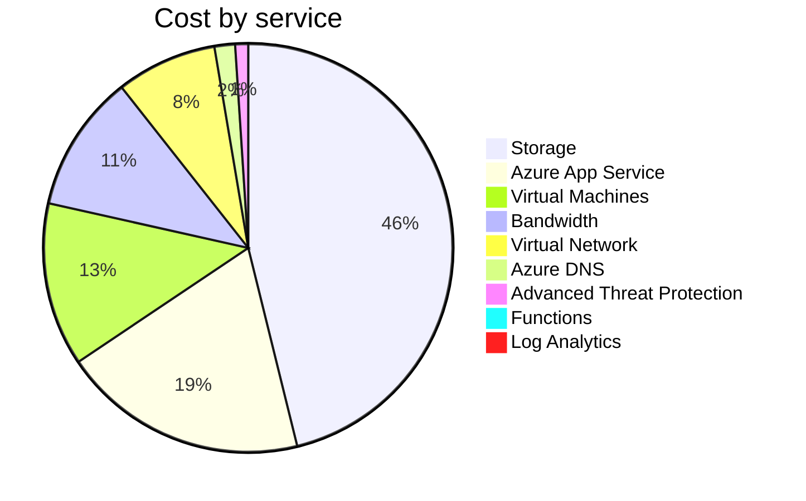
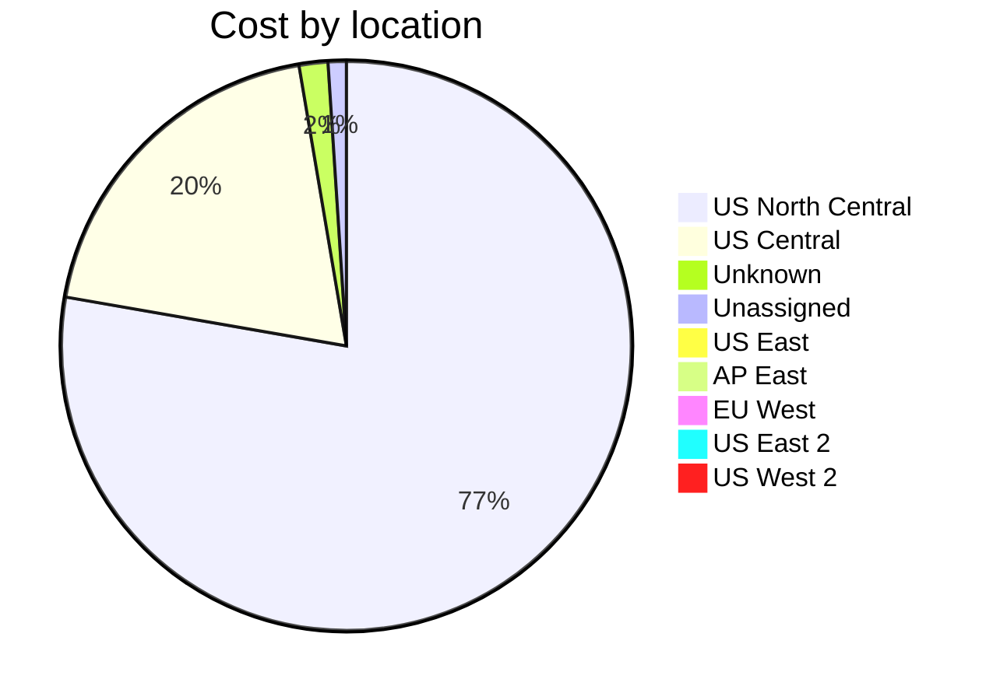
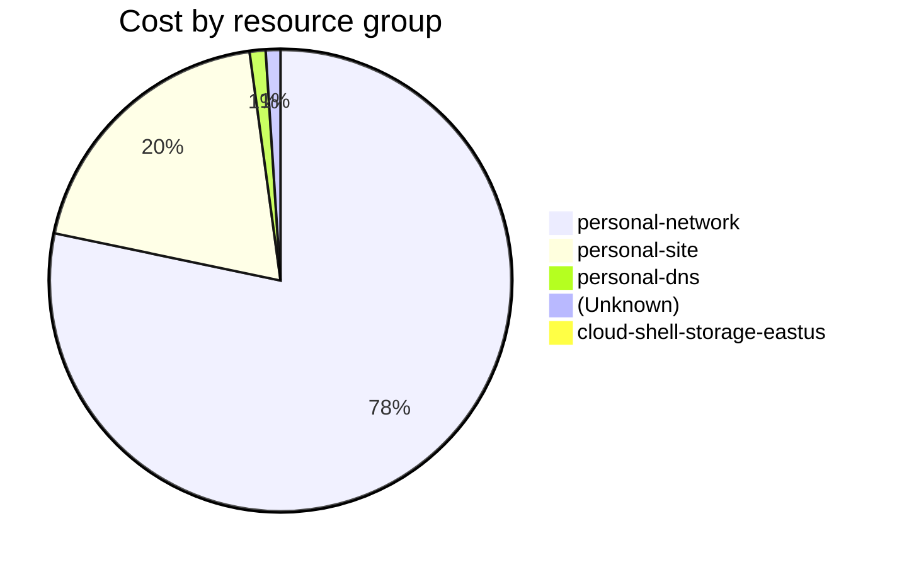

Fetching subscription details...
Fetching cost data...
Fetching forecasted cost data...
Fetching cost data by service name...
Fetching cost data by location...
Fetching cost data by resource group...
# Azure Cost Overview

> Accumulated cost for subscription id `JPF Pay-As-You-Go` from **10/01/2023** to **10/05/2023**

## Totals

|Period|Amount|
|---|---:|
|Today|0.09 USD|
|Yesterday|2.14 USD|
|Last 7 days|11.68 USD|
|Last 30 days|11.68 USD|

```mermaid
gantt
   title Accumulated cost
   dateFormat  X
   axisFormat %s
   section 01 Oct
   USD 3.79 :0, 379
   section 02 Oct
   USD 6.98 :0, 698
   section 03 Oct
   USD 9.45 :0, 945
   section 04 Oct
   USD 11.59 :0, 1159
   section 05 Oct
   USD 11.68 :0, 1168
   section 06 Oct
   USD 14.61 : done, 0, 1461
   section 07 Oct
   USD 16.60 : done, 0, 1660
   section 08 Oct
   USD 18.20 : done, 0, 1820
   section 09 Oct
   USD 19.47 : done, 0, 1947
   section 10 Oct
   USD 21.64 : done, 0, 2164
   section 11 Oct
   USD 22.13 : done, 0, 2213
   section 12 Oct
   USD 22.41 : done, 0, 2241
   section 13 Oct
   USD 22.60 : done, 0, 2260
   section 14 Oct
   USD 22.60 : done, 0, 2260
   section 15 Oct
   USD 22.60 : done, 0, 2260
   section 16 Oct
   USD 22.60 : done, 0, 2260
   section 17 Oct
   USD 22.60 : done, 0, 2260
   section 18 Oct
   USD 22.60 : done, 0, 2260
   section 19 Oct
   USD 22.60 : done, 0, 2260
   section 20 Oct
   USD 22.60 : done, 0, 2260
   section 21 Oct
   USD 22.60 : done, 0, 2260
   section 22 Oct
   USD 22.60 : done, 0, 2260
   section 23 Oct
   USD 22.60 : done, 0, 2260
   section 24 Oct
   USD 22.60 : done, 0, 2260
   section 25 Oct
   USD 22.60 : done, 0, 2260
   section 26 Oct
   USD 22.60 : done, 0, 2260
   section 27 Oct
   USD 22.60 : done, 0, 2260
   section 28 Oct
   USD 22.60 : done, 0, 2260
   section 29 Oct
   USD 22.60 : done, 0, 2260
   section 30 Oct
   USD 22.60 : done, 0, 2260
   section 31 Oct
   USD 22.60 : done, 0, 2260
```

## By Service Name

|Service|Amount|
|---|---:|
|Storage|5.39 USD|
|Azure App Service|2.27 USD|
|Virtual Machines|1.51 USD|
|Bandwidth|1.27 USD|
|Virtual Network|0.93 USD|
|Azure DNS|0.19 USD|
|Advanced Threat Protection|0.12 USD|
|Functions|0.00 USD|
|Log Analytics|0.00 USD|

## By Location

|Location|Amount|
|---|---:|
|US North Central|9.05 USD|
|US Central|2.28 USD|
|Unknown|0.19 USD|
|Unassigned|0.12 USD|
|US East|0.04 USD|
|AP East|0.00 USD|
|EU West|0.00 USD|
|US East 2|0.00 USD|
|US West 2|0.00 USD|

## By Resource Group

|Resource Group|Amount|
|---|---:|
|personal-network|9.12 USD|
|personal-site|2.28 USD|
|personal-dns|0.13 USD|
||0.12 USD|
|cloud-shell-storage-eastus|0.04 USD|

Generated at 2023-10-05 11:31:19 for subscription with id `4913be3f-a345-4652-9bba-767418dd25e3`
