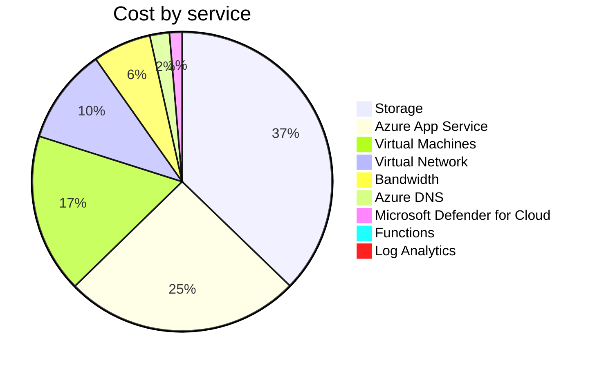

Fetching subscription details...
Fetching cost data...
Fetching forecasted cost data...
Fetching cost data by service name...
Fetching cost data by location...
Fetching cost data by resource group...
# Azure Cost Overview

> Accumulated cost for subscription id `JPF Pay-As-You-Go` from **12/01/2023** to **12/22/2023**

## Totals

|Period|Amount|
|---|---:|
|Today|0.10 USD|
|Yesterday|1.90 USD|
|Last 7 days|15.14 USD|
|Last 30 days|48.48 USD|

```mermaid
gantt
   title Accumulated cost
   dateFormat  X
   axisFormat %s
   section 01 Dec
   USD 2.41 :0, 241
   section 02 Dec
   USD 4.93 :0, 493
   section 03 Dec
   USD 7.79 :0, 779
   section 04 Dec
   USD 10.04 :0, 1004
   section 05 Dec
   USD 12.27 :0, 1227
   section 06 Dec
   USD 15.11 :0, 1511
   section 07 Dec
   USD 17.58 :0, 1758
   section 08 Dec
   USD 19.73 :0, 1973
   section 09 Dec
   USD 22.14 :0, 2214
   section 10 Dec
   USD 24.44 :0, 2444
   section 11 Dec
   USD 26.72 :0, 2672
   section 12 Dec
   USD 28.93 :0, 2893
   section 13 Dec
   USD 31.13 :0, 3113
   section 14 Dec
   USD 33.34 :0, 3334
   section 15 Dec
   USD 35.49 :0, 3549
   section 16 Dec
   USD 37.67 :0, 3767
   section 17 Dec
   USD 39.85 :0, 3985
   section 18 Dec
   USD 42.09 :0, 4209
   section 19 Dec
   USD 44.33 :0, 4433
   section 20 Dec
   USD 46.48 :0, 4648
   section 21 Dec
   USD 48.39 :0, 4839
   section 22 Dec
   USD 48.48 :0, 4848
   section 23 Dec
   USD 50.79 : done, 0, 5079
   section 24 Dec
   USD 52.93 : done, 0, 5293
   section 25 Dec
   USD 55.00 : done, 0, 5500
   section 26 Dec
   USD 57.04 : done, 0, 5704
   section 27 Dec
   USD 59.07 : done, 0, 5907
   section 28 Dec
   USD 61.25 : done, 0, 6125
   section 29 Dec
   USD 63.30 : done, 0, 6330
   section 30 Dec
   USD 65.52 : done, 0, 6552
   section 31 Dec
   USD 67.57 : done, 0, 6757
```

## By Service Name

|Service|Amount|
|---|---:|
|Storage|18.06 USD|
|Azure App Service|12.33 USD|
|Virtual Machines|8.35 USD|
|Virtual Network|5.01 USD|
|Bandwidth|3.05 USD|
|Azure DNS|1.02 USD|
|Microsoft Defender for Cloud|0.66 USD|
|Functions|0.00 USD|
|Log Analytics|0.00 USD|

## By Location

|Location|Amount|
|---|---:|
|US North Central|34.22 USD|
|US Central|12.37 USD|
|Unknown|1.02 USD|
|Unassigned|0.66 USD|
|US East|0.20 USD|
|AP East|0.00 USD|
|EU West|0.00 USD|
|US East 2|0.00 USD|
|US West 2|0.00 USD|

## By Resource Group

|Resource Group|Amount|
|---|---:|
|personal-network|34.56 USD|
|personal-site|12.37 USD|
|personal-dns|0.69 USD|
||0.66 USD|
|cloud-shell-storage-eastus|0.20 USD|

Generated at 2023-12-22 11:35:18 for subscription with id `4913be3f-a345-4652-9bba-767418dd25e3`
