Fetching subscription details...
Fetching cost data...
Fetching forecasted cost data...
Fetching cost data by service name...
Fetching cost data by location...
Fetching cost data by resource group...
# Azure Cost Overview

> Accumulated cost for subscription id `JPF Pay-As-You-Go` from **02/01/2024** to **02/20/2024**

## Totals

|Period|Amount|
|---|---:|
|Today|0.12 USD|
|Yesterday|2.05 USD|
|Last 7 days|15.24 USD|
|Last 30 days|49.54 USD|

```mermaid
gantt
   title Accumulated cost
   dateFormat  X
   axisFormat %s
   section 01 Feb
   USD 2.99 :0, 299
   section 02 Feb
   USD 6.68 :0, 668
   section 03 Feb
   USD 9.81 :0, 981
   section 04 Feb
   USD 12.83 :0, 1283
   section 05 Feb
   USD 15.90 :0, 1590
   section 06 Feb
   USD 18.73 :0, 1873
   section 07 Feb
   USD 21.64 :0, 2164
   section 08 Feb
   USD 25.07 :0, 2507
   section 09 Feb
   USD 27.83 :0, 2783
   section 10 Feb
   USD 30.01 :0, 3001
   section 11 Feb
   USD 32.16 :0, 3216
   section 12 Feb
   USD 34.31 :0, 3431
   section 13 Feb
   USD 36.50 :0, 3650
   section 14 Feb
   USD 38.68 :0, 3868
   section 15 Feb
   USD 40.85 :0, 4085
   section 16 Feb
   USD 43.04 :0, 4304
   section 17 Feb
   USD 45.20 :0, 4520
   section 18 Feb
   USD 47.38 :0, 4738
   section 19 Feb
   USD 49.43 :0, 4943
   section 20 Feb
   USD 49.54 :0, 4954
   section 21 Feb
   USD 51.47 : done, 0, 5147
   section 22 Feb
   USD 53.66 : done, 0, 5366
   section 23 Feb
   USD 55.98 : done, 0, 5598
   section 24 Feb
   USD 57.97 : done, 0, 5797
   section 25 Feb
   USD 60.09 : done, 0, 6009
   section 26 Feb
   USD 61.90 : done, 0, 6190
   section 27 Feb
   USD 63.94 : done, 0, 6394
   section 28 Feb
   USD 65.64 : done, 0, 6564
   section 29 Feb
   USD 67.59 : done, 0, 6759
```

## By Service Name

|Service|Amount|
|---|---:|
|Storage|17.50 USD|
|Azure App Service|11.17 USD|
|Bandwidth|8.16 USD|
|Virtual Machines|6.77 USD|
|Virtual Network|4.55 USD|
|Azure DNS|0.93 USD|
|Microsoft Defender for Cloud|0.46 USD|
|Azure Monitor|0.00 USD|
|Functions|0.00 USD|
|Log Analytics|0.00 USD|

## By Location

|Location|Amount|
|---|---:|
|US North Central|36.74 USD|
|US Central|11.22 USD|
|Unknown|0.93 USD|
|Unassigned|0.46 USD|
|US East|0.20 USD|
|AP East|0.00 USD|
|EU West|0.00 USD|
|US East 2|0.00 USD|
|US West|0.00 USD|
|US West 2|0.00 USD|

## By Resource Group

|Resource Group|Amount|
|---|---:|
|personal-network|37.05 USD|
|personal-site|11.22 USD|
|personal-dns|0.62 USD|
||0.46 USD|
|cloud-shell-storage-eastus|0.20 USD|
|azureapp-auto-alerts-873533-jpatrick_fulton_gmail_com|0.00 USD|

Generated at 2024-02-20 11:36:27 for subscription with id `4913be3f-a345-4652-9bba-767418dd25e3`
