Fetching subscription details...
Fetching cost data...
Fetching forecasted cost data...
Fetching cost data by service name...
Fetching cost data by location...
Fetching cost data by resource group...
# Azure Cost Overview

> Accumulated cost for subscription id `JPF Pay-As-You-Go` from **04/01/2024** to **04/14/2024**

## Totals

|Period|Amount|
|---|---:|
|Today|0.00 USD|
|Yesterday|0.59 USD|
|Last 7 days|4.41 USD|
|Last 30 days|8.87 USD|

```mermaid
gantt
   title Accumulated cost
   dateFormat  X
   axisFormat %s
   section 01 Apr
   USD 0.64 :0, 64
   section 02 Apr
   USD 1.27 :0, 127
   section 03 Apr
   USD 1.91 :0, 191
   section 04 Apr
   USD 2.55 :0, 255
   section 05 Apr
   USD 3.19 :0, 319
   section 06 Apr
   USD 3.83 :0, 383
   section 07 Apr
   USD 4.46 :0, 446
   section 08 Apr
   USD 5.10 :0, 510
   section 09 Apr
   USD 5.74 :0, 574
   section 10 Apr
   USD 6.38 :0, 638
   section 11 Apr
   USD 7.01 :0, 701
   section 12 Apr
   USD 7.65 :0, 765
   section 13 Apr
   USD 8.29 :0, 829
   section 14 Apr
   USD 8.87 :0, 887
   section 15 Apr
   USD 9.51 : done, 0, 951
   section 16 Apr
   USD 10.15 : done, 0, 1015
   section 17 Apr
   USD 10.78 : done, 0, 1078
   section 18 Apr
   USD 11.42 : done, 0, 1142
   section 19 Apr
   USD 12.06 : done, 0, 1206
   section 20 Apr
   USD 12.70 : done, 0, 1270
   section 21 Apr
   USD 13.33 : done, 0, 1333
   section 22 Apr
   USD 13.97 : done, 0, 1397
   section 23 Apr
   USD 14.61 : done, 0, 1461
   section 24 Apr
   USD 15.25 : done, 0, 1525
   section 25 Apr
   USD 15.88 : done, 0, 1588
   section 26 Apr
   USD 16.52 : done, 0, 1652
   section 27 Apr
   USD 17.16 : done, 0, 1716
   section 28 Apr
   USD 17.80 : done, 0, 1780
   section 29 Apr
   USD 18.43 : done, 0, 1843
   section 30 Apr
   USD 19.07 : done, 0, 1907
```

## By Service Name

|Service|Amount|
|---|---:|
|Azure App Service|8.24 USD|
|Azure DNS|0.46 USD|
|Storage|0.18 USD|
|Bandwidth|0.00 USD|
|Functions|0.00 USD|
|Log Analytics|0.00 USD|

## By Location

|Location|Amount|
|---|---:|
|US Central|8.27 USD|
|Unknown|0.46 USD|
|US East|0.14 USD|
|AP East|0.00 USD|
|EU West|0.00 USD|
|US East 2|0.00 USD|
|US West 2|0.00 USD|

## By Resource Group

|Resource Group|Amount|
|---|---:|
|personal-site|8.27 USD|
|personal-dns|0.46 USD|
|cloud-shell-storage-eastus|0.14 USD|

Generated at 2024-04-15 11:22:50 for subscription with id `4913be3f-a345-4652-9bba-767418dd25e3`
