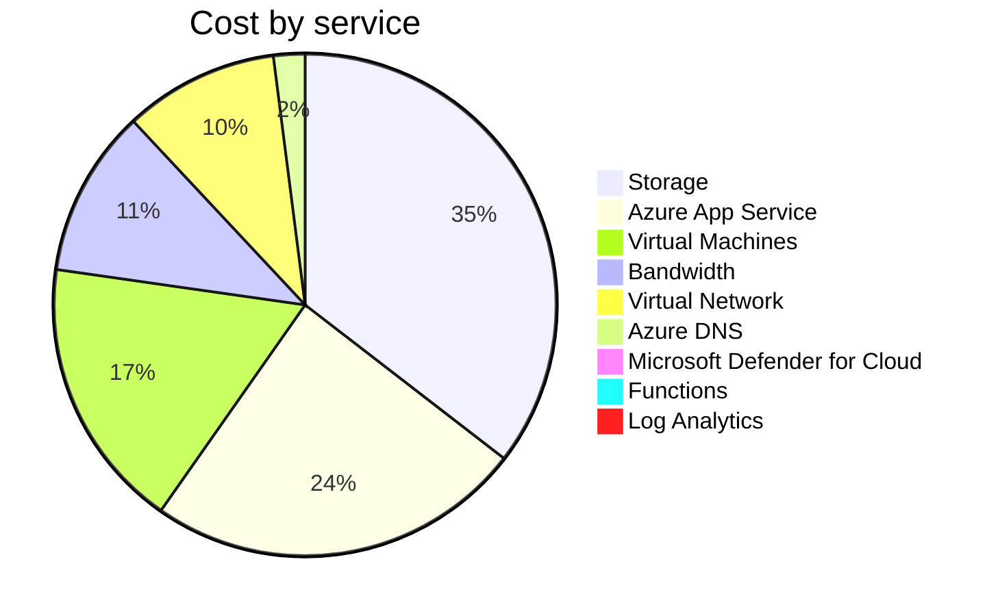
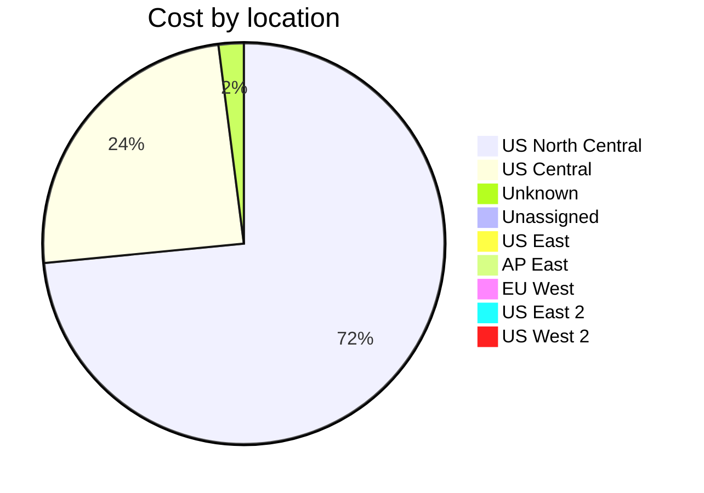
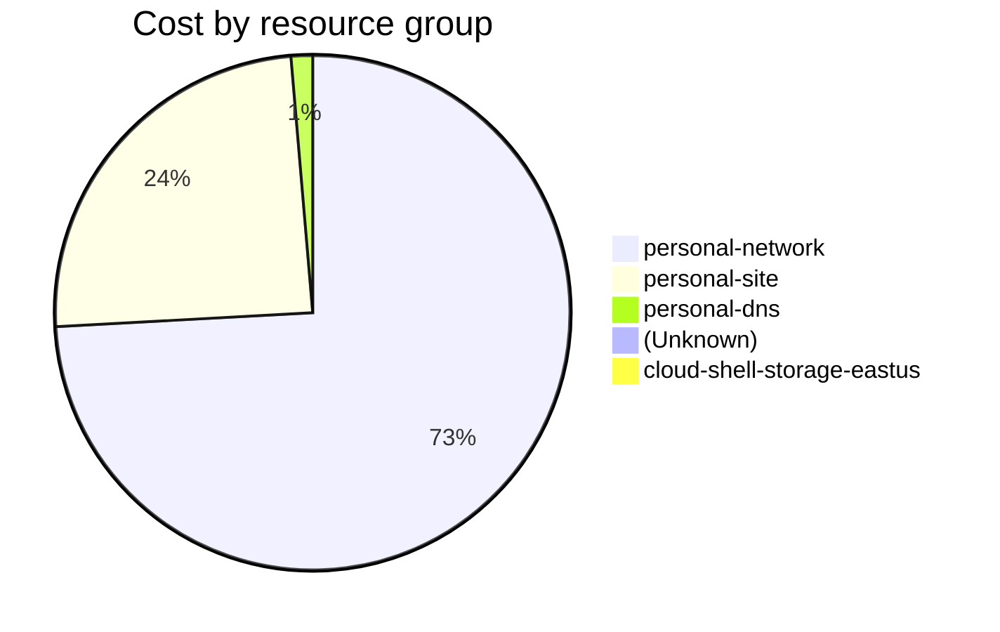

Fetching subscription details...
Fetching cost data...
Fetching forecasted cost data...
Fetching cost data by service name...
Fetching cost data by location...
Fetching cost data by resource group...
# Azure Cost Overview

> Accumulated cost for subscription id `JPF Pay-As-You-Go` from **12/01/2023** to **12/06/2023**

## Totals

|Period|Amount|
|---|---:|
|Today|0.11 USD|
|Yesterday|2.04 USD|
|Last 7 days|11.99 USD|
|Last 30 days|11.99 USD|

```mermaid
gantt
   title Accumulated cost
   dateFormat  X
   axisFormat %s
   section 01 Dec
   USD 2.37 :0, 237
   section 02 Dec
   USD 4.84 :0, 484
   section 03 Dec
   USD 7.59 :0, 759
   section 04 Dec
   USD 9.83 :0, 983
   section 05 Dec
   USD 11.87 :0, 1187
   section 06 Dec
   USD 11.99 :0, 1199
   section 07 Dec
   USD 14.42 : done, 0, 1442
   section 08 Dec
   USD 16.83 : done, 0, 1683
   section 09 Dec
   USD 19.25 : done, 0, 1925
   section 10 Dec
   USD 21.67 : done, 0, 2167
   section 11 Dec
   USD 24.16 : done, 0, 2416
   section 12 Dec
   USD 26.76 : done, 0, 2676
   section 13 Dec
   USD 29.19 : done, 0, 2919
   section 14 Dec
   USD 31.63 : done, 0, 3163
   section 15 Dec
   USD 34.05 : done, 0, 3405
   section 16 Dec
   USD 36.49 : done, 0, 3649
   section 17 Dec
   USD 38.92 : done, 0, 3892
   section 18 Dec
   USD 41.41 : done, 0, 4141
   section 19 Dec
   USD 44.03 : done, 0, 4403
   section 20 Dec
   USD 46.46 : done, 0, 4646
   section 21 Dec
   USD 48.91 : done, 0, 4891
   section 22 Dec
   USD 51.34 : done, 0, 5134
   section 23 Dec
   USD 53.79 : done, 0, 5379
   section 24 Dec
   USD 56.23 : done, 0, 5623
   section 25 Dec
   USD 58.74 : done, 0, 5874
   section 26 Dec
   USD 61.37 : done, 0, 6137
   section 27 Dec
   USD 63.81 : done, 0, 6381
   section 28 Dec
   USD 66.27 : done, 0, 6627
   section 29 Dec
   USD 68.71 : done, 0, 6871
   section 30 Dec
   USD 71.17 : done, 0, 7117
   section 31 Dec
   USD 73.62 : done, 0, 7362
```

## By Service Name

|Service|Amount|
|---|---:|
|Storage|4.21 USD|
|Azure App Service|2.88 USD|
|Virtual Machines|2.08 USD|
|Bandwidth|1.28 USD|
|Virtual Network|1.18 USD|
|Azure DNS|0.24 USD|
|Microsoft Defender for Cloud|0.11 USD|
|Functions|0.00 USD|
|Log Analytics|0.00 USD|

## By Location

|Location|Amount|
|---|---:|
|US North Central|8.69 USD|
|US Central|2.90 USD|
|Unknown|0.24 USD|
|Unassigned|0.11 USD|
|US East|0.05 USD|
|AP East|0.00 USD|
|EU West|0.00 USD|
|US East 2|0.00 USD|
|US West 2|0.00 USD|

## By Resource Group

|Resource Group|Amount|
|---|---:|
|personal-network|8.77 USD|
|personal-site|2.90 USD|
|personal-dns|0.16 USD|
||0.11 USD|
|cloud-shell-storage-eastus|0.05 USD|

Generated at 2023-12-06 11:34:30 for subscription with id `4913be3f-a345-4652-9bba-767418dd25e3`
