Fetching subscription details...
Fetching cost data...
Fetching forecasted cost data...
Fetching cost data by service name...
Fetching cost data by location...
Fetching cost data by resource group...
# Azure Cost Overview

> Accumulated cost for subscription id `JPF Pay-As-You-Go` from **10/01/2023** to **10/20/2023**

## Totals

|Period|Amount|
|---|---:|
|Today|0.09 USD|
|Yesterday|1.95 USD|
|Last 7 days|14.72 USD|
|Last 30 days|44.99 USD|

```mermaid
gantt
   title Accumulated cost
   dateFormat  X
   axisFormat %s
   section 01 Oct
   USD 3.83 :0, 383
   section 02 Oct
   USD 7.06 :0, 706
   section 03 Oct
   USD 9.56 :0, 956
   section 04 Oct
   USD 12.08 :0, 1208
   section 05 Oct
   USD 14.49 :0, 1449
   section 06 Oct
   USD 17.05 :0, 1705
   section 07 Oct
   USD 19.51 :0, 1951
   section 08 Oct
   USD 21.67 :0, 2167
   section 09 Oct
   USD 23.92 :0, 2392
   section 10 Oct
   USD 26.03 :0, 2603
   section 11 Oct
   USD 28.15 :0, 2815
   section 12 Oct
   USD 30.27 :0, 3027
   section 13 Oct
   USD 32.39 :0, 3239
   section 14 Oct
   USD 34.49 :0, 3449
   section 15 Oct
   USD 36.58 :0, 3658
   section 16 Oct
   USD 38.71 :0, 3871
   section 17 Oct
   USD 40.82 :0, 4082
   section 18 Oct
   USD 42.95 :0, 4295
   section 19 Oct
   USD 44.90 :0, 4490
   section 20 Oct
   USD 44.99 :0, 4499
   section 21 Oct
   USD 46.69 : done, 0, 4669
   section 22 Oct
   USD 48.17 : done, 0, 4817
   section 23 Oct
   USD 49.37 : done, 0, 4937
   section 24 Oct
   USD 50.05 : done, 0, 5005
   section 25 Oct
   USD 50.85 : done, 0, 5085
   section 26 Oct
   USD 52.23 : done, 0, 5223
   section 27 Oct
   USD 53.50 : done, 0, 5350
   section 28 Oct
   USD 54.59 : done, 0, 5459
   section 29 Oct
   USD 55.45 : done, 0, 5545
   section 30 Oct
   USD 56.02 : done, 0, 5602
   section 31 Oct
   USD 56.08 : done, 0, 5608
```

## By Service Name

|Service|Amount|
|---|---:|
|Storage|18.21 USD|
|Azure App Service|11.17 USD|
|Virtual Machines|6.86 USD|
|Virtual Network|4.54 USD|
|Bandwidth|2.79 USD|
|Azure DNS|0.92 USD|
|Advanced Threat Protection|0.50 USD|
|Azure Active Directory for External Identities|0.00 USD|
|Azure Monitor|0.00 USD|
|Others|0.00 USD|

## By Location

|Location|Amount|
|---|---:|
|US North Central|32.17 USD|
|US Central|11.22 USD|
|Unknown|0.92 USD|
|Unassigned|0.50 USD|
|US East|0.18 USD|
|AP East|0.00 USD|
|EU West|0.00 USD|
|US East 2|0.00 USD|
|US West 2|0.00 USD|

## By Resource Group

|Resource Group|Amount|
|---|---:|
|personal-network|32.47 USD|
|personal-site|11.22 USD|
|personal-dns|0.62 USD|
||0.50 USD|
|cloud-shell-storage-eastus|0.18 USD|
|azureapp-auto-alerts-873533-jpatrick_fulton_gmail_com|0.00 USD|

Generated at 2023-10-20 11:34:20 for subscription with id `4913be3f-a345-4652-9bba-767418dd25e3`
