Fetching subscription details...
Fetching cost data...
Fetching forecasted cost data...
Fetching cost data by service name...
Fetching cost data by location...
Fetching cost data by resource group...
# Azure Cost Overview

> Accumulated cost for subscription id `JPF Pay-As-You-Go` from **11/01/2023** to **11/29/2023**

## Totals

|Period|Amount|
|---|---:|
|Today|0.09 USD|
|Yesterday|2.32 USD|
|Last 7 days|16.21 USD|
|Last 30 days|66.12 USD|

```mermaid
gantt
   title Accumulated cost
   dateFormat  X
   axisFormat %s
   section 01 Nov
   USD 2.50 :0, 250
   section 02 Nov
   USD 4.87 :0, 487
   section 03 Nov
   USD 7.51 :0, 751
   section 04 Nov
   USD 9.95 :0, 995
   section 05 Nov
   USD 12.34 :0, 1234
   section 06 Nov
   USD 14.80 :0, 1480
   section 07 Nov
   USD 17.20 :0, 1720
   section 08 Nov
   USD 19.70 :0, 1970
   section 09 Nov
   USD 22.18 :0, 2218
   section 10 Nov
   USD 24.48 :0, 2448
   section 11 Nov
   USD 26.76 :0, 2676
   section 12 Nov
   USD 29.10 :0, 2910
   section 13 Nov
   USD 31.47 :0, 3147
   section 14 Nov
   USD 33.63 :0, 3363
   section 15 Nov
   USD 35.94 :0, 3594
   section 16 Nov
   USD 38.20 :0, 3820
   section 17 Nov
   USD 40.50 :0, 4050
   section 18 Nov
   USD 42.76 :0, 4276
   section 19 Nov
   USD 45.03 :0, 4503
   section 20 Nov
   USD 47.38 :0, 4738
   section 21 Nov
   USD 49.91 :0, 4991
   section 22 Nov
   USD 52.20 :0, 5220
   section 23 Nov
   USD 54.62 :0, 5462
   section 24 Nov
   USD 56.92 :0, 5692
   section 25 Nov
   USD 59.26 :0, 5926
   section 26 Nov
   USD 61.49 :0, 6149
   section 27 Nov
   USD 63.70 :0, 6370
   section 28 Nov
   USD 66.02 :0, 6602
   section 29 Nov
   USD 66.12 :0, 6612
   section 30 Nov
   USD 68.42 : done, 0, 6842
```

## By Service Name

|Service|Amount|
|---|---:|
|Storage|24.69 USD|
|Azure App Service|16.47 USD|
|Virtual Machines|10.57 USD|
|Virtual Network|6.70 USD|
|Bandwidth|5.57 USD|
|Azure DNS|1.36 USD|
|Microsoft Defender for Cloud|0.75 USD|
|Functions|0.00 USD|
|Log Analytics|0.00 USD|

## By Location

|Location|Amount|
|---|---:|
|US North Central|47.19 USD|
|US Central|16.54 USD|
|Unknown|1.36 USD|
|Unassigned|0.75 USD|
|US East|0.28 USD|
|AP East|0.00 USD|
|EU West|0.00 USD|
|US East 2|0.00 USD|
|US West 2|0.00 USD|

## By Resource Group

|Resource Group|Amount|
|---|---:|
|personal-network|47.64 USD|
|personal-site|16.54 USD|
|personal-dns|0.91 USD|
||0.75 USD|
|cloud-shell-storage-eastus|0.28 USD|

Generated at 2023-11-29 11:35:52 for subscription with id `4913be3f-a345-4652-9bba-767418dd25e3`
