Fetching subscription details...
Fetching cost data...
Fetching forecasted cost data...
Fetching cost data by service name...
Fetching cost data by location...
Fetching cost data by resource group...
# Azure Cost Overview

> Accumulated cost for subscription id `JPF Pay-As-You-Go` from **08/01/2024** to **08/14/2024**

## Totals

|Period|Amount|
|---|---:|
|Today|0.00 USD|
|Yesterday|0.58 USD|
|Last 7 days|4.40 USD|
|Last 30 days|8.85 USD|

```mermaid
gantt
   title Accumulated cost
   dateFormat  X
   axisFormat %s
   section 01 Aug
   USD 0.64 :0, 64
   section 02 Aug
   USD 1.27 :0, 127
   section 03 Aug
   USD 1.91 :0, 191
   section 04 Aug
   USD 2.54 :0, 254
   section 05 Aug
   USD 3.18 :0, 318
   section 06 Aug
   USD 3.82 :0, 382
   section 07 Aug
   USD 4.45 :0, 445
   section 08 Aug
   USD 5.09 :0, 509
   section 09 Aug
   USD 5.72 :0, 572
   section 10 Aug
   USD 6.36 :0, 636
   section 11 Aug
   USD 7.00 :0, 700
   section 12 Aug
   USD 7.63 :0, 763
   section 13 Aug
   USD 8.27 :0, 827
   section 14 Aug
   USD 8.85 :0, 885
   section 15 Aug
   USD 9.47 : done, 0, 947
   section 16 Aug
   USD 10.09 : done, 0, 1009
   section 17 Aug
   USD 10.71 : done, 0, 1071
   section 18 Aug
   USD 11.33 : done, 0, 1133
   section 19 Aug
   USD 11.95 : done, 0, 1195
   section 20 Aug
   USD 12.56 : done, 0, 1256
   section 21 Aug
   USD 13.18 : done, 0, 1318
   section 22 Aug
   USD 13.79 : done, 0, 1379
   section 23 Aug
   USD 14.40 : done, 0, 1440
   section 24 Aug
   USD 15.01 : done, 0, 1501
   section 25 Aug
   USD 15.62 : done, 0, 1562
   section 26 Aug
   USD 16.22 : done, 0, 1622
   section 27 Aug
   USD 16.83 : done, 0, 1683
   section 28 Aug
   USD 17.43 : done, 0, 1743
   section 29 Aug
   USD 18.03 : done, 0, 1803
   section 30 Aug
   USD 18.63 : done, 0, 1863
   section 31 Aug
   USD 19.23 : done, 0, 1923
```

## By Service Name

|Service|Amount|
|---|---:|
|Azure App Service|8.24 USD|
|Azure DNS|0.46 USD|
|Storage|0.16 USD|
|Bandwidth|0.00 USD|
|Functions|0.00 USD|
|Log Analytics|0.00 USD|

## By Location

|Location|Amount|
|---|---:|
|US Central|8.26 USD|
|Unknown|0.46 USD|
|US East|0.13 USD|
|AP East|0.00 USD|
|EU West|0.00 USD|
|US East 2|0.00 USD|
|US West 2|0.00 USD|

## By Resource Group

|Resource Group|Amount|
|---|---:|
|personal-site|8.26 USD|
|personal-dns|0.46 USD|
|cloud-shell-storage-eastus|0.13 USD|

Generated at 2024-08-15 11:23:11 for subscription with id `4913be3f-a345-4652-9bba-767418dd25e3`
