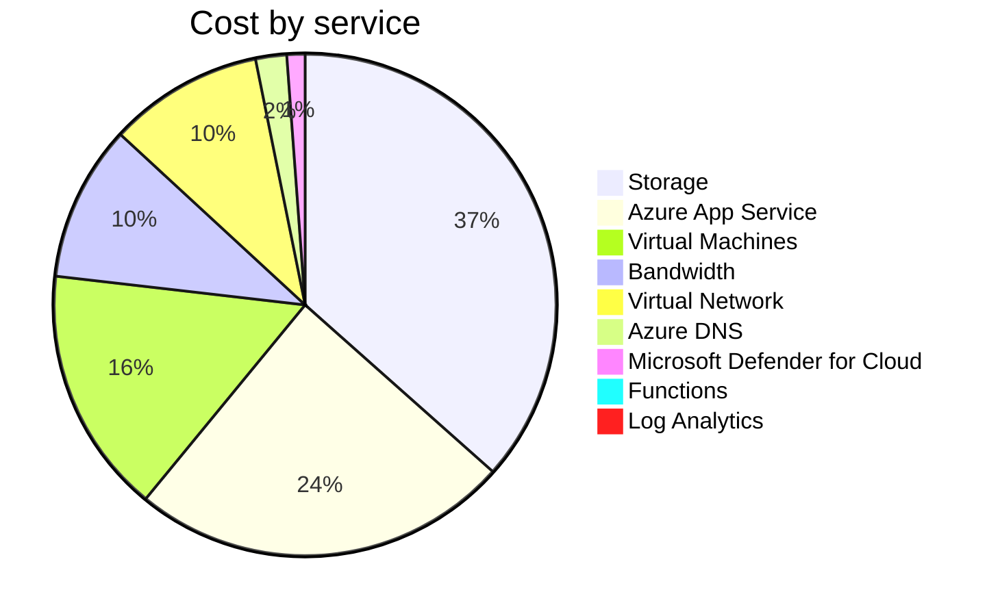

Fetching subscription details...
Fetching cost data...
Fetching forecasted cost data...
Fetching cost data by service name...
Fetching cost data by location...
Fetching cost data by resource group...
# Azure Cost Overview

> Accumulated cost for subscription id `JPF Pay-As-You-Go` from **11/01/2023** to **11/12/2023**

## Totals

|Period|Amount|
|---|---:|
|Today|0.09 USD|
|Yesterday|2.08 USD|
|Last 7 days|16.55 USD|
|Last 30 days|26.50 USD|

## By Service Name

|Service|Amount|
|---|---:|
|Storage|9.69 USD|
|Azure App Service|6.46 USD|
|Virtual Machines|4.21 USD|
|Bandwidth|2.66 USD|
|Virtual Network|2.64 USD|
|Azure DNS|0.53 USD|
|Microsoft Defender for Cloud|0.31 USD|
|Functions|0.00 USD|
|Log Analytics|0.00 USD|

## By Location

|Location|Amount|
|---|---:|
|US North Central|19.06 USD|
|US Central|6.49 USD|
|Unknown|0.53 USD|
|Unassigned|0.31 USD|
|US East|0.11 USD|
|AP East|0.00 USD|
|EU West|0.00 USD|
|US East 2|0.00 USD|
|US West 2|0.00 USD|

## By Resource Group

|Resource Group|Amount|
|---|---:|
|personal-network|19.23 USD|
|personal-site|6.49 USD|
|personal-dns|0.36 USD|
||0.31 USD|
|cloud-shell-storage-eastus|0.11 USD|

Generated at 2023-11-12 11:35:16 for subscription with id `4913be3f-a345-4652-9bba-767418dd25e3`
