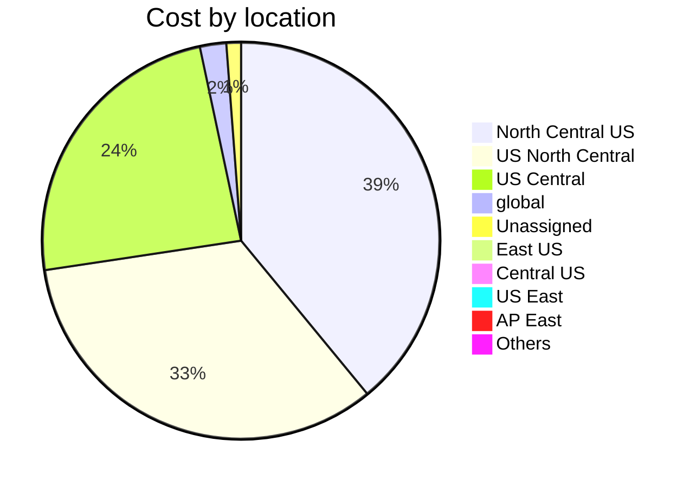

Fetching subscription details...
Fetching cost data...
Fetching forecasted cost data...
Fetching cost data by service name...
Fetching cost data by location...
Fetching cost data by resource group...
# Azure Cost Overview

> Accumulated cost for subscription id `JPF Pay-As-You-Go` from **11/01/2023** to **11/03/2023**

## Totals

|Period|Amount|
|---|---:|
|Today|0.09 USD|
|Yesterday|1.72 USD|
|Last 7 days|4.22 USD|
|Last 30 days|4.22 USD|

```mermaid
gantt
   title Accumulated cost
   dateFormat  X
   axisFormat %s
   section 01 Nov
   USD 2.41 :0, 241
   section 02 Nov
   USD 4.13 :0, 413
   section 03 Nov
   USD 4.22 :0, 422
   section 04 Nov
   USD 6.51 : done, 0, 651
   section 05 Nov
   USD 8.60 : done, 0, 860
   section 06 Nov
   USD 10.83 : done, 0, 1083
   section 07 Nov
   USD 13.14 : done, 0, 1314
   section 08 Nov
   USD 15.49 : done, 0, 1549
   section 09 Nov
   USD 17.83 : done, 0, 1783
   section 10 Nov
   USD 20.21 : done, 0, 2021
   section 11 Nov
   USD 22.47 : done, 0, 2247
   section 12 Nov
   USD 24.55 : done, 0, 2455
   section 13 Nov
   USD 26.75 : done, 0, 2675
   section 14 Nov
   USD 29.03 : done, 0, 2903
   section 15 Nov
   USD 31.36 : done, 0, 3136
   section 16 Nov
   USD 33.67 : done, 0, 3367
   section 17 Nov
   USD 36.03 : done, 0, 3603
   section 18 Nov
   USD 38.26 : done, 0, 3826
   section 19 Nov
   USD 40.31 : done, 0, 4031
   section 20 Nov
   USD 42.48 : done, 0, 4248
   section 21 Nov
   USD 44.74 : done, 0, 4474
   section 22 Nov
   USD 47.04 : done, 0, 4704
   section 23 Nov
   USD 49.33 : done, 0, 4933
   section 24 Nov
   USD 51.66 : done, 0, 5166
   section 25 Nov
   USD 53.87 : done, 0, 5387
   section 26 Nov
   USD 55.89 : done, 0, 5589
   section 27 Nov
   USD 58.04 : done, 0, 5804
   section 28 Nov
   USD 60.27 : done, 0, 6027
   section 29 Nov
   USD 62.55 : done, 0, 6255
   section 30 Nov
   USD 64.81 : done, 0, 6481
```

## By Service Name

|Service|Amount|
|---|---:|
|Storage|1.51 USD|
|Azure App Service|1.01 USD|
|Virtual Machines|0.84 USD|
|Virtual Network|0.41 USD|
|Bandwidth|0.31 USD|
|Azure DNS|0.09 USD|
|Microsoft Defender for Cloud|0.05 USD|
|Functions|0.00 USD|
|Log Analytics|0.00 USD|

## By Location

|Location|Amount|
|---|---:|
|North Central US|1.64 USD|
|US North Central|1.41 USD|
|US Central|1.01 USD|
|global|0.09 USD|
|Unassigned|0.05 USD|
|East US|0.02 USD|
|Central US|0.00 USD|
|US East|0.00 USD|
|AP East|0.00 USD|
|Others|0.00 USD|

## By Resource Group

|Resource Group|Amount|
|---|---:|
|personal-network|3.08 USD|
|personal-site|1.01 USD|
|personal-dns|0.06 USD|
||0.05 USD|
|cloud-shell-storage-eastus|0.02 USD|

Generated at 2023-11-03 11:34:30 for subscription with id `4913be3f-a345-4652-9bba-767418dd25e3`
