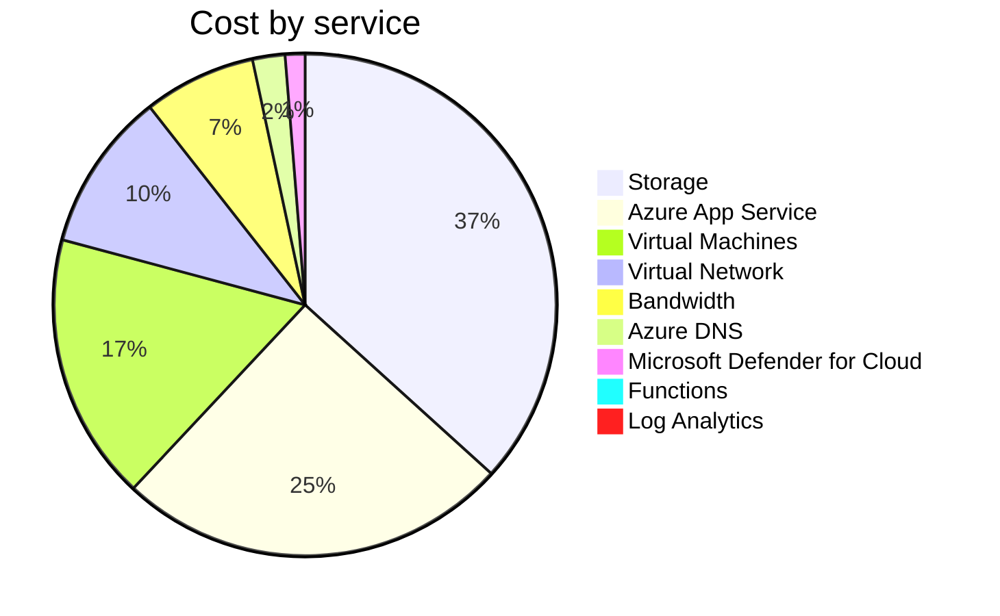

Fetching subscription details...
Fetching cost data...
Fetching forecasted cost data...
Fetching cost data by service name...
Fetching cost data by location...
Fetching cost data by resource group...
# Azure Cost Overview

> Accumulated cost for subscription id `JPF Pay-As-You-Go` from **12/01/2023** to **12/31/2023**

## Totals

|Period|Amount|
|---|---:|
|Today|0.08 USD|
|Yesterday|1.29 USD|
|Last 7 days|14.47 USD|
|Last 30 days|68.95 USD|

```mermaid
gantt
   title Accumulated cost
   dateFormat  X
   axisFormat %s
   section 01 Dec
   USD 2.41 :0, 241
   section 02 Dec
   USD 4.93 :0, 493
   section 03 Dec
   USD 7.79 :0, 779
   section 04 Dec
   USD 10.04 :0, 1004
   section 05 Dec
   USD 12.27 :0, 1227
   section 06 Dec
   USD 15.11 :0, 1511
   section 07 Dec
   USD 17.58 :0, 1758
   section 08 Dec
   USD 19.73 :0, 1973
   section 09 Dec
   USD 22.16 :0, 2216
   section 10 Dec
   USD 24.80 :0, 2480
   section 11 Dec
   USD 27.43 :0, 2743
   section 12 Dec
   USD 29.74 :0, 2974
   section 13 Dec
   USD 32.04 :0, 3204
   section 14 Dec
   USD 34.33 :0, 3433
   section 15 Dec
   USD 36.49 :0, 3649
   section 16 Dec
   USD 38.73 :0, 3873
   section 17 Dec
   USD 41.00 :0, 4100
   section 18 Dec
   USD 43.39 :0, 4339
   section 19 Dec
   USD 45.82 :0, 4582
   section 20 Dec
   USD 48.01 :0, 4801
   section 21 Dec
   USD 50.16 :0, 5016
   section 22 Dec
   USD 52.35 :0, 5235
   section 23 Dec
   USD 54.48 :0, 5448
   section 24 Dec
   USD 56.61 :0, 5661
   section 25 Dec
   USD 58.74 :0, 5874
   section 26 Dec
   USD 60.87 :0, 6087
   section 27 Dec
   USD 63.05 :0, 6305
   section 28 Dec
   USD 65.26 :0, 6526
   section 29 Dec
   USD 67.58 :0, 6758
   section 30 Dec
   USD 68.87 :0, 6887
   section 31 Dec
   USD 68.95 :0, 6895
```

## By Service Name

|Service|Amount|
|---|---:|
|Storage|25.32 USD|
|Azure App Service|17.41 USD|
|Virtual Machines|11.86 USD|
|Virtual Network|7.06 USD|
|Bandwidth|4.98 USD|
|Azure DNS|1.44 USD|
|Microsoft Defender for Cloud|0.88 USD|
|Functions|0.00 USD|
|Log Analytics|0.00 USD|

## By Location

|Location|Amount|
|---|---:|
|US North Central|48.87 USD|
|US Central|17.47 USD|
|Unknown|1.44 USD|
|Unassigned|0.88 USD|
|US East|0.29 USD|
|AP East|0.00 USD|
|EU West|0.00 USD|
|US East 2|0.00 USD|
|US West 2|0.00 USD|

## By Resource Group

|Resource Group|Amount|
|---|---:|
|personal-network|49.35 USD|
|personal-site|17.47 USD|
|personal-dns|0.97 USD|
||0.88 USD|
|cloud-shell-storage-eastus|0.29 USD|

Generated at 2023-12-31 11:35:01 for subscription with id `4913be3f-a345-4652-9bba-767418dd25e3`
