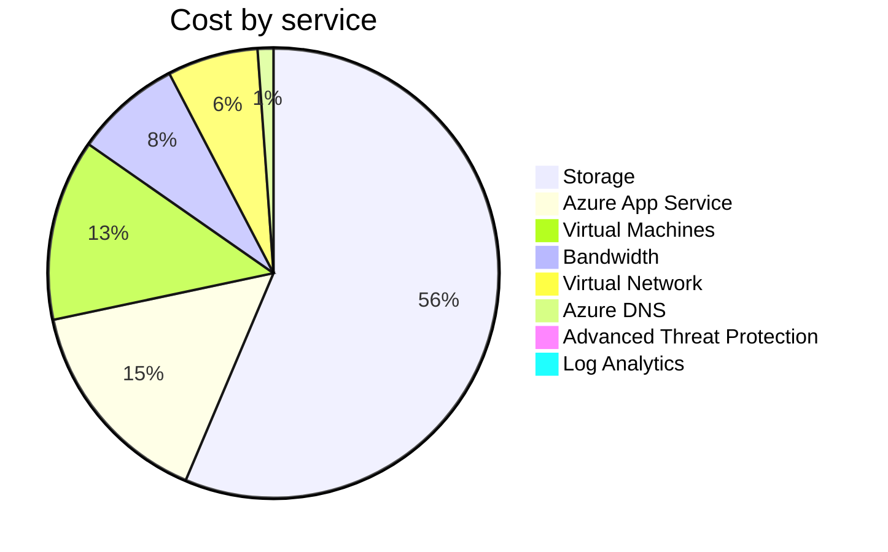
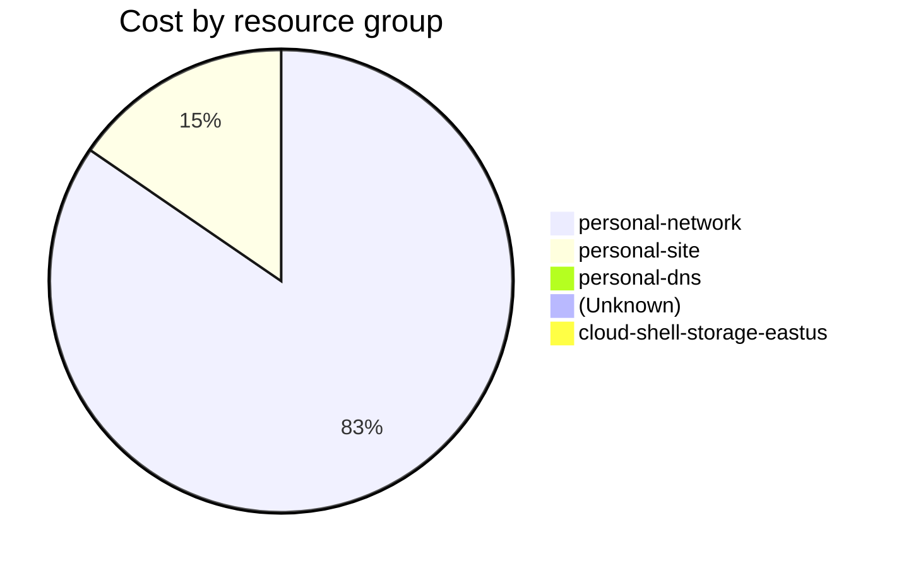

Fetching subscription details...
Fetching cost data...
Fetching forecasted cost data...
Fetching cost data by service name...
Fetching cost data by location...
Fetching cost data by resource group...
# Azure Cost Overview

> Accumulated cost for subscription id `JPF Pay-As-You-Go` from **10/01/2023** to **10/02/2023**

## Totals

|Period|Amount|
|---|---:|
|Today|0.10 USD|
|Yesterday|3.46 USD|
|Last 7 days|3.57 USD|
|Last 30 days|3.57 USD|

```mermaid
gantt
   title Accumulated cost
   dateFormat  X
   axisFormat %s
   section 01 Oct
   USD 3.46 :0, 346
   section 02 Oct
   USD 3.57 :0, 357
   section 03 Oct
   USD 14.56 : done, 0, 1456
   section 04 Oct
   USD 21.73 : done, 0, 2173
   section 05 Oct
   USD 28.77 : done, 0, 2877
   section 06 Oct
   USD 35.90 : done, 0, 3590
   section 07 Oct
   USD 42.82 : done, 0, 4282
   section 08 Oct
   USD 49.71 : done, 0, 4971
   section 09 Oct
   USD 56.51 : done, 0, 5651
   section 10 Oct
   USD 66.89 : done, 0, 6689
   section 11 Oct
   USD 73.45 : done, 0, 7345
   section 12 Oct
   USD 79.88 : done, 0, 7988
   section 13 Oct
   USD 86.41 : done, 0, 8641
   section 14 Oct
   USD 92.72 : done, 0, 9272
   section 15 Oct
   USD 99.00 : done, 0, 9900
   section 16 Oct
   USD 105.19 : done, 0, 10519
   section 17 Oct
   USD 114.97 : done, 0, 11497
   section 18 Oct
   USD 120.92 : done, 0, 12092
   section 19 Oct
   USD 126.74 : done, 0, 12674
   section 20 Oct
   USD 132.66 : done, 0, 13266
   section 21 Oct
   USD 138.36 : done, 0, 13836
   section 22 Oct
   USD 144.03 : done, 0, 14403
   section 23 Oct
   USD 149.62 : done, 0, 14962
   section 24 Oct
   USD 158.78 : done, 0, 15878
   section 25 Oct
   USD 164.13 : done, 0, 16413
   section 26 Oct
   USD 169.34 : done, 0, 16934
   section 27 Oct
   USD 174.65 : done, 0, 17465
   section 28 Oct
   USD 179.74 : done, 0, 17974
   section 29 Oct
   USD 184.81 : done, 0, 18481
   section 30 Oct
   USD 189.78 : done, 0, 18978
   section 31 Oct
   USD 198.34 : done, 0, 19834
```

## By Service Name

|Service|Amount|
|---|---:|
|Storage|1.99 USD|
|Azure App Service|0.54 USD|
|Virtual Machines|0.46 USD|
|Bandwidth|0.27 USD|
|Virtual Network|0.23 USD|
|Azure DNS|0.04 USD|
|Advanced Threat Protection|0.03 USD|
|Log Analytics|0.00 USD|

## By Location

|Location|Amount|
|---|---:|
|US North Central|2.94 USD|
|US Central|0.54 USD|
|Unknown|0.04 USD|
|Unassigned|0.03 USD|
|US East|0.01 USD|
|AP East|0.00 USD|
|EU West|0.00 USD|
|US East 2|0.00 USD|
|US West 2|0.00 USD|

## By Resource Group

|Resource Group|Amount|
|---|---:|
|personal-network|2.96 USD|
|personal-site|0.54 USD|
|personal-dns|0.03 USD|
||0.03 USD|
|cloud-shell-storage-eastus|0.01 USD|

Generated at 2023-10-02 11:29:22 for subscription with id `4913be3f-a345-4652-9bba-767418dd25e3`
