Fetching subscription details...
Fetching cost data...
Fetching forecasted cost data...
Fetching cost data by service name...
Fetching cost data by location...
Fetching cost data by resource group...
# Azure Cost Overview

> Accumulated cost for subscription id `JPF Pay-As-You-Go` from **01/01/2024** to **01/07/2024**

## Totals

|Period|Amount|
|---|---:|
|Today|0.10 USD|
|Yesterday|2.75 USD|
|Last 7 days|16.08 USD|
|Last 30 days|16.08 USD|

```mermaid
gantt
   title Accumulated cost
   dateFormat  X
   axisFormat %s
   section 01 Jan
   USD 2.62 :0, 262
   section 02 Jan
   USD 5.66 :0, 566
   section 03 Jan
   USD 8.11 :0, 811
   section 04 Jan
   USD 10.66 :0, 1066
   section 05 Jan
   USD 13.23 :0, 1323
   section 06 Jan
   USD 15.98 :0, 1598
   section 07 Jan
   USD 16.08 :0, 1608
   section 08 Jan
   USD 18.76 : done, 0, 1876
   section 09 Jan
   USD 21.44 : done, 0, 2144
   section 10 Jan
   USD 23.81 : done, 0, 2381
   section 11 Jan
   USD 26.20 : done, 0, 2620
   section 12 Jan
   USD 28.47 : done, 0, 2847
   section 13 Jan
   USD 30.90 : done, 0, 3090
   section 14 Jan
   USD 33.41 : done, 0, 3341
   section 15 Jan
   USD 36.09 : done, 0, 3609
   section 16 Jan
   USD 38.76 : done, 0, 3876
   section 17 Jan
   USD 41.13 : done, 0, 4113
   section 18 Jan
   USD 43.51 : done, 0, 4351
   section 19 Jan
   USD 45.78 : done, 0, 4578
   section 20 Jan
   USD 48.20 : done, 0, 4820
   section 21 Jan
   USD 50.71 : done, 0, 5071
   section 22 Jan
   USD 53.38 : done, 0, 5338
   section 23 Jan
   USD 56.05 : done, 0, 5605
   section 24 Jan
   USD 58.41 : done, 0, 5841
   section 25 Jan
   USD 60.79 : done, 0, 6079
   section 26 Jan
   USD 63.05 : done, 0, 6305
   section 27 Jan
   USD 65.47 : done, 0, 6547
   section 28 Jan
   USD 67.97 : done, 0, 6797
   section 29 Jan
   USD 70.64 : done, 0, 7064
   section 30 Jan
   USD 73.30 : done, 0, 7330
   section 31 Jan
   USD 75.66 : done, 0, 7566
```

## By Service Name

|Service|Amount|
|---|---:|
|Storage|5.22 USD|
|Azure App Service|3.50 USD|
|Bandwidth|2.86 USD|
|Virtual Machines|2.58 USD|
|Virtual Network|1.44 USD|
|Azure DNS|0.29 USD|
|Microsoft Defender for Cloud|0.19 USD|
|Functions|0.00 USD|
|Log Analytics|0.00 USD|

## By Location

|Location|Amount|
|---|---:|
|US North Central|12.02 USD|
|US Central|3.51 USD|
|Unknown|0.29 USD|
|Unassigned|0.19 USD|
|US East|0.06 USD|
|AP East|0.00 USD|
|EU West|0.00 USD|
|US East 2|0.00 USD|
|US West 2|0.00 USD|

## By Resource Group

|Resource Group|Amount|
|---|---:|
|personal-network|12.12 USD|
|personal-site|3.51 USD|
|personal-dns|0.20 USD|
||0.19 USD|
|cloud-shell-storage-eastus|0.06 USD|

Generated at 2024-01-07 11:33:50 for subscription with id `4913be3f-a345-4652-9bba-767418dd25e3`
