Fetching subscription details...
Fetching cost data...
Fetching forecasted cost data...
Fetching cost data by service name...
Fetching cost data by location...
Fetching cost data by resource group...
# Azure Cost Overview

> Accumulated cost for subscription id `JPF Pay-As-You-Go` from **11/01/2023** to **11/28/2023**

## Totals

|Period|Amount|
|---|---:|
|Today|0.08 USD|
|Yesterday|1.98 USD|
|Last 7 days|15.70 USD|
|Last 30 days|62.49 USD|

```mermaid
gantt
   title Accumulated cost
   dateFormat  X
   axisFormat %s
   section 01 Nov
   USD 2.50 :0, 250
   section 02 Nov
   USD 4.87 :0, 487
   section 03 Nov
   USD 7.51 :0, 751
   section 04 Nov
   USD 9.95 :0, 995
   section 05 Nov
   USD 12.34 :0, 1234
   section 06 Nov
   USD 14.80 :0, 1480
   section 07 Nov
   USD 17.20 :0, 1720
   section 08 Nov
   USD 19.70 :0, 1970
   section 09 Nov
   USD 22.17 :0, 2217
   section 10 Nov
   USD 24.42 :0, 2442
   section 11 Nov
   USD 26.65 :0, 2665
   section 12 Nov
   USD 28.92 :0, 2892
   section 13 Nov
   USD 31.21 :0, 3121
   section 14 Nov
   USD 33.36 :0, 3336
   section 15 Nov
   USD 35.61 :0, 3561
   section 16 Nov
   USD 37.83 :0, 3783
   section 17 Nov
   USD 40.07 :0, 4007
   section 18 Nov
   USD 42.29 :0, 4229
   section 19 Nov
   USD 44.51 :0, 4451
   section 20 Nov
   USD 46.79 :0, 4679
   section 21 Nov
   USD 49.17 :0, 4917
   section 22 Nov
   USD 51.41 :0, 5141
   section 23 Nov
   USD 53.72 :0, 5372
   section 24 Nov
   USD 55.97 :0, 5597
   section 25 Nov
   USD 58.24 :0, 5824
   section 26 Nov
   USD 60.44 :0, 6044
   section 27 Nov
   USD 62.41 :0, 6241
   section 28 Nov
   USD 62.49 :0, 6249
   section 29 Nov
   USD 64.78 : done, 0, 6478
   section 30 Nov
   USD 67.03 : done, 0, 6703
```

## By Service Name

|Service|Amount|
|---|---:|
|Storage|23.78 USD|
|Azure App Service|15.91 USD|
|Virtual Machines|10.18 USD|
|Virtual Network|6.46 USD|
|Bandwidth|4.13 USD|
|Azure DNS|1.31 USD|
|Microsoft Defender for Cloud|0.72 USD|
|Functions|0.00 USD|
|Log Analytics|0.00 USD|

## By Location

|Location|Amount|
|---|---:|
|US North Central|44.22 USD|
|US Central|15.97 USD|
|Unknown|1.31 USD|
|Unassigned|0.72 USD|
|US East|0.27 USD|
|AP East|0.00 USD|
|EU West|0.00 USD|
|US East 2|0.00 USD|
|US West 2|0.00 USD|

## By Resource Group

|Resource Group|Amount|
|---|---:|
|personal-network|44.66 USD|
|personal-site|15.97 USD|
|personal-dns|0.88 USD|
||0.72 USD|
|cloud-shell-storage-eastus|0.27 USD|

Generated at 2023-11-28 11:35:17 for subscription with id `4913be3f-a345-4652-9bba-767418dd25e3`
