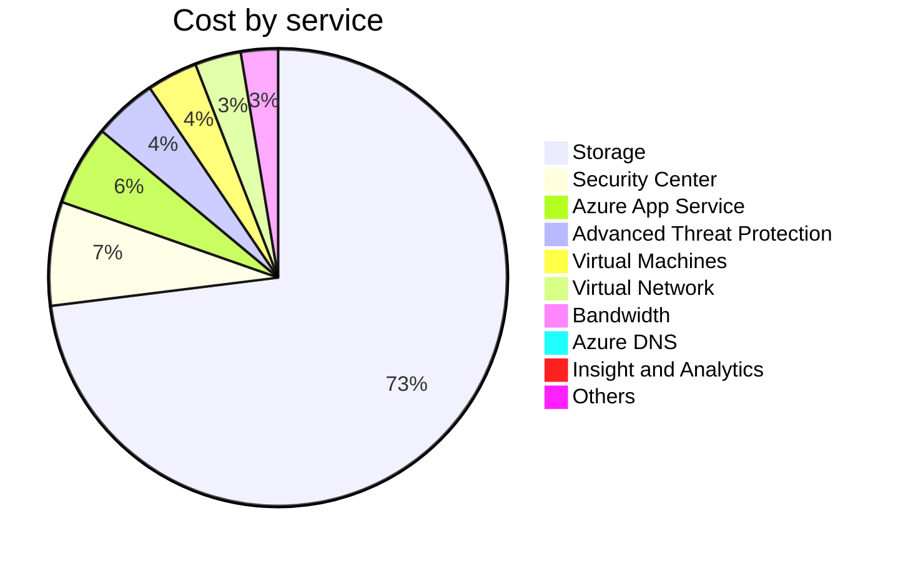

Fetching subscription details...
Fetching cost data...
Fetching forecasted cost data...
Fetching cost data by service name...
Fetching cost data by location...
Fetching cost data by resource group...
# Azure Cost Overview

> Accumulated cost for subscription id `JPF Pay-As-You-Go` from **09/01/2023** to **09/27/2023**

## Totals

|Period|Amount|
|---|---:|
|Today|0.12 USD|
|Yesterday|3.52 USD|
|Last 7 days|26.63 USD|
|Last 30 days|270.77 USD|

```mermaid
gantt
   title Accumulated cost
   dateFormat  X
   axisFormat %s
   section 01 Sep
   USD 6.35 :0, 635
   section 02 Sep
   USD 12.48 :0, 1248
   section 03 Sep
   USD 18.76 :0, 1876
   section 04 Sep
   USD 24.93 :0, 2493
   section 05 Sep
   USD 31.24 :0, 3124
   section 06 Sep
   USD 37.37 :0, 3737
   section 07 Sep
   USD 43.61 :0, 4361
   section 08 Sep
   USD 49.87 :0, 4987
   section 09 Sep
   USD 56.01 :0, 5601
   section 10 Sep
   USD 62.06 :0, 6206
   section 11 Sep
   USD 68.20 :0, 6820
   section 12 Sep
   USD 81.57 :0, 8157
   section 13 Sep
   USD 128.57 :0, 12857
   section 14 Sep
   USD 163.86 :0, 16386
   section 15 Sep
   USD 170.27 :0, 17027
   section 16 Sep
   USD 184.23 :0, 18423
   section 17 Sep
   USD 212.59 :0, 21259
   section 18 Sep
   USD 228.25 :0, 22825
   section 19 Sep
   USD 244.14 :0, 24414
   section 20 Sep
   USD 247.92 :0, 24792
   section 21 Sep
   USD 251.87 :0, 25187
   section 22 Sep
   USD 256.20 :0, 25620
   section 23 Sep
   USD 259.80 :0, 25980
   section 24 Sep
   USD 263.43 :0, 26343
   section 25 Sep
   USD 267.12 :0, 26712
   section 26 Sep
   USD 270.65 :0, 27065
   section 27 Sep
   USD 270.77 :0, 27077
   section 28 Sep
   USD 283.37 : done, 0, 28337
   section 29 Sep
   USD 296.30 : done, 0, 29630
   section 30 Sep
   USD 309.25 : done, 0, 30925
```

## By Service Name

|Service|Amount|
|---|---:|
|Storage|196.81 USD|
|Security Center|19.78 USD|
|Azure App Service|15.34 USD|
|Advanced Threat Protection|12.09 USD|
|Virtual Machines|9.65 USD|
|Virtual Network|8.78 USD|
|Bandwidth|7.06 USD|
|Azure DNS|1.27 USD|
|Insight and Analytics|0.00 USD|
|Others|0.00 USD|

## By Location

|Location|Amount|
|---|---:|
|US North Central|225.65 USD|
|US Central|26.21 USD|
|Unassigned|12.00 USD|
|US East|5.65 USD|
|Unknown|1.27 USD|
|AP East|0.00 USD|
|EU West|0.00 USD|
|Intercontinental|0.00 USD|
|US East 2|0.00 USD|
|Others|0.00 USD|

## By Resource Group

|Resource Group|Amount|
|---|---:|
|personal-network|226.06 USD|
|personal-site|26.21 USD|
||12.00 USD|
|cloud-shell-storage-eastus|5.65 USD|
|personal-dns|0.85 USD|
|defaultresourcegroup-ncus|0.00 USD|
|azureapp-auto-alerts-873533-jpatrick_fulton_gmail_com|0.00 USD|

Generated at 2023-09-27 11:34:48 for subscription with id `4913be3f-a345-4652-9bba-767418dd25e3`
