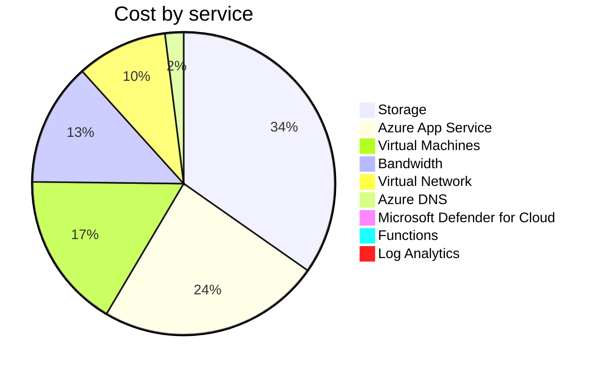

Fetching subscription details...
Fetching cost data...
Fetching forecasted cost data...
Fetching cost data by service name...
Fetching cost data by location...
Fetching cost data by resource group...
# Azure Cost Overview

> Accumulated cost for subscription id `JPF Pay-As-You-Go` from **12/01/2023** to **12/07/2023**

## Totals

|Period|Amount|
|---|---:|
|Today|0.08 USD|
|Yesterday|2.53 USD|
|Last 7 days|14.77 USD|
|Last 30 days|14.77 USD|

```mermaid
gantt
   title Accumulated cost
   dateFormat  X
   axisFormat %s
   section 01 Dec
   USD 2.39 :0, 239
   section 02 Dec
   USD 4.88 :0, 488
   section 03 Dec
   USD 7.69 :0, 769
   section 04 Dec
   USD 9.94 :0, 994
   section 05 Dec
   USD 12.16 :0, 1216
   section 06 Dec
   USD 14.69 :0, 1469
   section 07 Dec
   USD 14.77 :0, 1477
   section 08 Dec
   USD 17.22 : done, 0, 1722
   section 09 Dec
   USD 19.68 : done, 0, 1968
   section 10 Dec
   USD 22.13 : done, 0, 2213
   section 11 Dec
   USD 24.53 : done, 0, 2453
   section 12 Dec
   USD 26.96 : done, 0, 2696
   section 13 Dec
   USD 29.41 : done, 0, 2941
   section 14 Dec
   USD 31.87 : done, 0, 3187
   section 15 Dec
   USD 34.32 : done, 0, 3432
   section 16 Dec
   USD 36.78 : done, 0, 3678
   section 17 Dec
   USD 39.24 : done, 0, 3924
   section 18 Dec
   USD 41.64 : done, 0, 4164
   section 19 Dec
   USD 44.07 : done, 0, 4407
   section 20 Dec
   USD 46.52 : done, 0, 4652
   section 21 Dec
   USD 48.98 : done, 0, 4898
   section 22 Dec
   USD 51.43 : done, 0, 5143
   section 23 Dec
   USD 53.90 : done, 0, 5390
   section 24 Dec
   USD 56.35 : done, 0, 5635
   section 25 Dec
   USD 58.76 : done, 0, 5876
   section 26 Dec
   USD 61.19 : done, 0, 6119
   section 27 Dec
   USD 63.64 : done, 0, 6364
   section 28 Dec
   USD 66.10 : done, 0, 6610
   section 29 Dec
   USD 68.55 : done, 0, 6855
   section 30 Dec
   USD 71.02 : done, 0, 7102
   section 31 Dec
   USD 73.48 : done, 0, 7348
```

## By Service Name

|Service|Amount|
|---|---:|
|Storage|5.08 USD|
|Azure App Service|3.48 USD|
|Virtual Machines|2.44 USD|
|Bandwidth|1.92 USD|
|Virtual Network|1.42 USD|
|Azure DNS|0.29 USD|
|Microsoft Defender for Cloud|0.14 USD|
|Functions|0.00 USD|
|Log Analytics|0.00 USD|

## By Location

|Location|Amount|
|---|---:|
|US North Central|10.79 USD|
|US Central|3.49 USD|
|Unknown|0.29 USD|
|Unassigned|0.14 USD|
|US East|0.06 USD|
|AP East|0.00 USD|
|EU West|0.00 USD|
|US East 2|0.00 USD|
|US West 2|0.00 USD|

## By Resource Group

|Resource Group|Amount|
|---|---:|
|personal-network|10.89 USD|
|personal-site|3.49 USD|
|personal-dns|0.19 USD|
||0.14 USD|
|cloud-shell-storage-eastus|0.06 USD|

Generated at 2023-12-07 11:35:21 for subscription with id `4913be3f-a345-4652-9bba-767418dd25e3`
