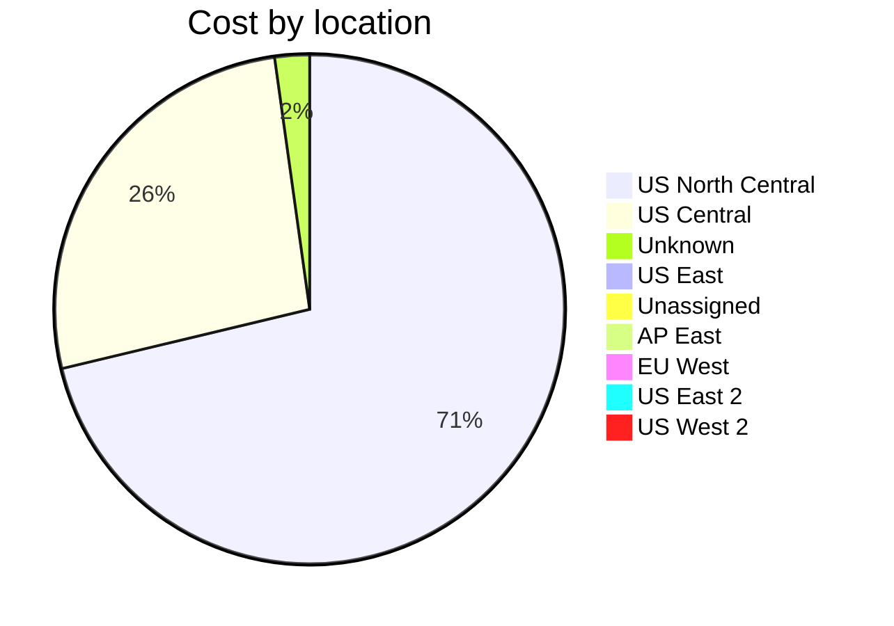

Fetching subscription details...
Fetching cost data...
Fetching forecasted cost data...
Fetching cost data by service name...
Fetching cost data by location...
Fetching cost data by resource group...
# Azure Cost Overview

> Accumulated cost for subscription id `JPF Pay-As-You-Go` from **03/01/2024** to **03/09/2024**

## Totals

|Period|Amount|
|---|---:|
|Today|0.09 USD|
|Yesterday|1.98 USD|
|Last 7 days|14.54 USD|
|Last 30 days|17.86 USD|

## By Service Name

|Service|Amount|
|---|---:|
|Storage|6.73 USD|
|Azure App Service|4.68 USD|
||2.89 USD|
|Virtual Network|1.91 USD|
|Bandwidth|1.19 USD|
|Azure DNS|0.39 USD|
|Microsoft Defender for Cloud|0.07 USD|
|Functions|0.00 USD|
|Log Analytics|0.00 USD|

## By Location

|Location|Amount|
|---|---:|
|US North Central|12.62 USD|
|US Central|4.70 USD|
|Unknown|0.39 USD|
|US East|0.08 USD|
|Unassigned|0.07 USD|
|AP East|0.00 USD|
|EU West|0.00 USD|
|US East 2|0.00 USD|
|US West 2|0.00 USD|

## By Resource Group

|Resource Group|Amount|
|---|---:|
|personal-network|12.69 USD|
|personal-site|4.70 USD|
|personal-dns|0.26 USD|
|cloud-shell-storage-eastus|0.08 USD|
||0.07 USD|

Generated at 2024-03-09 11:33:59 for subscription with id `4913be3f-a345-4652-9bba-767418dd25e3`
