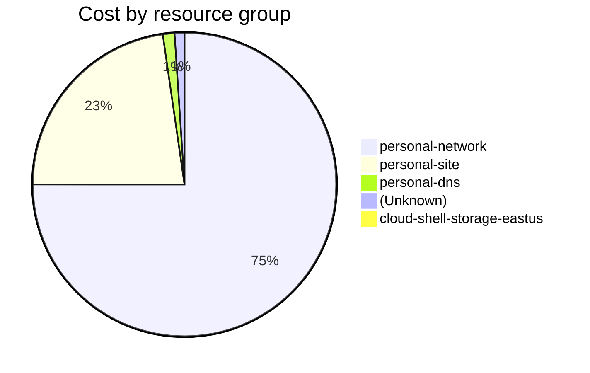

Fetching subscription details...
Fetching cost data...
Fetching forecasted cost data...
Fetching cost data by service name...
Fetching cost data by location...
Fetching cost data by resource group...
# Azure Cost Overview

> Accumulated cost for subscription id `JPF Pay-As-You-Go` from **10/01/2023** to **10/11/2023**

## Totals

|Period|Amount|
|---|---:|
|Today|0.04 USD|
|Yesterday|1.87 USD|
|Last 7 days|16.27 USD|
|Last 30 days|25.83 USD|

```mermaid
gantt
   title Accumulated cost
   dateFormat  X
   axisFormat %s
   section 01 Oct
   USD 3.83 :0, 383
   section 02 Oct
   USD 7.06 :0, 706
   section 03 Oct
   USD 9.56 :0, 956
   section 04 Oct
   USD 12.08 :0, 1208
   section 05 Oct
   USD 14.49 :0, 1449
   section 06 Oct
   USD 17.05 :0, 1705
   section 07 Oct
   USD 19.51 :0, 1951
   section 08 Oct
   USD 21.67 :0, 2167
   section 09 Oct
   USD 23.92 :0, 2392
   section 10 Oct
   USD 25.79 :0, 2579
   section 11 Oct
   USD 25.83 :0, 2583
   section 12 Oct
   USD 25.83 : done, 0, 2583
   section 13 Oct
   USD 25.83 : done, 0, 2583
   section 14 Oct
   USD 25.83 : done, 0, 2583
   section 15 Oct
   USD 25.83 : done, 0, 2583
   section 16 Oct
   USD 25.83 : done, 0, 2583
   section 17 Oct
   USD 25.83 : done, 0, 2583
   section 18 Oct
   USD 25.83 : done, 0, 2583
   section 19 Oct
   USD 25.83 : done, 0, 2583
   section 20 Oct
   USD 25.83 : done, 0, 2583
   section 21 Oct
   USD 25.83 : done, 0, 2583
   section 22 Oct
   USD 25.83 : done, 0, 2583
   section 23 Oct
   USD 25.83 : done, 0, 2583
   section 24 Oct
   USD 25.83 : done, 0, 2583
   section 25 Oct
   USD 25.83 : done, 0, 2583
   section 26 Oct
   USD 25.83 : done, 0, 2583
   section 27 Oct
   USD 25.83 : done, 0, 2583
   section 28 Oct
   USD 25.83 : done, 0, 2583
   section 29 Oct
   USD 25.83 : done, 0, 2583
   section 30 Oct
   USD 25.83 : done, 0, 2583
   section 31 Oct
   USD 25.83 : done, 0, 2583
```

## By Service Name

|Service|Amount|
|---|---:|
|Storage|10.49 USD|
|Azure App Service|5.82 USD|
|Virtual Machines|3.61 USD|
|Bandwidth|2.79 USD|
|Virtual Network|2.37 USD|
|Azure DNS|0.48 USD|
|Advanced Threat Protection|0.27 USD|
|Azure Active Directory for External Identities|0.00 USD|
|Functions|0.00 USD|
|Log Analytics|0.00 USD|

## By Location

|Location|Amount|
|---|---:|
|US North Central|19.14 USD|
|US Central|5.84 USD|
|Unknown|0.48 USD|
|Unassigned|0.27 USD|
|US East|0.10 USD|
|AP East|0.00 USD|
|EU West|0.00 USD|
|US East 2|0.00 USD|
|US West 2|0.00 USD|

## By Resource Group

|Resource Group|Amount|
|---|---:|
|personal-network|19.30 USD|
|personal-site|5.84 USD|
|personal-dns|0.32 USD|
||0.27 USD|
|cloud-shell-storage-eastus|0.10 USD|

Generated at 2023-10-11 11:31:19 for subscription with id `4913be3f-a345-4652-9bba-767418dd25e3`
