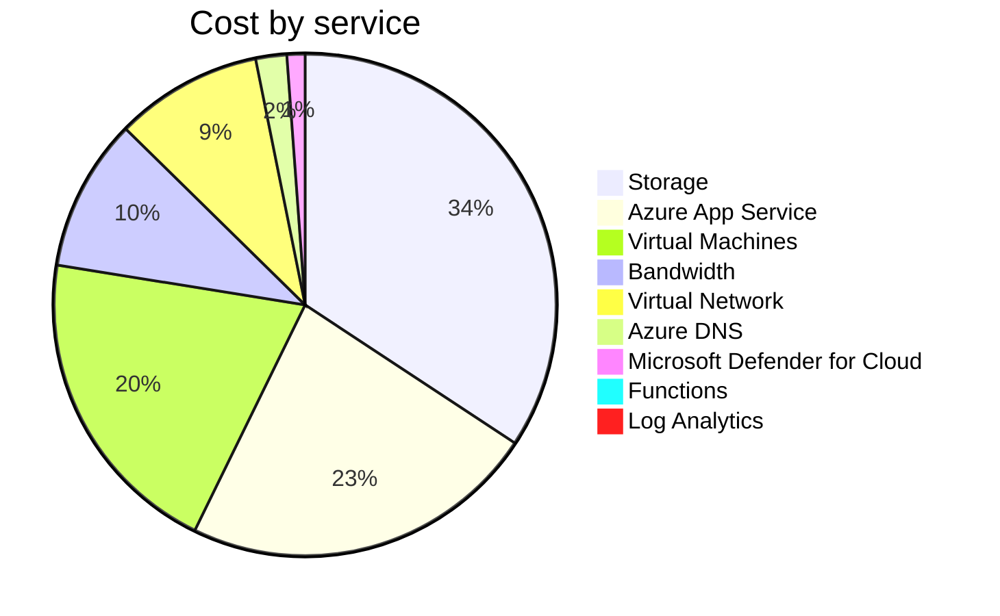
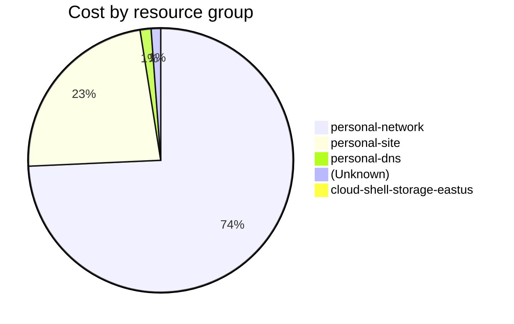

Fetching subscription details...
Fetching cost data...
Fetching forecasted cost data...
Fetching cost data by service name...
Fetching cost data by location...
Fetching cost data by resource group...
# Azure Cost Overview

> Accumulated cost for subscription id `JPF Pay-As-You-Go` from **11/01/2023** to **11/04/2023**

## Totals

|Period|Amount|
|---|---:|
|Today|0.09 USD|
|Yesterday|1.16 USD|
|Last 7 days|6.00 USD|
|Last 30 days|6.00 USD|

```mermaid
gantt
   title Accumulated cost
   dateFormat  X
   axisFormat %s
   section 01 Nov
   USD 2.43 :0, 243
   section 02 Nov
   USD 4.75 :0, 475
   section 03 Nov
   USD 5.91 :0, 591
   section 04 Nov
   USD 6.00 :0, 600
   section 05 Nov
   USD 8.13 : done, 0, 813
   section 06 Nov
   USD 10.39 : done, 0, 1039
   section 07 Nov
   USD 12.72 : done, 0, 1272
   section 08 Nov
   USD 15.07 : done, 0, 1507
   section 09 Nov
   USD 17.44 : done, 0, 1744
   section 10 Nov
   USD 19.87 : done, 0, 1987
   section 11 Nov
   USD 22.16 : done, 0, 2216
   section 12 Nov
   USD 24.26 : done, 0, 2426
   section 13 Nov
   USD 26.50 : done, 0, 2650
   section 14 Nov
   USD 28.82 : done, 0, 2882
   section 15 Nov
   USD 31.15 : done, 0, 3115
   section 16 Nov
   USD 33.50 : done, 0, 3350
   section 17 Nov
   USD 35.91 : done, 0, 3591
   section 18 Nov
   USD 38.18 : done, 0, 3818
   section 19 Nov
   USD 40.27 : done, 0, 4027
   section 20 Nov
   USD 42.49 : done, 0, 4249
   section 21 Nov
   USD 44.79 : done, 0, 4479
   section 22 Nov
   USD 47.09 : done, 0, 4709
   section 23 Nov
   USD 49.43 : done, 0, 4943
   section 24 Nov
   USD 51.82 : done, 0, 5182
   section 25 Nov
   USD 54.07 : done, 0, 5407
   section 26 Nov
   USD 56.14 : done, 0, 5614
   section 27 Nov
   USD 58.34 : done, 0, 5834
   section 28 Nov
   USD 60.62 : done, 0, 6062
   section 29 Nov
   USD 62.91 : done, 0, 6291
   section 30 Nov
   USD 65.23 : done, 0, 6523
```

## By Service Name

|Service|Amount|
|---|---:|
|Storage|2.06 USD|
|Azure App Service|1.38 USD|
|Virtual Machines|1.22 USD|
|Bandwidth|0.59 USD|
|Virtual Network|0.57 USD|
|Azure DNS|0.12 USD|
|Microsoft Defender for Cloud|0.07 USD|
|Functions|0.00 USD|
|Log Analytics|0.00 USD|

## By Location

|Location|Amount|
|---|---:|
|US North Central|4.41 USD|
|US Central|1.39 USD|
|Unknown|0.12 USD|
|Unassigned|0.07 USD|
|US East|0.02 USD|
|AP East|0.00 USD|
|EU West|0.00 USD|
|US East 2|0.00 USD|
|US West 2|0.00 USD|

## By Resource Group

|Resource Group|Amount|
|---|---:|
|personal-network|4.45 USD|
|personal-site|1.39 USD|
|personal-dns|0.08 USD|
||0.07 USD|
|cloud-shell-storage-eastus|0.02 USD|

Generated at 2023-11-04 11:35:27 for subscription with id `4913be3f-a345-4652-9bba-767418dd25e3`
