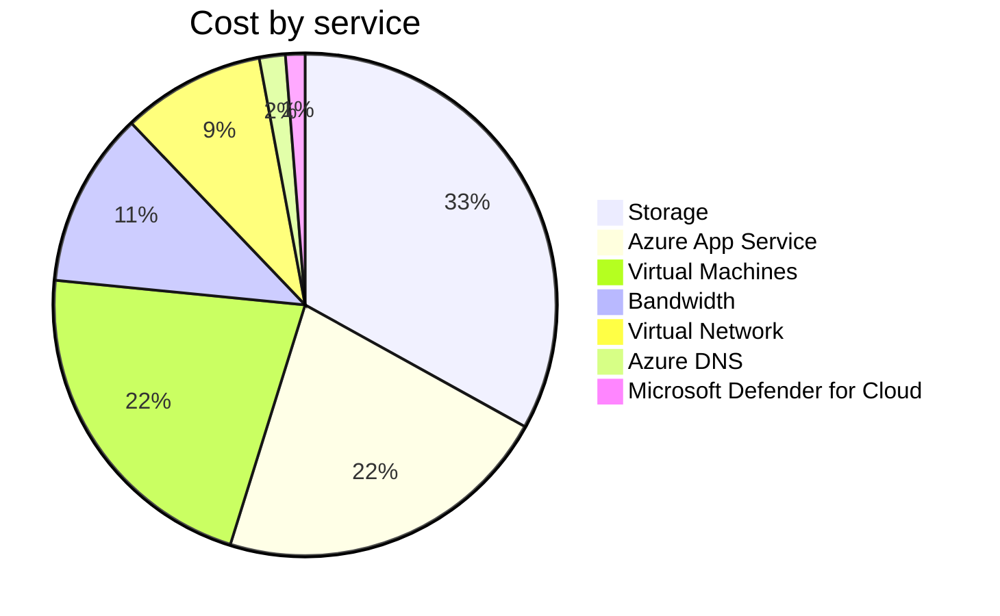

Fetching subscription details...
Fetching cost data...
Fetching forecasted cost data...
Fetching cost data by service name...
Fetching cost data by location...
Fetching cost data by resource group...
# Azure Cost Overview

> Accumulated cost for subscription id `JPF Pay-As-You-Go` from **01/01/2024** to **01/02/2024**

## Totals

|Period|Amount|
|---|---:|
|Today|0.10 USD|
|Yesterday|2.28 USD|
|Last 7 days|2.38 USD|
|Last 30 days|2.38 USD|

```mermaid
gantt
   title Accumulated cost
   dateFormat  X
   axisFormat %s
   section 01 Jan
   USD 2.28 :0, 228
   section 02 Jan
   USD 2.38 :0, 238
   section 03 Jan
   USD 4.57 : done, 0, 457
   section 04 Jan
   USD 6.78 : done, 0, 678
   section 05 Jan
   USD 8.88 : done, 0, 888
   section 06 Jan
   USD 11.18 : done, 0, 1118
   section 07 Jan
   USD 13.45 : done, 0, 1345
   section 08 Jan
   USD 15.69 : done, 0, 1569
   section 09 Jan
   USD 17.85 : done, 0, 1785
   section 10 Jan
   USD 19.98 : done, 0, 1998
   section 11 Jan
   USD 22.13 : done, 0, 2213
   section 12 Jan
   USD 24.16 : done, 0, 2416
   section 13 Jan
   USD 26.41 : done, 0, 2641
   section 14 Jan
   USD 28.61 : done, 0, 2861
   section 15 Jan
   USD 30.80 : done, 0, 3080
   section 16 Jan
   USD 32.90 : done, 0, 3290
   section 17 Jan
   USD 34.97 : done, 0, 3497
   section 18 Jan
   USD 37.06 : done, 0, 3706
   section 19 Jan
   USD 39.04 : done, 0, 3904
   section 20 Jan
   USD 41.22 : done, 0, 4122
   section 21 Jan
   USD 43.37 : done, 0, 4337
   section 22 Jan
   USD 45.49 : done, 0, 4549
   section 23 Jan
   USD 47.53 : done, 0, 4753
   section 24 Jan
   USD 49.55 : done, 0, 4955
   section 25 Jan
   USD 51.58 : done, 0, 5158
   section 26 Jan
   USD 53.50 : done, 0, 5350
   section 27 Jan
   USD 55.63 : done, 0, 5563
   section 28 Jan
   USD 57.71 : done, 0, 5771
   section 29 Jan
   USD 59.78 : done, 0, 5978
   section 30 Jan
   USD 61.76 : done, 0, 6176
   section 31 Jan
   USD 63.71 : done, 0, 6371
```

## By Service Name

|Service|Amount|
|---|---:|
|Storage|0.79 USD|
|Azure App Service|0.52 USD|
|Virtual Machines|0.52 USD|
|Bandwidth|0.27 USD|
|Virtual Network|0.22 USD|
|Azure DNS|0.04 USD|
|Microsoft Defender for Cloud|0.03 USD|

## By Location

|Location|Amount|
|---|---:|
|US North Central|1.78 USD|
|US Central|0.52 USD|
|Unknown|0.04 USD|
|Unassigned|0.03 USD|
|US East|0.01 USD|
|AP East|0.00 USD|
|EU West|0.00 USD|
|US East 2|0.00 USD|
|US West 2|0.00 USD|

## By Resource Group

|Resource Group|Amount|
|---|---:|
|personal-network|1.80 USD|
|personal-site|0.52 USD|
|personal-dns|0.03 USD|
||0.03 USD|
|cloud-shell-storage-eastus|0.01 USD|

Generated at 2024-01-02 11:35:18 for subscription with id `4913be3f-a345-4652-9bba-767418dd25e3`
