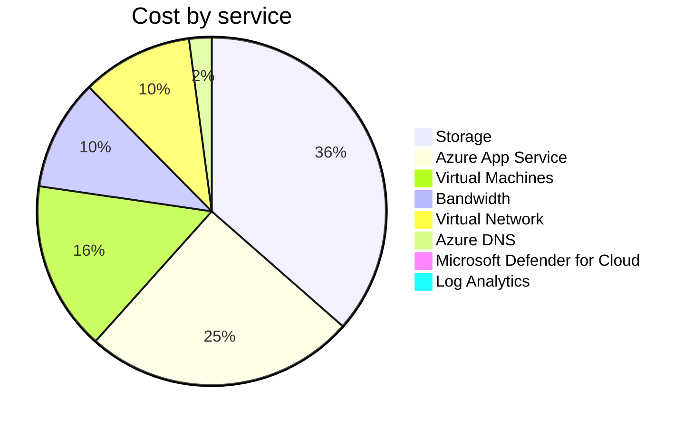
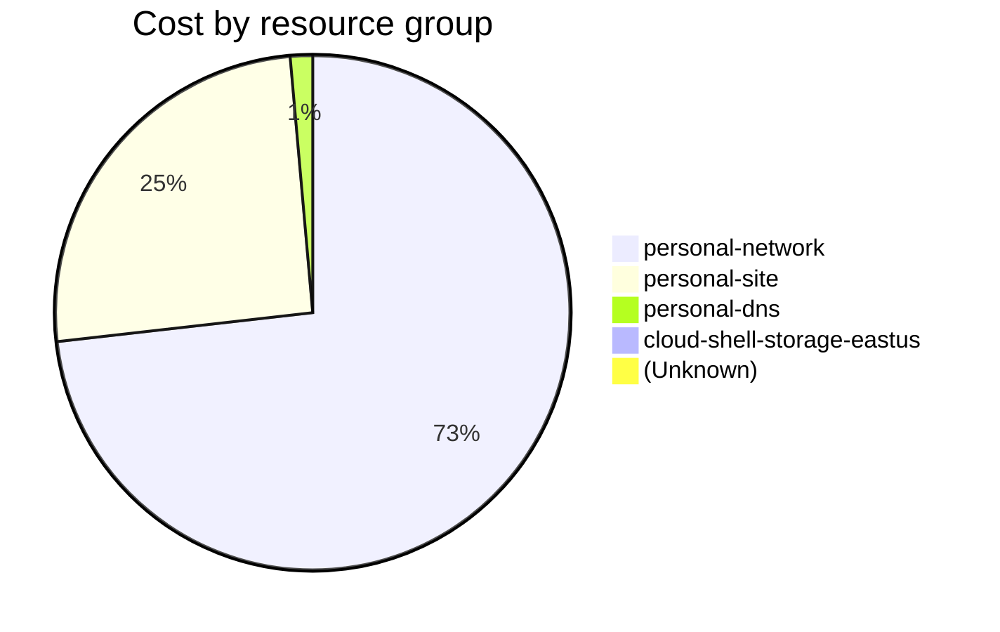

Fetching subscription details...
Fetching cost data...
Fetching forecasted cost data...
Fetching cost data by service name...
Fetching cost data by location...
Fetching cost data by resource group...
# Azure Cost Overview

> Accumulated cost for subscription id `JPF Pay-As-You-Go` from **03/01/2024** to **03/06/2024**

## Totals

|Period|Amount|
|---|---:|
|Today|0.04 USD|
|Yesterday|1.90 USD|
|Last 7 days|11.50 USD|
|Last 30 days|11.50 USD|

```mermaid
gantt
   title Accumulated cost
   dateFormat  X
   axisFormat %s
   section 01 Mar
   USD 3.32 :0, 332
   section 02 Mar
   USD 5.40 :0, 540
   section 03 Mar
   USD 7.47 :0, 747
   section 04 Mar
   USD 9.55 :0, 955
   section 05 Mar
   USD 11.45 :0, 1145
   section 06 Mar
   USD 11.50 :0, 1150
   section 07 Mar
   USD 13.55 : done, 0, 1355
   section 08 Mar
   USD 15.99 : done, 0, 1599
   section 09 Mar
   USD 18.02 : done, 0, 1802
   section 10 Mar
   USD 19.98 : done, 0, 1998
   section 11 Mar
   USD 21.71 : done, 0, 2171
   section 12 Mar
   USD 24.01 : done, 0, 2401
   section 13 Mar
   USD 26.13 : done, 0, 2613
   section 14 Mar
   USD 28.02 : done, 0, 2802
   section 15 Mar
   USD 30.31 : done, 0, 3031
   section 16 Mar
   USD 32.18 : done, 0, 3218
   section 17 Mar
   USD 33.97 : done, 0, 3397
   section 18 Mar
   USD 35.55 : done, 0, 3555
   section 19 Mar
   USD 37.69 : done, 0, 3769
   section 20 Mar
   USD 39.65 : done, 0, 3965
   section 21 Mar
   USD 41.38 : done, 0, 4138
   section 22 Mar
   USD 43.51 : done, 0, 4351
   section 23 Mar
   USD 45.21 : done, 0, 4521
   section 24 Mar
   USD 46.85 : done, 0, 4685
   section 25 Mar
   USD 48.27 : done, 0, 4827
   section 26 Mar
   USD 50.25 : done, 0, 5025
   section 27 Mar
   USD 52.05 : done, 0, 5205
   section 28 Mar
   USD 53.62 : done, 0, 5362
   section 29 Mar
   USD 55.59 : done, 0, 5559
   section 30 Mar
   USD 57.14 : done, 0, 5714
   section 31 Mar
   USD 58.61 : done, 0, 5861
```

## By Service Name

|Service|Amount|
|---|---:|
|Storage|4.18 USD|
|Azure App Service|2.88 USD|
|Virtual Machines|1.80 USD|
|Bandwidth|1.18 USD|
|Virtual Network|1.18 USD|
|Azure DNS|0.24 USD|
|Microsoft Defender for Cloud|0.04 USD|
|Log Analytics|0.00 USD|

## By Location

|Location|Amount|
|---|---:|
|US North Central|8.28 USD|
|US Central|2.90 USD|
|Unknown|0.24 USD|
|US East|0.05 USD|
|Unassigned|0.04 USD|
|AP East|0.00 USD|
|EU West|0.00 USD|
|US East 2|0.00 USD|
|US West 2|0.00 USD|

## By Resource Group

|Resource Group|Amount|
|---|---:|
|personal-network|8.36 USD|
|personal-site|2.90 USD|
|personal-dns|0.16 USD|
|cloud-shell-storage-eastus|0.05 USD|
||0.04 USD|

Generated at 2024-03-06 11:34:31 for subscription with id `4913be3f-a345-4652-9bba-767418dd25e3`
