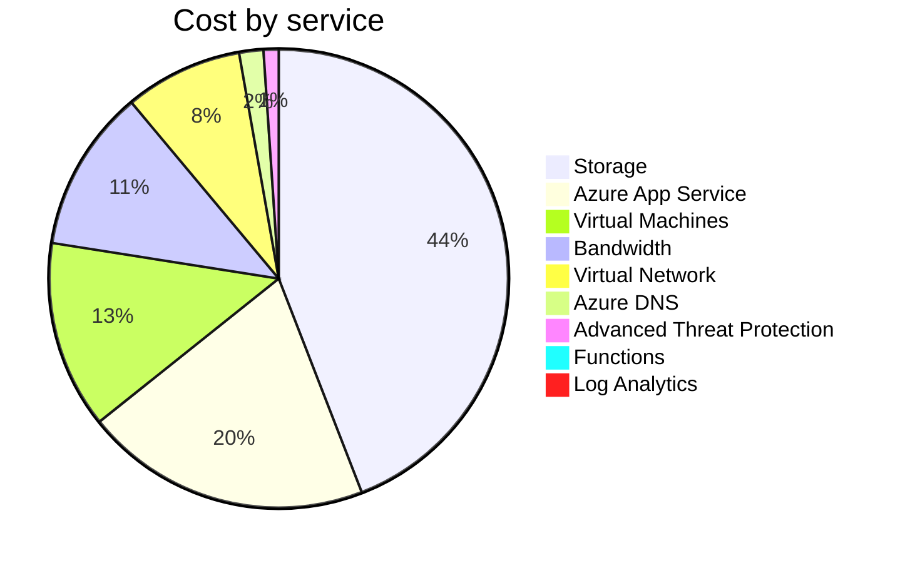
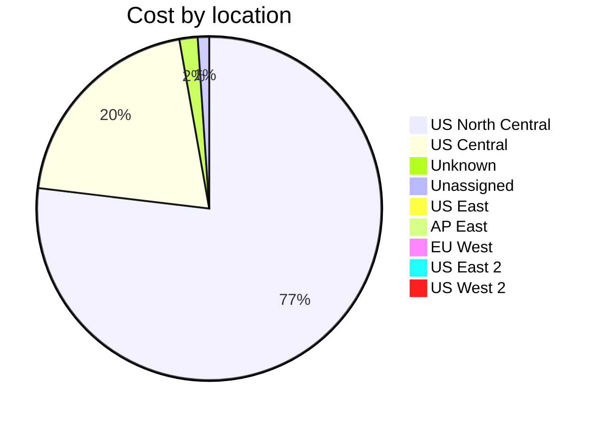

Fetching subscription details...
Fetching cost data...
Fetching forecasted cost data...
Fetching cost data by service name...
Fetching cost data by location...
Fetching cost data by resource group...
# Azure Cost Overview

> Accumulated cost for subscription id `JPF Pay-As-You-Go` from **10/01/2023** to **10/06/2023**

## Totals

|Period|Amount|
|---|---:|
|Today|0.07 USD|
|Yesterday|2.03 USD|
|Last 7 days|14.08 USD|
|Last 30 days|14.08 USD|

```mermaid
gantt
   title Accumulated cost
   dateFormat  X
   axisFormat %s
   section 01 Oct
   USD 3.80 :0, 380
   section 02 Oct
   USD 7.00 :0, 700
   section 03 Oct
   USD 9.48 :0, 948
   section 04 Oct
   USD 11.97 :0, 1197
   section 05 Oct
   USD 14.00 :0, 1400
   section 06 Oct
   USD 14.08 :0, 1408
   section 07 Oct
   USD 14.77 : done, 0, 1477
   section 08 Oct
   USD 14.99 : done, 0, 1499
   section 09 Oct
   USD 14.99 : done, 0, 1499
   section 10 Oct
   USD 17.89 : done, 0, 1789
   section 11 Oct
   USD 17.89 : done, 0, 1789
   section 12 Oct
   USD 17.89 : done, 0, 1789
   section 13 Oct
   USD 17.89 : done, 0, 1789
   section 14 Oct
   USD 17.89 : done, 0, 1789
   section 15 Oct
   USD 17.89 : done, 0, 1789
   section 16 Oct
   USD 17.89 : done, 0, 1789
   section 17 Oct
   USD 17.89 : done, 0, 1789
   section 18 Oct
   USD 17.89 : done, 0, 1789
   section 19 Oct
   USD 17.89 : done, 0, 1789
   section 20 Oct
   USD 17.89 : done, 0, 1789
   section 21 Oct
   USD 17.89 : done, 0, 1789
   section 22 Oct
   USD 17.89 : done, 0, 1789
   section 23 Oct
   USD 17.89 : done, 0, 1789
   section 24 Oct
   USD 17.89 : done, 0, 1789
   section 25 Oct
   USD 17.89 : done, 0, 1789
   section 26 Oct
   USD 17.89 : done, 0, 1789
   section 27 Oct
   USD 17.89 : done, 0, 1789
   section 28 Oct
   USD 17.89 : done, 0, 1789
   section 29 Oct
   USD 17.89 : done, 0, 1789
   section 30 Oct
   USD 17.89 : done, 0, 1789
   section 31 Oct
   USD 17.89 : done, 0, 1789
```

## By Service Name

|Service|Amount|
|---|---:|
|Storage|6.21 USD|
|Azure App Service|2.84 USD|
|Virtual Machines|1.86 USD|
|Bandwidth|1.61 USD|
|Virtual Network|1.17 USD|
|Azure DNS|0.24 USD|
|Advanced Threat Protection|0.15 USD|
|Functions|0.00 USD|
|Log Analytics|0.00 USD|

## By Location

|Location|Amount|
|---|---:|
|US North Central|10.79 USD|
|US Central|2.85 USD|
|Unknown|0.24 USD|
|Unassigned|0.15 USD|
|US East|0.05 USD|
|AP East|0.00 USD|
|EU West|0.00 USD|
|US East 2|0.00 USD|
|US West 2|0.00 USD|

## By Resource Group

|Resource Group|Amount|
|---|---:|
|personal-network|10.87 USD|
|personal-site|2.85 USD|
|personal-dns|0.16 USD|
||0.15 USD|
|cloud-shell-storage-eastus|0.05 USD|

Generated at 2023-10-06 11:31:15 for subscription with id `4913be3f-a345-4652-9bba-767418dd25e3`
