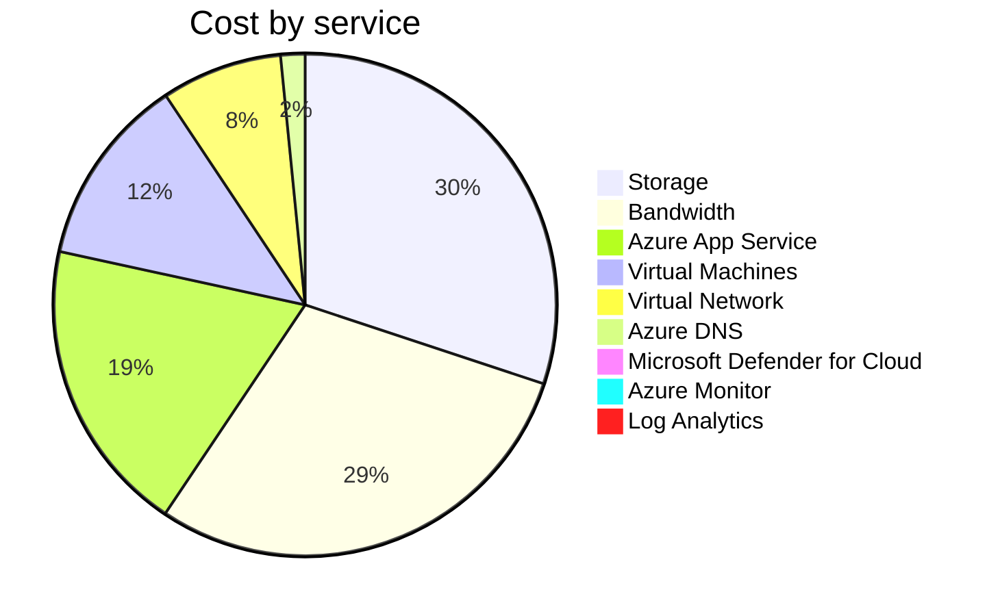

Fetching subscription details...
Fetching cost data...
Fetching forecasted cost data...
Fetching cost data by service name...
Fetching cost data by location...
Fetching cost data by resource group...
# Azure Cost Overview

> Accumulated cost for subscription id `JPF Pay-As-You-Go` from **02/01/2024** to **02/07/2024**

## Totals

|Period|Amount|
|---|---:|
|Today|0.09 USD|
|Yesterday|2.27 USD|
|Last 7 days|18.02 USD|
|Last 30 days|18.02 USD|

```mermaid
gantt
   title Accumulated cost
   dateFormat  X
   axisFormat %s
   section 01 Feb
   USD 2.95 :0, 295
   section 02 Feb
   USD 6.57 :0, 657
   section 03 Feb
   USD 9.66 :0, 966
   section 04 Feb
   USD 12.63 :0, 1263
   section 05 Feb
   USD 15.66 :0, 1566
   section 06 Feb
   USD 17.93 :0, 1793
   section 07 Feb
   USD 18.02 :0, 1802
   section 08 Feb
   USD 20.92 : done, 0, 2092
   section 09 Feb
   USD 24.05 : done, 0, 2405
   section 10 Feb
   USD 27.61 : done, 0, 2761
   section 11 Feb
   USD 30.58 : done, 0, 3058
   section 12 Feb
   USD 33.61 : done, 0, 3361
   section 13 Feb
   USD 36.56 : done, 0, 3656
   section 14 Feb
   USD 39.23 : done, 0, 3923
   section 15 Feb
   USD 42.17 : done, 0, 4217
   section 16 Feb
   USD 45.35 : done, 0, 4535
   section 17 Feb
   USD 48.95 : done, 0, 4895
   section 18 Feb
   USD 51.96 : done, 0, 5196
   section 19 Feb
   USD 55.04 : done, 0, 5504
   section 20 Feb
   USD 58.03 : done, 0, 5803
   section 21 Feb
   USD 60.75 : done, 0, 6075
   section 22 Feb
   USD 63.73 : done, 0, 6373
   section 23 Feb
   USD 66.95 : done, 0, 6695
   section 24 Feb
   USD 70.60 : done, 0, 7060
   section 25 Feb
   USD 73.66 : done, 0, 7366
   section 26 Feb
   USD 76.77 : done, 0, 7677
   section 27 Feb
   USD 79.82 : done, 0, 7982
   section 28 Feb
   USD 82.57 : done, 0, 8257
   section 29 Feb
   USD 85.60 : done, 0, 8560
```

## By Service Name

|Service|Amount|
|---|---:|
|Storage|5.38 USD|
|Bandwidth|5.24 USD|
|Azure App Service|3.40 USD|
|Virtual Machines|2.19 USD|
|Virtual Network|1.39 USD|
|Azure DNS|0.28 USD|
|Microsoft Defender for Cloud|0.14 USD|
|Azure Monitor|0.00 USD|
|Log Analytics|0.00 USD|

## By Location

|Location|Amount|
|---|---:|
|US North Central|14.12 USD|
|US Central|3.42 USD|
|Unknown|0.28 USD|
|Unassigned|0.14 USD|
|US East|0.06 USD|
|AP East|0.00 USD|
|EU West|0.00 USD|
|US East 2|0.00 USD|
|US West 2|0.00 USD|

## By Resource Group

|Resource Group|Amount|
|---|---:|
|personal-network|14.22 USD|
|personal-site|3.42 USD|
|personal-dns|0.19 USD|
||0.14 USD|
|cloud-shell-storage-eastus|0.06 USD|
|azureapp-auto-alerts-873533-jpatrick_fulton_gmail_com|0.00 USD|

Generated at 2024-02-07 11:33:03 for subscription with id `4913be3f-a345-4652-9bba-767418dd25e3`
